## О языке Java
На сегодняшний момент язык *Java* является одним из самых распространенных и популярных языков программирования.

Первая версия языка была разработана еще в 1996 году в недрах компании Sun Microsystems, впоследствии поглощенной компанией Oracle. *Java* задумывался как универсальный язык программирования, который можно применять для различного рода задач. 

Текущей версией является **Java 16**, которая вышла в марте 2021 года, а наиболее поддерживаемой сейчас - **Java 11**. 

*Java* превратилась из просто универсального языка в целую платформу и экосистему, которая объединяет различные технологии, используемые для целого ряда задач: от создания десктопных приложений до написания крупных веб-порталов и сервисов. Кроме того, экосистема *Java* активно применяется для создания программного обеспечения для множества устройств: обычных ПК, планшетов, смартфонов и мобильных телефонов и даже бытовой техники. Достаточно вспомнить популярность мобильной ОС *Android*, большинство программ для которой пишутся именно на языках экосистемы *Java*.

## Особенности и архитектура Java
Ключевой особенностью языка *Java* является то, что его код сначала компилируется в специальный байт-код, независимый от платформы. А затем этот байт-код выполняется виртуальной машиной *JVM* (*Java Virtual Machine*) (он может как интерпретироваться,так и [компилироваться](https://habr.com/ru/post/536288/)). Эталонной реализацией *JVM* является *HotSpot JVM*.

В этом плане *Java* отличается от стандартных интерпретируемых языков как *Python* или *Ruby*, код которых сразу же выполняется интерпретатором. В то же время *Java* не является чисто компилируемым языком, как *С/C++* или *Pascal*.

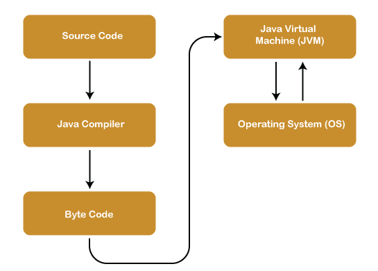

*Рисунок 1. Архитектура и принцип работы Java*

Подобная архитектура обеспечивает кроссплатформенность и аппаратную переносимость программ на *Java*, благодаря чему подобные программы **без перекомпиляции** могут выполняться на различных платформах - *Windows*, *Linux*, *Mac OS* и др. Для каждой из платформ должна быть своя реализация виртуальной машины *JVM*, но каждая из этих реализаций может выполнять один и тот же код.

*Java* является языком с *C*-подобным синтаксисом и близок в этом отношении к *C/C++*, *C#* и *D*. Поэтому, если вы знакомы с одним из этих языков, то овладеть *Java* будет легче.

Еще одной ключевой особенностью *Java* является то, что она поддерживает автоматическую сборку мусора. А это значит, что вам не надо освобождать вручную память от ранее использовавшихся объектов, как в С++, так как сборщик мусора это сделает автоматически за вас.


*Рисунок 2. Архитектура JVM*

Java является **объектно-ориентированным языком**. Он поддерживает *полиморфизм*, *наследование*, *статическую типизацию*. Объектно-ориентированный подход позволяет решить задачи по построению крупных, но в тоже время гибких, масштабируемых и расширяемых приложений.

## JDK. Oracle JDK и OpenJDK
Для работы *Java* недостаточно одной лишь *JVM*. Также требуется общая библиотека классов и другие вспомогательные инструменты. Распространяемый комплект, позволяющий запустить любое *Java* приложение, называется *Java Runtime Environment* или *JRE*. Он содержит в себе *JVM* и дополнительные инструменты.

Для разработки на языке программирования *Java* потребуется специальный комплект инструментов, который называется *Java Development Kit* или *JDK*. Этот комплект инструментов включают в себя компилятор, отладчик, *JRE*, документацию и другие инструменты. 

Стоит отметить, что существуют разные реализации *JDK*, хотя все они используют один и тот же язык - *Java*. Две наиболее популярных реализации - *Oracle JDK* и дистрибутивы *OpenJDK*.

*Oracle JDK* всецело развивается компанией *Oracle*. *OpenJDK* же развивается *Oracle* и рядом других крупных и не очень компаний.

Наибольшие различия с точки зрения лицензирования. *OpenJDK* полностью бесплатна для любых сценариев использования, а *Oracle JDK* бесплатна для персональных нужд, а для коммерческих целей и поддержки потребуется приобрести лицензию.
В плане функционала, набора возможностей Oracle JDK и OpenJDK практически не должны отличаться.

Наиболее распространнеными дистрибутивами *OpenJDK* являются [AdoptOpenJDK](https://adoptopenjdk.net/) и [LibericaJDK](https://libericajdk.ru/).

## Пример компиляции Java-кода из командной строки
Для разработки на *Java* достаточно любого текстового редактора(*Notepad*, *Vim*, *Visual Studio Code* и т.д.) и компилятора `javac` из комплекта *JDK*.

Создадим текстовый файл `Main.java` со следующим содержанием:
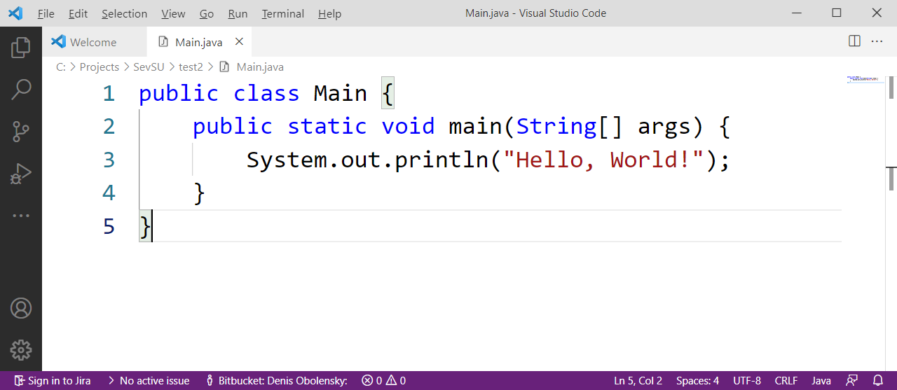

*Рисунок 3. Простейшая программа*

Данная программа выводит текст *Hello, World* на экран консоли.

Для компиляции нашей программы в байт-код выполним команду:
```bash
javac .\Main.java
```

В результате получится файл с названием `Main.class`. Это скомпилированный байт-код.

Для запуска JVM и выполнения нашего байт-кода запустим следующую команду
```bash
java Main
```

Результат показан ниже:
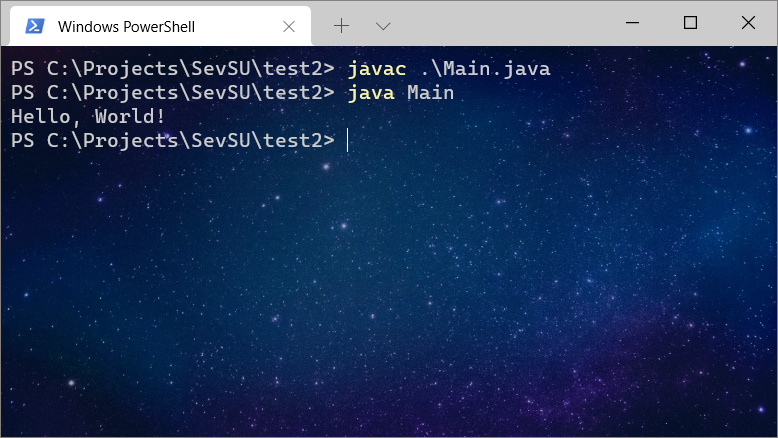

*Рисунок 4. Простейшая программа*

## Среда разработки BlueJ
В реальности, как правило, крупные программы разрабатываются не при помощи простого текстового редактора, а с использованием таких средств как **IDE** или интегрированные среды разработки, которые упрощают и ускоряют написание кода и создание приложений.

Для новичков может быть рекомендована среда разработки **BlueJ**, которая имеет простой интерфейс и прекрасно подходит для обучения.

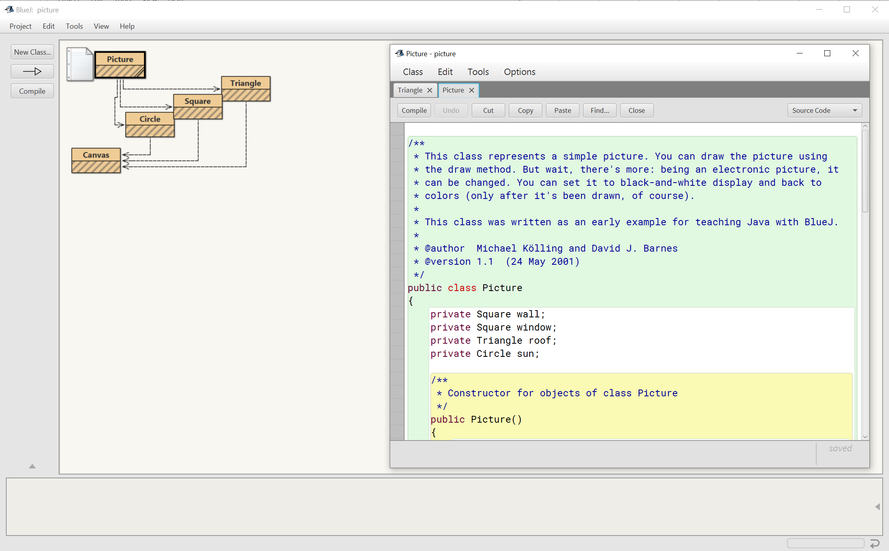

*Рисунок 5. Среда BlueJ*

Основное окно системы *BlueJ* показано на рисунке 6. 

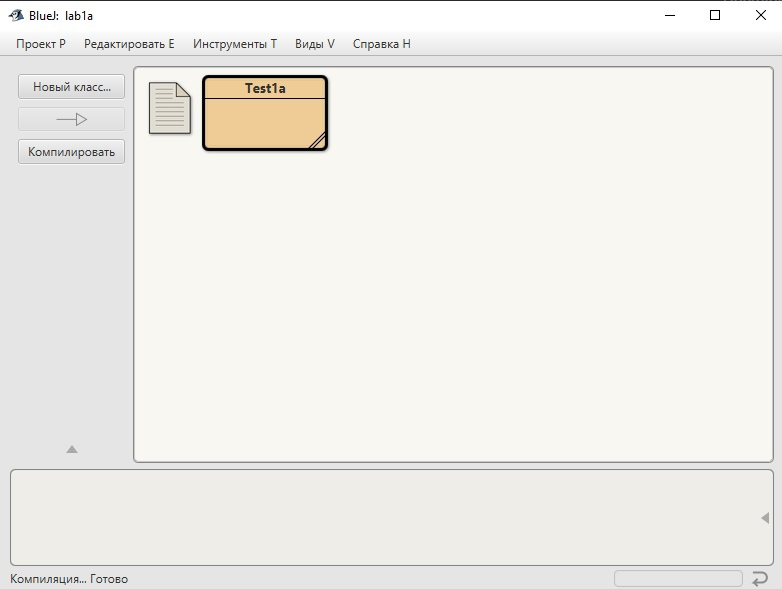

*Рисунок 6. Основное окно BlueJ*

Окно содержит главное меню системы, управляющие кнопки, окно проекта, стенд объектов, окно команд (окно кода) и индикатор работы виртуальной машины *Java*.

Окно редактора можно открыть, если дважды кликнуть на соответствующий класс в окне проекта. Окно редактора с нужным текстом показано на рисунке 7. 

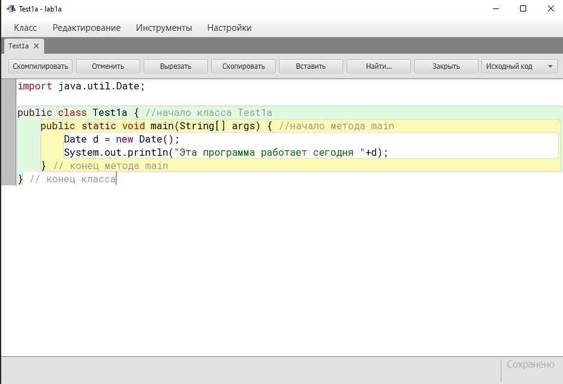

*Рисунок 7. Окно текстового редактора*

Запуск проекта осуществляется с помощью контекстного меню, которое можно открыть при клике правой кнопкой мыши на соответствующем классе.

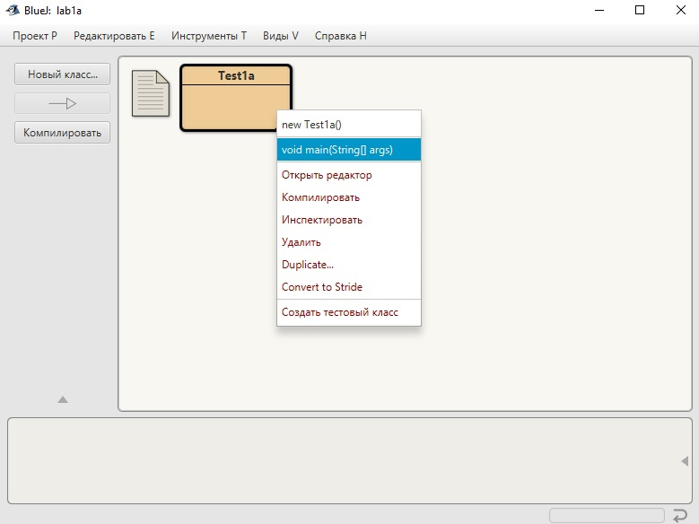

*Рисунок 8. Контекстное меню класса и доступные методы, в т.ч. метод `main`*

Результат работы программы выводятся в окно терминала (рисунок 9). (Если окна терминала нет, в главном окне выберите *Виды* – *Показать терминал*). 

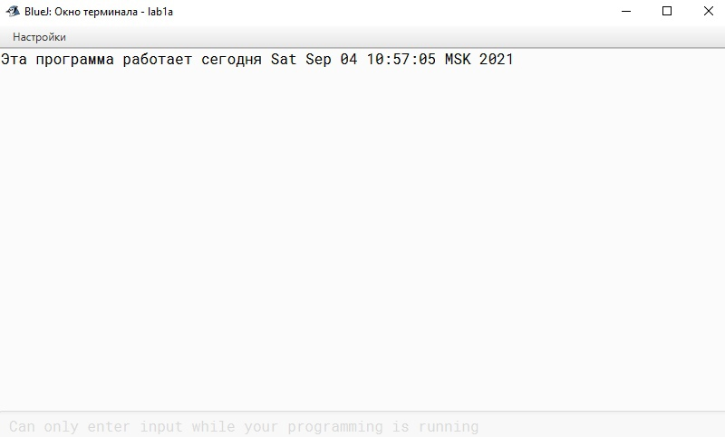

*Рисунок 9. Окно терминала. Результат выполнения программы*


## ⭐ Среда разработки IntelliJ IDEA
Самой популярной средой разработки для *Java* является **IntelliJ IDEA** от компании *JetBrains* (по ряду опросов на момент середины 2021 ею пользовалось до 70% разработчиков на Java).

При создании проекта мы можем увидеть следующее окно (рисунок 10). Здесь мы можем создать новый проект (рисунок 11), открыть уже созданный, либо открыть проект из системы контроля версий. Подробнее про создание проекта можно почитать в официальном [туториале](https://www.jetbrains.com/help/idea/creating-and-running-your-first-java-application.html). 

Главное окно среды показано на рисунке 12.

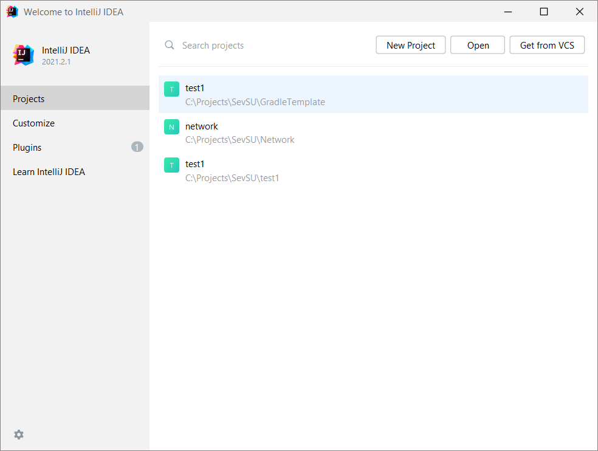

*Рисунок 10. Среда IntelliJ IDEA*

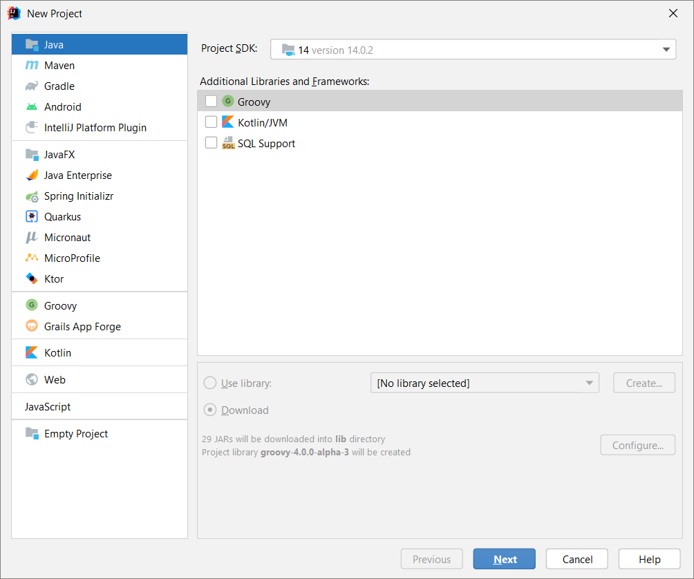

*Рисунок 11. Среда IntelliJ IDEA*

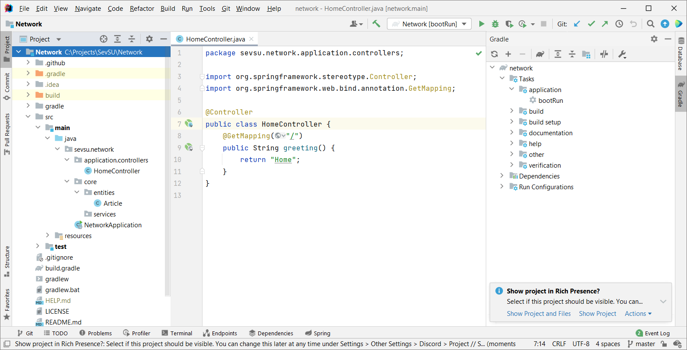

*Рисунок 12. Среда IntelliJ IDEA*

Скачать данную среду можно с [официального сайта](https://www.jetbrains.com/idea/download). По этому адресу можно найти установочые образы для Windows, MacOS, Linux. Кроме того, сама среда доступна в двух версиях - *Ultimate* (платная с триальным бесплатным периодом) и *Community* (бесплатная). Для обучения рекомендуется бесплатная версия *Community*.

## ⭐ Системы сборки. Gradle
Ручная сборка или ручное управление зависимостями это хорошо, но не эффективно. Разработчики - очень ленивые люди и не хотят писать заново то, что кто-то уже написал для своего проекта. Для решения подобных проблем появились в свет системы сборки проектов, которые автоматизируют этот процесс. Кроме того, позволяют с одной стороны собрать Вам проект так, как Вы этого хотите, с другой стороны предоставляют вам более менее стандартизированные средства.

В экосистеме *Java* представлено 3 распространненных системы сборки - *Ant*, *Maven* и *Gradle*. 

Альтернативой Gradle является система автоматической сборки Maven. Эти две системы сборки с одной стороны разные, а с другой стороны имеют и ряд сходств. На эту тему на сайте [Gradle](https://gradle.org/) есть [материалы](https://docs.gradle.org/current/userguide/migrating_from_maven.html). 

Преимущества использования *Gradle*:

- [x] Удобная и расширяемая система сборки проектов
- [x] Управление зависимостями
- [x] Запуск юнит-тестов и другие дополнительные проверки
- [x] Процессинг ресурсов


*Рисунок 13. Граф задач Gradle*

*Gradle* и *Maven* имеют разницу во взгляде на то, как собирать проект. *Gradle* основан на графе задач (`task`), которые могут зависеть друг от друга. Задачи выполняют какую-то работу. Maven же использует модель определённых фаз (`phase`), к которым присоединяются определённые "*цели*" (`goals`). В этих `goals` и выполняется какая-то работа. Однако, при таких разных подходах обе системы сборки следуют одному соглашению и управление зависимостями происходит схоже.

Чтобы начать использовать *Gradle* необходимо его скачать с сайта, либо использовать *IntelliJ IDEA*, которая скачает его автоматически при создании/клонировании проекта. Установка подробно описана [здесь](https://docs.gradle.org/current/userguide/installation.html). Во всех случаях рекомендованным способом запуска *Gradle* является `gradlew`, утилита командной строки.

Для запуска любой задачи *Gradle* можно использовать следующую команду:

```bash
gradlew <task_name>
```

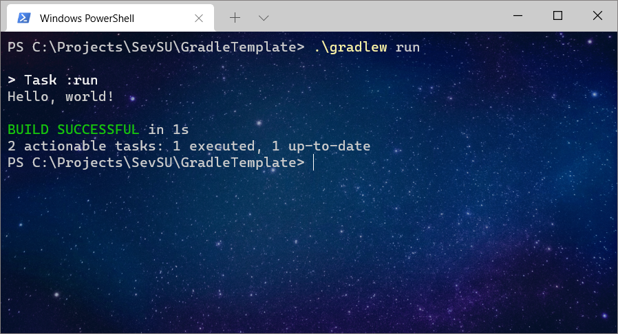

*Рисунок 14. Пример запуска Gradle в терминале*

В Gradle процесс сборки - это последовательное выполнение задач, называемых `task` в соответствии с графом задач выше. Задачи(их еще называют *таски*) предоставляются различными плагинами (plugins). Плагины могут как добавлять новые задачи, так и становиться зависимостями других задач. Подробнее про плагины можно прочитать в [официальной документации](https://docs.gradle.org/current/userguide/plugins.html).

**Gradle Build Script** – файл `build.gradle`, главный файл, в котором описывается то, какие библиотеки и фреймворки использует проект, какие плагины нужно подключить к проекту и описывает различные таски. Подробнее про данный файл [тут](https://docs.gradle.org/current/userguide/tutorial_using_tasks.html).

Cтруктура Gradle Project:

* `src/main/java` - Место содержащее исходники на языке *Java*
* `src/test/java` - Место содержащее все исходные коды модульных тестов
* `build.gradle` - Файл, описывающий задачи, плагины, зависимости приложения, главный файл *Gradle*
* `settings.gradle`  - Файл содержаций нужные настройки.

Полностью сконфигурированный проект, рекомендуемый для обучения с использованием *Gradle*, расположен здесь:

[readonlyden/GradleTemplate :fontawesome-brands-github:](https://github.com/readonlyden/GradleTemplate){ .md-button .md-button--primary }

```groovy
// Используемые плагины
plugins {
    id 'java'
    id 'application'
}

// Метаинформация про наш проект
group 'org.example'
// Версия проекта
version '1.0-SNAPSHOT'

// Репозиторий библиотек
repositories {
    mavenCentral()
}

// Зависимости
dependencies {
    // Подключаем библиотеку для тестирования
    testImplementation 'org.junit.jupiter:junit-jupiter-api:5.7.2'
    testRuntimeOnly 'org.junit.jupiter:junit-jupiter-engine:5.7.2'
}

// Настройка задачи test
test {
    useJUnitPlatform()
}

// Настройка плагина application
application {
    mainClass = 'Main' // Главный класс приложения
}

// Настройка задачи application:run
run {
    standardInput = System.in // Подключаем стандартный поток ввода
}
```

При открытии проекта в **IntelliJ IDEA** она автоматически установит `gradlew` и восстановит зависимости. Для запуска задач в gradle есть специальное меню (рисунок 15). На рисунке 16 показан результат запуска проекта.

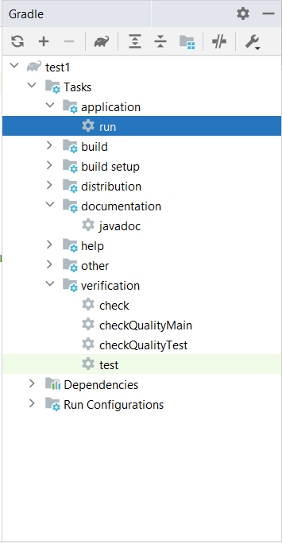

*Рисунок 15. Меню Gradle в IntelliJ IDEA*

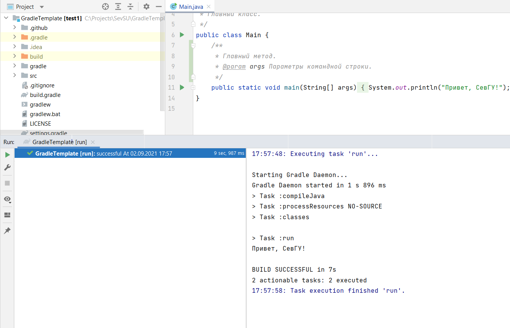

*Рисунок 16. Результат запуска Gradle в IntelliJ*
