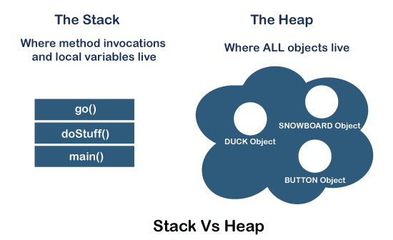
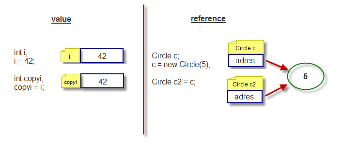
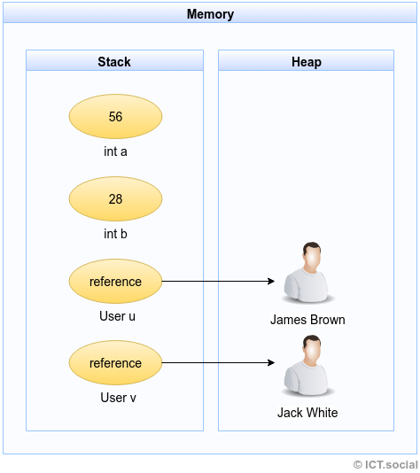

## Базовая программа. Запуск программы. Метод main
*Java* является ***объектно-ориентированным*** языком, поэтому всю программу можно представить как **набор взаимодействующих между собой классов и объектов**. Простейшая программа на Java представлена следующим образом:

```java
public class Program{ 
    public static void main (String args[]){    
         System.out.println("Hello Java!");
    }
}
```

То есть основу программы составляет класс **`Program`**. При определении класса вначале идет модификатор доступа **`public`**, который указывает, что данный класс будет доступен всем, в том числе для *JVM*, и мы сможем его запустить из командной строки. Далее идет ключевое слово **`class`**, а затем название класса. После названия класса идет блок кода, в котором расположено содержимое класса.

Входной точкой в программу на языке Java является метод **`main`**, который определен в классе **`Program`**. Именно с него начинается выполнение программы. Он обязательно должен присутствовать в программе. При этом его заголовок может быть **только** таким:

```java
public static void main (String args[])
```

При запуске приложения виртуальная машина *Java* (*JVM*) ищет в главном классе программы метод **`main`** с подобным заголовком, и после его обнаружения запускает его. Если метод отсутствует, то компиляция возможна, но при запуске будет получена ошибка `Error: Main method not found`.

Вначале заголовка метода идет модификатор **`public`**, который указывает, что метод будет доступен извне. Слово **`static`** указывает, что метод **`main`** - статический (не связан с конкретным объектом), а слово **`void`** - что он не возвращает никакого значения. Далее в скобках у нас идут параметры метода - **`String args[]`** - это массив **`args`**, который хранит значения типа **`String`**, то есть строки. При запуске программы через этот массив мы можем передать в программу различные данные.

После заголовка метода идет его блок, который содержит набор выполняемых инструкций.

## Структура программы
Основным строительным блоком программы на языке *Java* являются **инструкции** (*statement*). Каждая инструкция выполняет некоторое действие, например, вызовы методов, объявление переменных и присвоение им значений. После завершения инструкции в *Java* ставится точка с запятой (`;`). Данный знак указывает компилятору на конец инструкции. Например:

```java
System.out.println("Hello Java!");
```

Данная строка представляет вызов метода `System.out.println`, который выводит на консоль строку `Hello Java!`. В данном случае вызов метода является инструкцией и поэтому завершается точкой с запятой.

Кроме отдельных инструкций распространенной конструкцией является **блок кода**. Блок кода содержит набор инструкций, он заключается в фигурные скобки, а инструкции помещаются между открывающей и закрывающей фигурными скобками:

```java
{
    System.out.println("Hello!");
    System.out.println("Welcome to Java!");
}
```
В этом блоке кода две инструкции, которые выводят на консоль определенную строку.

## Комментарии
Код программы может содержать комментарии. Комментарии позволяют понять смысл программы, что делают те или иные ее части. При компиляции комментарии игнорируются и не оказывают никакого влияния на работу приложения и на его размер.

В Java есть два типа комментариев: однострочный и многострочный. Однострочный комментарий размещается на одной строке после двойного слеша `//`. А многострочный комментарий заключается между символами `/* текст комментария */`. Он может размещаться на нескольких строках. Например:

```javA
/*
    многострочный комментарий
    Объявление нового класса,
    который содержит код программы
*/
public class Program{   // начало объявления класса Program
      
    // определение метода main
    public static void main (String args[]){    // объявление нового метод  
         System.out.println("Hello Java!");     // вывод строки на консоль
    }   // конец объявления нового метода
} // конец объявления класса Program
```

Существует продвинутый (и более сложный формат комментариев), называемый **JavaDoc**. Он используется совместно с одноименной утилитой, входящей в состав JDK, и предназначен для создания документации разработчика из исходного кода. Такие комментарии используются при разработке крупных и средних проектов, и нужны для описания классов, методов и других объектов с целью упрощения разработки. Комментарий *JavaDoc* пишется на языке *HTML*, может содержать метаинформацию (например, описание параметров метода). Такие комментарии также поддерживаются средами разработки для создания подсказок. Пример метода с *JavaDoc* комментариями представлен ниже. *JavaDoc* комментарий является обычным многострочным комментарием, но начинается с `/**` на отдельной строчке.

```java
/**
* Returns a sum of two integers. 
* Please refer to <a href="url">Calculator</a>
* for details.
*
* @param  first  first number
* @param  second second number
* @return      the sum of two numbers
* @see         Integer
*/
public int getSumOfTwoNumbers(int first, int second) {
    return first + second;
}
```

## Переменные и константы

Для хранения данных в программе предназначены **переменные**. 

**Переменная** – это именованная область памяти, в которой программа может установить некоторое значение. Значение переменной может изменяться во время выполнения программы.

Переменная определяется комбинацией **идентификатора** (имени), **типа** и необязательного инициализатора. Переменная должна быть объявлена перед ее использованием.

**Идентификаторы** используются в качестве имен классов, методов и переменных. Идентификатор может быть любой последовательностью букв верхнего и нижнего регистра (в том числе, кириллических), чисел или символов подчеркивания `_` и знака доллара (`$`). Он не должен начинаться с цифры, чтобы не вступать в конфликт с числовой константой. Язык *Java* чувствителен к регистру, поэтому идентификатор `VALUE`, например, отличается от идентификатора `Value`.

**Тип**, также называемый **тип данных**, определяет, какую информацию может хранить переменная или диапазон допустимых значений.

Синтаксис объявления переменной:
```
type identifier [=value][, identifier [=value]…];
```

* `type` – один из типов *Java*, имя класса или интерфейса,
* `identifier` – имя переменной,
* `value` – литерал (значение подходящего типа) или *выражение*.


Примеры объявления переменной:
```java
int a, b, c;
int d = 3, e, f = 5;
```

Начиная с **Java 10** в язык было добавлено ключевое слово **`var`**, которое также позволяет определять переменную:

```java
var x = 10;
System.out.println(x);  // 10
```

Слово `var` ставится вместо типа данных, а сам тип переменной *выводится* из того значения, которое ей присваивается. Например, переменной `x` присваивается число `10`, значит, переменная будет представлять целочисленный тип `int`.

Но если переменная объявляется с помощью `var`, то ее необходимо **обязательно** инициализировать, то есть предоставить ей начальное значение, иначе мы получим ошибку, как, например, в следующем случае:

```java
var x;      // ! Ошибка, переменная не инициализирована, непонятно какой тип данных
x = 10;
```

Начинающим разработчикам рекомендуется использовать `var` в тех случаях, когда тип легко понять из выражения справа, и использовать явное указание типа в других случаях.

Кроме переменных, в *Java* для хранения данных можно использовать **константы**. В отличие от переменных константам можно присвоить значение только один раз. Константа объявляется также, как и переменная, только вначале идет ключевое слово **`final`**:

```java
final int LIMIT = 5;
System.out.println(LIMIT);  // 5
// LIMIT=57; // так мы уже не можем написать, так как LIMIT - константа
```
*Как правило* (зависит от стиля кодирования на проекте), константы имеют имена в верхнем регистре.

Константы позволяют задать такие переменные, которые не должны больше изменяться. Например, если у нас есть переменная для хранения числа `pi`, то мы можем объявить ее константой, так как ее значение постоянно.

## Типы данных
Язык *Java* является строго типизированным. А это значит, что каждая переменная и константа представляет определенный тип и данный тип строго определен. Тип данных определяет диапазон значений, которые может хранить переменная или константа.

В *Java* существует два вида типов данных - **примитивные**(рассмотрены выше) и **ссылочные**.

### Примитивные типы
Итак, рассмотрим систему встроенных базовых типов данных, которая используется для создания переменных в *Java*. А она представлена следующими типами.

* `boolean`: хранит значение true или false:
```java
boolean canDestroySpaceships = false;
boolean canDestroyEnemies = true;
```
* `byte`: хранит целое число от -128 до 127 и занимает **1 байт**
```java
byte a = 3;
byte b = 8;
```
* `short`: хранит целое число от -32768 до 32767 и занимает **2 байта**
```java
short a = 3;
short b = 8;
```
* `int`: хранит целое число от -2147483648 до 2147483647 и занимает **4 байта**
```java
int a = 4;
int b = 9;
```
* `long`: хранит целое число от –9 223 372 036 854 775 808 до 9 223 372 036 854 775 807 и занимает **8 байт**
```java
long a = 5;
long b = 10;
```
* `float`: хранит число с плавающей точкой от -3.4✕10^38^ до 3.4✕10^38^ и занимает **4 байта**. В качестве разделителя целой и дробной части в дробных литералах используется точка.
```java
float x = 8.5F;
float y = 2.7F;
```
* `double`: хранит число с плавающей точкой от ±4.9✕10^-324^ до ±1.8✕10^308^ и занимает **8 байт**. В качестве разделителя целой и дробной части в дробных литералах используется точка.
```java
double x = 8.5;
double y = 2.7;
```
* `char`: хранит одиночный символ в кодировке **UTF-16** (Unicode) и занимает **2 байта**, поэтому диапазон хранимых значений от 0 до 65535.
```java
char a = 'a';
```

При этом переменная может принимать только те значения, которые соответствуют ее типу. Если переменная представляет целочисленный тип, то она не может хранить дробные числа.

### Строки
Тип `String` не является примитивным типом данных, однако это один из наиболее используемых типов в *Java*.  `String`  предназначен для хранения строк текста. Несколько примеров использования String:
```java
//Создание строки с помощью конструктора 
String phrase = new String("Wabba lubba dub dub");
//Можно также создать строку используя строковый литерал
String answer = "Ответ - 42";
```

### Ссылочные типы
В ссылочные типы входят все *массивы*, *строки* (вышеупомянутый тип `String`), *классы*, *интерфейсы*.

Для того, чтобы понять ссылочные типы максимально полно, нужно разобраться с понятиями **стек** и **куча**, а также кратко изучить то, как Java работает с памятью.

Для оптимальной работы приложения *JVM* делит память на область *стека* (*stack*) и область *кучи* (*heap*). Всякий раз, когда мы объявляем новые переменные, создаем объекты или вызываем новый метод, *JVM* выделяет память для этих операций в стеке или в куче.

#### __Stack(Стек)__ и __Heap(Куча)__


*Рисунок 1. Стек и куча*

**Стек** работает по схеме *LIFO* (*последним вошел, первым вышел* - *last in first out*). Всякий раз, когда вызывается новый метод, содержащий примитивные значения или ссылки на объекты, то на вершине стека под них выделяется блок памяти, называемый фреймом.
Когда метод завершает выполнение, блок памяти, отведенный для его нужд, очищается, и пространство становится доступным для следующего метода.

Когда метод завершает выполнение, соответствующий фрейм стека сбрасывается, поток возвращается к вызывающему методу, и пространство становится доступным для следующего метода.

Особенности стека:

* Он заполняется и освобождается по мере вызова и завершения новых методов
* Переменные в стеке существуют до тех пор, пока выполняется метод в котором они были созданы
* Если память стека будет заполнена, *Java* бросит исключение `java.lang.StackOverFlowError`
* Доступ к этой области памяти осуществляется *быстрее*, чем к куче
* Является потокобезопасным, поскольку для каждого потока создается свой отдельный стек

**Куча** используется для объектов. Новые объекты всегда создаются в куче, а ссылки на них хранятся в стеке.
Эти объекты *имеют глобальный доступ* и могут быть доступны из любого места программы.

Особенности кучи:

* Когда эта область памяти полностью заполняется, *Java* бросает `java.lang.OutOfMemoryError`
* Доступ к ней *медленнее*, чем к стеку, но при этом размер кучи гораздо больше, чем размер стека
* Эта память, в отличие от стека, автоматически не освобождается. Для сбора неиспользуемых объектов используется *сборщик мусора* (*GC*)
* В отличие от стека, куча *не является потокобезопасной и ее необходимо контролировать*, правильно синхронизируя код.

#### Ссылочные типы и семантика ссылок



*Рисунок 3. Примитивные и ссылочные типы*

**Примитивные типы** - это основные типы данных: `byte` , `short` , `int` , `long` , `float` , `double` , `boolean` , `char`. Примитивные переменные хранят значения как есть, т.е соответствующие ячейки памяти(в сколько-то там байт) будут хранить само значение. *Примитивный тип описывает значение*.

**Ссылочные типы** хранят не значения, а адреса мест в памяти (а если быть точнее адрес в *куче*, так как все объекты живут в куче), в которых хранятся данные. Это любой экземпляр класса (объект), а также массивы, строки и так далее.

Любая переменная ссылочного типа (*reference type*) хранит в себе или ссылку на объект, или `null`, если она не связана с объектом.

!!! note "Вопрос на засыпку"
    А где же живут примитивные типы? Если ссылочные типы указывают на значения в куче, то примитивные живут в стеке, да? Как бы да, но вообще-то нет. Если переменная примитивного типа является частью любого объекта, то ее значение будет жить в куче.



*Рисунок 2. Примитивные и ссылочные типы*

В *Java* параметры всегда передаются только *по значению*, что определяется как *«скопировать значение и передать копию»*. С примитивами это будет копия содержимого. Со ссылками - тоже копия содержимого, т.е. копия ссылки. При этом внутренние члены ссылочных типов через такую копию изменить возможно, а вот саму ссылку, указывающую на экземпляр - нет. Несколько переменных ссылочного типа могут указывать на один и тот же объект. При присвоении переменной примитивных типов мы копируем значение, а при присвоении переменной ссылочного типа - мы копируем ссылку.

Ссылочные или непримитивные типы данных могут быть любого размера (и как минимум занимают размер ссылки).

При задании значения переменной ссылочного типа необходимо выделить память. В *Java* для этого использовуется ключевое слово `new`. Подробнее про это будет в разделе про массивы и про объекты.

#### Классы-оболочки для примитивных типов

Для каждого примитивного типа существует, соответствующий ему ссылочный тип, так называемые *классы-оболочки*:

* `Byte`
* `Short`
* `Integer`
* `Long`
* `Float`
* `Double`
* `Character`
* `Boolean`

В отличие от примитивных типов, они пишутся с заглавной буквы. Эти типы соответствуют примитивным типам, однако являются ссылочными. Их классы cодержат методы для преобразования типов, а также другие константы и методы полезные при работе с примитивными типами данных.

Классы-обертки являются *неизменяемыми*: это означает, что после создания объекта его состояние (значение поля `value`) не может быть изменено; и задекларированы, как `final` (от этих классов невозможно наследоваться).

*Java* автоматически производит преобразования между примитивными типами и их обертками:
```java
Integer j = 1;          // autoboxing
int i = new Integer(1); // unboxing
```

Процесс преобразования примитивных типов в ссылочные называется автоупаковкой (*autoboxing*), а обратный ему — автораспаковкой (*unboxing*).

!!! note "Замечание"
    *Boxing* и *unboxing* достаточно дорогостоящие операции, поэтому если вы в цикле просто так решите туда-сюда выполнять эти операции, не удивляйтесь низкой производительности.

Классы-оболочки позволяют работать с примитивными типами там, где невозможно с ними работать напрямую, а также дают больше возможностей. 

### Значения переменных разных типов по умолчанию
+ Числа инициализируются `0` или `0.0`; 
+ `char` — `\u0000`;
+ `boolean` — `false`;
+ Объекты (в том числе `String`) — `null`.

## Целые числа
Все целочисленные литералы, например, числа 10, 4, -5, воспринимаются как значения типа `int`, однако мы можем присваивать целочисленные литералы другим целочисленным типам: `byte`, `long`, `short`. В этом случае *Java* автоматически осуществляет соответствующие преобразования:
```java
byte a = 1;
short b = 2;
long c = 100500;
```

При присвоении переменной типа `long` очень большого числа, которое выходит за пределы допустимых значений для типа `int`, то мы столкнемся с ошибкой во время компиляции:
```java
long num = 100500100500; // Ошибка компиляции
```

В данной ситуации число 100500100500 является допустимым для типа `long`, но выходит за предельные значения для типа `int`. И так как *все целочисленные значения по умолчанию расцениваются как значения типа* `int`, то компилятор укажет нам на ошибку. Чтобы решить проблему, надо добавить к числу суффикс `l` или `L`, который указывает, что число представляет тип `long`:
```java
long num = 100500100500L; // Всё ОК
```

Как правило, значения для целочисленных переменных задаются в десятичной системе счисления, однако также можно применять двоичную, восьмеричную и шестнадцатеричную системы:
```java
int hexNum = 0x6F; // 16-тиричная система, число 111
int octNum = 010; // 8-ричная система, число 8
int binaryNum = 0b1101; // 2-ичная система, число 13
```

Для задания шестнадцатеричного значения после символов `0x` (или `0X`) указывается число в шестнадцатеричном формате. Таким же образом восьмеричное значение указывается после символа `0`, а двоичное значение - после символов `0b` или `0B`.

Также целые числа поддерживают разделение разрядов числа с помощью знака подчеркивания:
```java
int x = 123_456;
int y = 234_567__789;
System.out.println(x);  // 123456
System.out.println(y);  // 234567789
```

## Вещественные числа
Вещественные числа в Java представлены типами данных `float` и `double`. `float` является 32-битным значением с плавающей точкой, с обычной точностью, а `double` представляет 64-битное значение с плавающей точкой, с двойной точностью. 

Оба типа соответствуют стандарту **IEEE 754-1985**, который определяет формат чисел и арифметические операции, применимые к этим числам. Но есть и небольшие отличия от этого стандарта. К обычным вещественным числам добавляются еще четыре значения:

* *положительная бесконечность*, выражаемая константой `POSITIVE_INFINITY` и возникающая при переполнении положительного значения, например в результате операции умножения `3.0*6e307` или при делении на нуль;
* *отрицательная бесконечность* `NEGATIVE_INFINITY`, возникающая при переполнении отрицательного значения, например в результате операции умножения `-3.0*6e307` или при делении на нуль отрицательного числа;
* *не число*, записываемое константой `NaN` (*Not a Number*) и возникающее, например, при умножении нуля на бесконечность.
* Кроме того, стандарт различает положительный и отрицательный нуль, возникающий при делении на бесконечность соответствующего знака, хотя сравнение `0.0 == -0.0` дает в результате `true`.

Операции с бесконечностями выполняются по обычным математическим правилам. Во всем остальном вещественные типы — это обычные вещественные значения, к которым применимы все арифметические операции и операции сравнения.

### Класс Math
Для выполнения различных математических операций в *Java* в пакете `java.lang` определен класс `Math`. Рассмотрим его основные методы:

* `abs(double value)`: возвращает абсолютное значение для аргумента `value`
```java
double result = Math.abs(-13.5); // 13.5
```

* `acos(double value)`: возвращает арккосинус `value`. Параметр `value` должен иметь значение от -1 до 1
```java
double result = Math.acos(1); // 0.0
```

* `asin(double value)`: возвращает арксинус `value`. Параметр `value` должен иметь значение от -1 до 1
* `atan(double value)`: возвращает арктангенс `value`

* `cbrt(double value)`: возвращает кубический корень числа `value`
```java
double result = Math.cbrt(27); // 3
```

* `ceil(double value)`: возвращает наименьшее целое число с плавающей точкой, которое не меньше `value`
```java
double result = Math.ceil(2.34); // 3
```

* `cos(double d)`: возвращает косинус угла `d`
* `cosh(double d)`: возвращает гиперболический косинус угла `d`
* `exp(double d)`: возвращает основание натурального логарифма, возведенное в степень `d`
* `floor(double d)`: возвращает наибольшее целое число, которое не больше `d`
```java
double result = Math.floor(2.56); // 2
```

* `floorDiv(int a, int b)`: возвращает целочисленный результат деления `a` на `b`
```java
System.out.println(Math.floorDiv(1, 2)); // 0
System.out.println(Math.floorDiv(7, 2)); // 3
System.out.println(Math.floorDiv(9, 2)); // 4
```

* `log(double a)`: возвращает натуральный логарифм числа `a`
* `log1p(double d)`: возвращает натуральный логарифм числа `(d + 1)`
* `log10(double d)`: возвращает десятичный логарифм числа `d`
* `max(double a, double b)`: возвращает максимальное число из `a` и `b`
* `min(double a, double b)`: возвращает минимальное число из `a` и `b`
* `pow(double a, double b)`: возвращает число `a`, возведенное в степень `b`
* `random()`: возвращает *случайное* число от 0.0 до 1.0
* `rint(double value)`: возвращает число `double`, которое представляет ближайшее к числу `value` целое число
```java
System.out.println(Math.rint(2)); // 2.0
System.out.println(Math.rint(2.3)); // 2.0
System.out.println(Math.rint(2.5)); // 2.0
System.out.println(Math.rint(2.5001)); // 3.0
System.out.println(Math.rint(2.8)); // 3.0
```

* `round(double d)`: возвращает число `d`, округленное до ближайшего целого числа
```java
System.out.println(Math.round(2.3)); // 2
System.out.println(Math.round(2.5)); // 3
System.out.println(Math.round(2.5001)); // 3
System.out.println(Math.round(2.8)); // 3
```

* `scalb(double value, int factor)`: возвращает произведение числа `value` на 2 в степени `factor`
```java
System.out.println(Math.scalb(5, 3)); // 5*2*2*2 = 40
System.out.println(Math.scalb(3, 4)); // 3*2*2*2*2 = 48
```

* `signum(double value)`: возвращает число 1, если число `value` положительное, и -1, если значение `value` отрицательное. Если `value` равно 0, то возвращает 0
```java
System.out.println(Math.signum(2.3)); // 1
System.out.println(Math.signum(-2.3)); // -1
```

* `sin(double value)`: возвращает синус угла `value`
* `sinh(double value)`: возвращает гиперболический синус угла `value`
* `sqrt(double value)`: возвращает квадратный корень числа `value`
```java
double result1 = Math.sqrt(16); // 4
```

* `tan(double value)`: возвращает тангенс угла `value`
* `tanh(double value)`: возвращает гиперболический тангенс угла `value`
* `toDegrees(double value)` переводит радианы в градусы и `toRadians(double value)` - градусы в радианы
```java
System.out.println(Math.toDegrees(3.14159)); // 180
System.out.println(Math.toRadians(90)); // 1,57079....
```

Также класс `Math` определяет две константы: `Math.E` и `Math.PI`. Например, вычисление площади круга:

```java
import java.util.Scanner;
 
public class Program {
   
    public static void main(String[] args) {       
        Scanner in = new Scanner(System.in);
        System.out.print("Введите радиус круга: ");
        int radius = in.nextInt();
        long area = Math.round(Math.PI * Math.pow(radius, 2));
        System.out.printf("Площадь круга с радиусом %d равна %d \n", radius, area);
    }
}
```

## Символы и строки
В качестве значения переменная символьного типа получает одиночный символ, заключенный в одинарные кавычки: 
```java
char ch='e';
```

Кроме того, переменной символьного типа также можно присвоить целочисленное значение от 0 до 65535. В этом случае переменная опять же будет хранить символ, а целочисленное значение будет указывать на номер символа в таблице символов Unicode (UTF-16). Например:
```java
char ch=102; // символ 'f'
System.out.println(ch);
```

Еще одной формой задания символьных переменных является шестнадцатеричная форма: переменная получает значение в шестнадцатеричной форме, которое следует после символов `\u`. Например, `char ch='\u0066'`; опять же будет хранить символ `'f'`.

Символьные переменные не стоит путать со строковыми, `'a'` не идентично `"a"`. Строковые переменные представляют объект `String`, который в отличие от `char` или `int` не является примитивным типом в Java:
```java
String hello = "Hello...";
System.out.println(hello);
```

Кроме собствено символов, которые представляют буквы, цифры, знаки препинания, прочие символы, есть специальные наборы символов, которые называют управляющими последовательностями. Например, самая популярная последовательность - `\n`. Она выполняет перенос на следующую строку. Например:
```java
String text = "Hello \nworld";
System.out.println(text);
```

Результат выполнения данного кода:
```
Hello
world
```

Начиная с версии **Java 15** поддерживаются текстовые блоки (*text blocks*) - многострочный текст, облеченный в тройные кавычки. 
До данной версии многострочный текст приходилось форматировать с помощью `\n`:
```java
String text = "Вот мысль, которой весь я предан,\n"+
                "Итог всего, что ум скопил.\n"+
                "Лишь тот, кем бой за жизнь изведан,\n"+
                "Жизнь и свободу заслужил.";
System.out.println(text);
```
С помощью оператора конкатенации (этот оператор работает со строками) `+` мы можем присоединить к одному тексту другой, причем продолжение текста может располагаться на следующей строке. Чтобы при выводе текста происходил перенос на следующую строку, применяется последовательность `\n`.

Текстовые блоки, которые появились в **Java 15**, позволяют упростить написание многострочного текста:

```java
String text = """
            Вот мысль, которой весь я предан,
            Итог всего, что ум скопил.
            Лишь тот, кем бой за жизнь изведан,
            Жизнь и свободу заслужил.
            """;
System.out.println(text);
```
Весь текстовый блок оборачивается в тройные кавычки, при этом не надо использовать соединение строк или последовательность `\n` для их переноса. Результат выполнения программы будет тем же.

## Приведение типов

Каждый базовый тип данных занимает определенное количество байт памяти. Это накладывает ограничение на операции, в которые вовлечены различные типы данных. Рассмотрим следующий пример:
```java
int a = 4;
byte b = a; // Упадёт
```

В данном коде мы столкнемся с ошибкой. Хотя и тип `byte`, и тип `int` представляют целые числа. Более того, значение переменной a, которое присваивается переменной типа `byte`, вполне укладывается в диапазон значений для типа `byte` (от -128 до 127). Тем не менее мы сталкиваемся с ошибкой на этапе компиляции. Поскольку в данном случае мы пытаемся присвоить некоторые данные, которые занимают 4 байта, переменной, которая занимает всего один 1 байт.

Тем не менее в программе может потребоваться, чтобы подобное преобразование было выполнено. В этом случае необходимо использовать операцию преобразования типов (операция `()`):
```java
int a = 4;
byte b = (byte)a;  // преобразование типов: от типа int к типу byte
System.out.println(b); // 4
```

Операция преобразования типов предполагает указание в скобках того типа, к которому надо преобразовать значение. Например, в случае операции `(byte)a`, идет преобразование данных типа `int` в тип `byte`. В итоге мы получим значение типа `byte`.

Когда в одной операции вовлечены данные разных типов, не всегда необходимо использовать операцию преобразования типов. Некоторые виды преобразований выполняются неявно, автоматически.


*Рисунок 4. Автоматические преобразования типов*

Стрелками на рисунке показано, какие преобразования типов могут выполняться автоматически. Пунктирными стрелками показаны автоматические преобразования с потерей точности.

Автоматически без каких-либо проблем производятся расширяющие преобразования (*widening*) - они расширяют представление объекта в памяти. Например:
```java
byte b = 7;
int d = b;  // преобразование от byte к int
```

В данном случае значение типа `byte`, которое занимает в памяти 1 байт, расширяется до типа `int`, которое занимает 4 байта.

Расширяющие автоматические преобразования представлены следующими цепочками:

**`byte`** -> **`short`** -> **`int`** -> **`long`**

**`int`** -> **`double`**

**`short`** -> **`float`** -> **`double`**

**`char`** -> **`int`**

Некоторые преобразования могут производиться автоматически между типами данных одинаковой разрядности или даже от типа данных с большей разрядностью к типа с меньшей разрядностью. Это следующие цепочки преобразований: **`int`** -> **`float`**, **`long`** -> **`float`** и **`long`** -> **`double`**. Они производятся без ошибок, но при преобразовании мы можем столкнуться с потерей информации.

Например:
```java
int a = 2147483647;
float b = a;            // от типа int к типу float
System.out.println(b);  // 2.14748365E9
```

Во всех остальных преобразованиях примитивных типов явным образом применяется операция преобразования типов. Обычно это сужающие преобразования (*narrowing*) от типа с большей разрядностью к типу с меньшей разрядностью:
```java
long a = 4;
int b = (int) a;
```

При применении явных преобразований мы можем столкнуться с потерей данных. Например, в следующем коде у нас не возникнет никаких проблем:
```java
int a = 5;
byte b = (byte) a;
System.out.println(b);      // 5
```

Число 5 вполне укладывается в диапазон значений типа `byte`, поэтому после преобразования переменная `b` будет равна 5. Но что будет в следующем случае:
```java
int a = 258;
byte b = (byte) a;
System.out.println(b);      // 2
```

Результатом будет число 2. В данном случае число 258 вне диапазона для типа `byte` (от -128 до 127), поэтому произойдет усечение значения. Почему результатом будет именно число 2?

Число `a`, которое равно 258, в двоичном системе будет равно **00000000 00000000 00000001 00000010**. Значения типа `byte` занимают в памяти только 8 бит. Поэтому двоичное представление числа `int` усекается до 8 правых разрядов, то есть **00000010**, что в десятичной системе дает число 2.

При преобразовании значений с плавающей точкой к целочисленным значениям, происходит усечение дробной части:
```java
double a = 56.9898;
int b = (int)a;
```

Здесь значение числа `b` будет равно 56, несмотря на то, что число 57 было бы ближе к 56.9898. Чтобы избежать подобных казусов, надо применять функцию округления, которая есть в математической библиотеке Java:
```java
double a = 56.9898;
int b = (int)Math.round(a);
```

Нередки ситуации, когда приходится применять различные операции, например, сложение и произведение, над значениями разных типов. Здесь также действуют некоторые правила:

* если один из операндов операции относится к типу `double`, то и второй операнд преобразуется к типу `double`
* если предыдущее условие не соблюдено, а один из операндов операции относится к типу `float`, то и второй операнд преобразуется к типу `float`
* если предыдущие условия не соблюдены, один из операндов операции относится к типу `long`, то и второй операнд преобразуется к типу `long`
* иначе все операнды операции преобразуются к типу `int`

Примеры преобразований:
```java
int a = 3;
double b = 4.6;
double c = a+b;
```
Так как в операции участвует значение типа `double`, то и другое значение приводится к типу `double` и сумма двух значений `a+b` будет представлять тип `double`.

Другой пример:
```java
byte a = 3;
short b = 4;
byte c = (byte)(a+b);
```
Две переменных типа `byte` и `short` (не `double`, `float` или `long`), поэтому при сложении они преобразуются к типу `int`, и их сумма `a+b` представляет значение типа `int`. Поэтому если затем мы присваиваем эту сумму переменной типа `byte`, то нам опять надо сделать преобразование типов к `byte`.

Если в операциях участвуют данные типа `char`, то они преобразуются в `int`:
```java
int d = 'a' + 5;
System.out.println(d);  // 102
```
## Операторы

**Выражение** – комбинация операндов и операций, задающая порядок вычисления некоторого значения (на основе приоритетов операций).

**Операнд** в простейшем случае является константой (литералом) или идентификатором (переменной). В общем случае каждый операнд выражения также представляет собой выражение, имеющее некоторое значение (в выражениях можно использовать скобки для изменения порядка действий).

**Операция** определяет действие, выполняемое над операндами. Возвращает некоторое значение.

**Оператор** − это некоторая конструкция, присущая данному конкретному языку, изменяющая состояние памяти компьютера, но ничего не возвращающая.

### Оператор присваивания
Присвоение переменной значения константы, другой переменной или выражения (переменных и/или констант, разделенных знаками операций), называется операцией присваивания и обозначается знаком "=", например:
```java
x = 3; y = x; z = x;
```

В *Java* допустимо многократное использование операции присваивания в одном выражении, например:
```java
x1 = x2 = x3 = 0;
```

Эта операция выполняется **справа налево**, т.е. сначала переменной `x3` присваивается значение 0, затем переменной `x2` присваивается значение переменной `x3` (0), и, наконец, переменной `x1` присваивается значение переменной `x2` (0).

Знаки операций, аргументами которых являются числа, разделяются на две категории: унарные (unary) знаки операций с одним аргументом и бинарные (binary) с двумя аргументами.

### Арифметические операторы
Большинство операторов в *Java* аналогичны тем, которые применяются в других *С*-подобных языках. Есть **унарные** операции (выполняются над одним операндом), **бинарные** - над двумя операндами, а также **тернарные** - выполняются над тремя операндами. 

В арифметических операциях участвуют числа. В *Java* есть *бинарные* арифметические операции (производятся над двумя операндами) и *унарные* (выполняются над одним операндом). К *бинарным* операциям относят следующие:

* `+`: операция сложения двух чисел:
```java
int a = 10;
int b = 7;
int c = a + b;  // 17
int d = 4 + b;  // 11
```
* `-`: операция вычитания двух чисел:
```java
int a = 10;
int b = 7;
int c = a - b;  // 3
int d = 4 - a;  // -6
```
* `*`: операция умножения двух чисел
```java
int a = 10;
int b = 7;
int c = a * b;  // 70
int d = b * 5;  // 35
```
* `/`: операция деления двух чисел:
```java
int a = 20;
int b = 5;
int c = a / b;  // 4
double d = 22.5 / 4.5;  // 5.0
```
!!! note "Замечание"
    При делении стоит учитывать, что если в операции участвуют два целых числа, то результат деления будет округляться до целого числа, даже если результат присваивается переменной `float` или `double`:
```java
double k = 10 / 4;     // 2
System.out.println(k);
```
!!! note "Замечание"
    Чтобы результат представлял число с плавающей точкой, один из операндов также должен представлять число с плавающей точкой:
```java
double k = 10.0 / 4;     // 2.5
System.out.println(k);
```

* `%`: получение остатка от деления двух чисел:
```java
int a = 33;
int b = 5;
int c = a % b;  // 3
int d = 22 % 4; // 2 (22 - 4*5 = 2)
```

Также есть две унарные арифметические операции, которые производятся над одним числом: `++` (инкремент) и `--` (декремент). Каждая из операций имеет две разновидности: префиксная и постфиксная.

* `++` (префиксный инкремент): Предполагает увеличение переменной на единицу, например, `z=++y` (вначале значение переменной `y` увеличивается на 1, а затем ее значение присваивается переменной `z`)
```java
int a = 8;
int b = ++a;
System.out.println(a);  // 9
System.out.println(b);  // 9
```
* `++` (постфиксный инкремент): Также представляет увеличение переменной на единицу, например, `z=y++` (вначале значение переменной `y` присваивается переменной `z`, а потом значение переменной `y` увеличивается на `1`)
```java
int a = 8;
int b = a++;
System.out.println(a);  // 9
System.out.println(b);  // 8
```
* `--` (префиксный декремент): уменьшение переменной на единицу, например, `z=--y` (вначале значение переменной `y` уменьшается на 1, а потом ее значение присваивается переменной `z`)
```java
int a = 8;
int b = --a;
System.out.println(a);  // 7
System.out.println(b);  // 7
```
* `--` (постфиксный декремент): `z=y--` (сначала значение переменной `y` присваивается переменной `z`, а затем значение переменной `y` уменьшается на 1)
```java
int a = 8;
int b = a--;
System.out.println(a);  // 7
System.out.println(b);  // 8
```

### Операторы сравнения
В операциях сравнения сравниваются два операнда, и возвращается значение типа `boolean` - `true`, если выражение верно, и `false`, если выражение неверно.

* `==`: сравнивает два операнда на равенство и возвращает `true` (если операнды равны) и `false` (если операнды не равны)
```java
int a = 10;
int b = 4;
boolean c = a == b;         // false
boolean d = a == 10;       // true
```
* `!=`: сравнивает два операнда и возвращает `true`, если операнды **НЕ равны**, и `false`, если операнды равны
```java
int a = 10;
int b = 4;
boolean c = a != b;         // true
boolean d = a != 10;       // false
```
* `<` (меньше чем): Возвращает `true`, если первый операнд меньше второго, иначе возвращает `false`
```java
int a = 10;
int b = 4;
boolean c = a < b;   // false
```
* `>` (больше чем): Возвращает `true`, если первый операнд больше второго, иначе возвращает `false`
```java
int a = 10;
int b = 4;
boolean c = a > b;   // true
```
* `>=` (больше или равно): Возвращает `true`, если первый операнд больше второго или равен второму, иначе возвращает `false`
```java
boolean c = 10 >= 10;    // true
boolean b = 10 >= 4;     // true
boolean d = 10 >= 20;    // false
```
* `<=` (меньше или равно): Возвращает `true`, если первый операнд меньше второго или равен второму, иначе возвращает `false`
```java
boolean c = 10 <= 10;    // true
boolean b = 10 <= 4;     // false
boolean d = 10 <= 20;    // true
```

### Логические операторы
Также в *Java* есть логические операторы, которые также представляют условие и возвращают `true` или `false` и обычно объединяют несколько операций сравнения. К логическим операторам относят следующие:

* `|` (оператор ИЛИ): 

`c=a|b;` (`c` равно `true`, если либо `a`, либо `b` (либо и `a`, и `b`) равны `true`, иначе `c` будет равно `false`)

* `&` (оператор И): 

`c=a&b;` (`c` равно `true`, если и `a`, и `b` равны `true`, иначе `c` будет равно `false`)

* `!` (опиратор НЕ): 

`c=!b;` (`c` равно `true`, если `b` равно `false`, иначе `c` будет равно `false`)

* `^` (оператор XOR - исключающее ИЛИ): 

`c=a^b;` (`c` равно `true`, если либо `a`, либо `b` (но не одновременно) равны `true`, иначе c будет равно `false`)

* `||` (оператор ИЛИ): 

`c=a||b;` (`c` равно `true`, если либо `a`, либо `b` (либо и `a`, и `b`) равны `true`, иначе c будет равно `false`)

* `&&` (оператор И): 

`c=a&&b;` (`c` равно `true`, если и `a`, и `b` равны `true`, иначе `c` будет равно `false`)

Две пары операций `|` и `||` (а также `&` и `&&`) выполняют похожие действия, однако же они не равнозначны.

Выражение `c=a|b;` будет вычислять сначала оба значения - `a` и `b` и на их основе выводить результат.

В выражении же `c=a||b;` вначале будет вычисляться значение `a`, и если оно равно `true`, то вычисление значения `b` уже смысла не имеет, так как у нас в любом случае уже c будет равно `true`. Значение `b` будет вычисляться только в том случае, если `a` равно `false`

То же самое касается пары операций `&/&&`. В выражении `c=a&b;` будут вычисляться оба значения - `a` и `b`.

В выражении же `c=a&&b;` сначала будет вычисляться значение a, и если оно равно `false`, то вычисление значения `b` уже не имеет смысла, так как значение `c` в любом случае равно `false`. Значение `b` будет вычисляться только в том случае, если `a` равно `true`

Таким образом, операторы `||` и `&&` более удобны в вычислениях, позволяя сократить время на вычисление значения выражения и тем самым повышая производительность. А операции `|` и `&` больше подходят для выполнения поразрядных операций над числами.

Операторы `||` и `&&` называются также **сокращенным оператором И** и **сокращенным оператором ИЛИ**.

Примеры:
```java
boolean a1 = (5 > 6) || (4 < 6); 
// 5 > 6 - false, 4 < 6 - true, поэтому возвращается true

boolean a2 = (5 > 6) || (4 > 6); 
// 5 > 6 - false, 4 > 6 - false, поэтому возвращается false

boolean a3 = (5 > 6) && (4 < 6); 
// 5 > 6 - false, поэтому возвращается false (4 < 6 - true, но не вычисляется)

boolean a4 = (50 > 6) && (4 / 2 < 3); 
// 50 > 6 - true, 4/2 < 3 - true, поэтому возвращается true

boolean a5 = (5 > 6) ^ (4 < 6); 
// 5 > 6 - true, поэтому возвращается true (4 < 6 - false)

boolean a6 = (50 > 6) ^ (4 / 2 < 3); 
// 50 > 6 - true, 4/2 < 3 - true, поэтому возвращается false
```

### Побитовые операции
+ `~`: Побитовый унарный оператор NOT;
+ `&`: Побитовый AND;
+ `&=`: Побитовый AND с присваиванием;
+ `|`: Побитовый OR;
+ `|=`: Побитовый OR с присваиванием;
+ `^`: Побитовый исключающее XOR;
+ `^=`: Побитовый исключающее XOR с присваиванием;
+ `>>`: Сдвиг вправо (деление на 2 в степени сдвига);
+ `>>=`: Сдвиг вправо с присваиванием;
+ `>>>`: Сдвиг вправо без учёта знака;
+ `>>>=`: Сдвиг вправо без учёта знака с присваиванием;
+ `<<`: Сдвиг влево (умножение на 2 в степени сдвига);
+ `<<=`: Сдвиг влево с присваиванием.

### Тернарный оператор
Тернарный условный оператор `?:` - оператор, которым можно заменить некоторые конструкции операторов `if-then-else`.

Выражение записывается в следующей форме:
>условие ? выражение1 : выражение2

Если `условие` выполняется, то вычисляется `выражение1` и его результат становится результатом выполнения всего оператора. Если же `условие` равно `false`, то вычисляется `выражение2` и его значение становится результатом работы оператора. Оба операнда `выражение1` и `выражение2` должны возвращать значение одинакового (или совместимого) типа.


### Приоритет операций
Приоритет операций в *Java* определяется следующей таблицей:

|Оператор	|Описание	|Ассоциативность|
|----|----|----|
|`++`,`--`|	 постинкремент, постдекремент|	 справа налево|
|`++`, `--`, `+`, `-`, `~`, `!`	 |преинкремент, предекремент, унарный плюс, унарный минус, поразрядное дополнение, булево «не»	 |справа налево|
|`*`, `/`, `%`	 |умножение, деление, остаток от деления	 |слева направо|
|`+`,`—`	 |сложение, вычитание	 |слева направо|
|`<<`, `>>`, `>>>`	 |сдвиг влево, сдвиг вправо, беззнаковый сдвиг вправо	 |слева направо|
|`<`, `>`, `<=`,` >=`, `instanceof`	 |меньше, больше, меньше или равно, больше или равно, сравнить тип	 |слева направо|
|`==`, `!=`	 |равно, не равно	 |слева направо|
|`&`	 |битовое «и»	 |слева направо|
|`^`	 |исключающее «или»	 |слева направо|
|`|`	 |битовое «или»	 |слева направо|
|`&&`	 |логическое «и»	 |слева направо|
|`||`	 |логическое «или»	 |слева направо|
| `?: `   |тернарный оператор	 |слева направо|
| `=`, `+=`, `-=`,`*=`, `/=`, `%=`, `&=`, `^=`,  `|=`, `<<=`, `>>=`,` >>>=`	 |операторы присваивания	 |справа налево|

Изменить приоритет операторов можно при помощи скобок:
```java
int a = 2+2*2; // a = 6
int b = (2+2)*2; // a = 8
```

## Простой ввод-вывод в _Java_
Наиболее простой способ взаимодействия с пользователем представляет **консоль**: мы можем выводить на консоль некоторую информацию или, наоборот, считывать с консоли некоторые данные. Для взаимодействия с консолью в *Java* применяется класс `System`, а его функциональность собственно обеспечивает консольный ввод и вывод.

### Вывод на консоль
Для создания потока вывода в класс `System` определен объект `out`. В этом объекте определен метод `println`, который позволяет вывести на консоль некоторое значение с последующим переводом курсора консоли на следующую строку. Например:
```java
public class Program {
    public static void main(String[] args) {        
        System.out.println("Hello world!");
        System.out.println("Initiating exterminatus in 3..2..1..go!");
    }
}
```

В метод `println` передается любое значение, как правило, строка, которое надо вывести на консоль.

При необходимости можно и не переводить курсор на следующую строку. В этом случае можно использовать метод `System.out.print()`, который аналогичен `println` за тем исключением, что не осуществляет перевода на следующую строку.
```java
public class Program {
    public static void main(String[] args) {
        System.out.print("Hello ");
        System.out.print("world...");
    }
}
```

Консольный вывод данной программы:
```
Hello world...
```

C помощью метода `System.out.print` также можно осуществить перевод каретки на следующую строку. Для этого надо использовать *escape-последовательность* `\n`:

```java
System.out.print("Hello world \n");
```

Нередко необходимо подставлять в строку какие-нибудь данные. Например, есть два числа, и нужно вывести их значения на экран. В этом случае можно, например, написать так:
```java
public class Program {
    public static void main(String[] args) {   
        int x=5;
        int y=6;
        System.out.println("x=" + x + "; y=" + y);
    }
}
```

Консольный вывод программы:
```
x=5; y=6
```

В *Java* есть также функция для форматированного вывода, унаследованная от языка *С*: `System.out.printf()`. С ее помощью мы можем переписать предыдущий пример следующим образом:
```java
int x=5;
int y=6;
System.out.printf("x=%d; y=%d \n", x, y);
```

В данном случае символы `%d` обозначают спецификатор, вместо которого подставляет один из аргументов. Спецификаторов и соответствующих им аргументов может быть множество. В данном случае у нас только два аргумента, поэтому вместо первого `%d` подставляет значение переменной `x`, а вместо второго - значение переменной `y`. Сама буква `d` означает, что данный спецификатор будет использоваться для вывода целочисленных значений.

Кроме спецификатора `%d` мы можем использовать еще ряд спецификаторов для других типов данных:

* `%x`: для вывода шестнадцатеричных чисел
* `%f`: для вывода чисел с плавающей точкой
* `%e`: для вывода чисел в экспоненциальной форме, например, `1.3e+01`
* `%c`: для вывода одиночного символа
* `%s`: для вывода строковых значений

Например:
```java
public class Program {
    public static void main(String[] args) {
        String name = "Tom";
        int age = 30;
        float height = 1.7f;
          
        System.out.printf("Name: %s  Age: %d  Height: %.2f \n", name, age, height);
    }
}
```
При выводе чисел с плавающей точкой мы можем указать количество знаков после запятой, для этого используем спецификатор на `%.2f`, где `.2` указывает, что после запятой будет два знака. В итоге мы получим следующий вывод:
```
Name: Tom  Age: 30  Height: 1,70
```

### ⭐ Ввод с консоли
Для получения ввода с консоли в классе `System` определен объект `in`. Этот объект является стандартным потоком ввода. Однако непосредственно через объект `System.in` не очень удобно работать, поэтому, как правило, используют класс `Scanner`, который, в свою очередь может использовать поток ввода `System.in`. Например, программа, которая осуществляет ввод чисел:
```java
import java.util.Scanner;
 
public class Program {
    public static void main(String[] args) {
           
        Scanner in = new Scanner(System.in);
        System.out.print("Input a number: ");
        int num = in.nextInt();
          
        System.out.printf("Your number: %d \n", num);
        in.close();
    }
}
```
Так как класс `Scanner` находится в пакете `java.util`, то мы вначале его импортируем с помощью инструкции 
```java
import java.util.Scanner
```

Для создания самого объекта `Scanner` в его конструктор передается объект `System.in`. После этого мы можем получать вводимые значения. Например, в данном случае вначале выводим приглашение к вводу и затем получаем вводимое число в переменную `num`.

Чтобы получить введенное число, используется метод `in.nextInt();`, который возвращает введенное с клавиатуры целочисленное значение.

Пример работы программы:
```
Input a number: 5
Your number: 5
```

Класс `Scanner` имеет еще ряд методов, которые позволяют получить введенные пользователем значения:

* `next()`: считывает введенную строку до первого пробела
* `nextLine()`: считывает всю введенную строку
* `nextInt()`: считывает введенное число `int`
* `nextDouble()`: считывает введенное число `double`
* `nextBoolean()`: считывает значение `boolean`
* `nextByte()`: считывает введенное число `byte`
* `nextFloat()`: считывает введенное число `float`
* `nextShort()`: считывает введенное число `short`

То есть для ввода значений каждого примитивного типа в классе `Scanner` определен свой метод.

Например, создадим программу для ввода информации о человеке:

```java
import java.util.Scanner;
 
public class Program {
    public static void main(String[] args) {    
        Scanner in = new Scanner(System.in);
        System.out.print("Input name: ");
        String name = in.nextLine();
        System.out.print("Input age: ");
        int age = in.nextInt();
        System.out.print("Input height: ");
        float height = in.nextFloat();
        System.out.printf("Name: %s  Age: %d  Height: %.2f \n", name, age, height);
        in.close();
    }
}
```

Здесь последовательно вводятся данные типов `String`, `int`, `float` и потом все введенные данные вместе выводятся на консоль. Пример работы программы:
```
Input name: Tom
Input age: 34
Input height: 1,7
Name: Tom  Age: 34  Height: 1,70
```

Обратите внимание, что для ввода значения типа `float` (то же самое относится к типу `double`) применяется число **1,7**, где разделителем является запятая, а не **1.7**, где разделителем является точка. В данном случае все зависит от текущей языковой локализации системы. Для русскоязычной локализации следует соответственно вводить необходимо числа, где разделителем является запятая. То же самое касается многих других локализаций, например, немецкой, французской и т.д., где применяется запятая. Для английской локализации следует использовать точку.