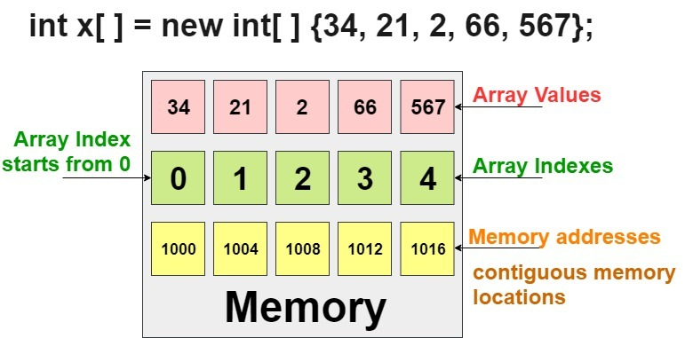
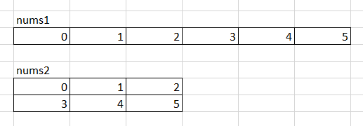
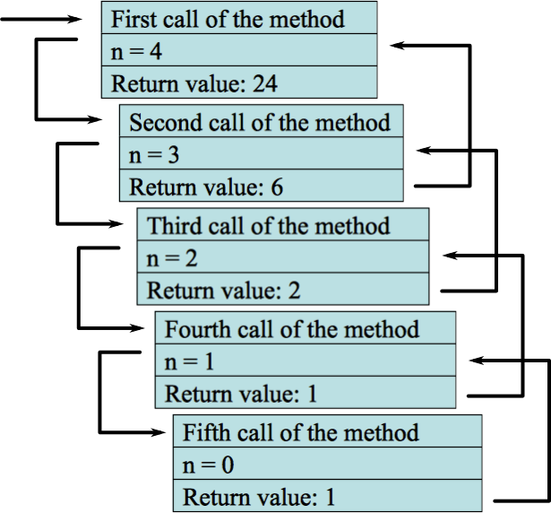

## Условные операторы
Условные операторы позволяют направить работу программы по одному из путей в зависимости от определенных условий.

В языке *Java* используются следующие условные операторы: 

* `if/else`
* `switch/case`

### Оператор __if__
Оператор `if` проверяет истинность некоторого условия и в зависимости от результатов проверки выполняет определенный код.
После ключевого слова `if` ставится *условие*. И если это условие выполняется, то срабатывает код, который помещен в далее в блоке `if` после фигурных скобок: 
```java
int num1 = 10;
int num2 = 4;
if (num1 > num2) {
    System.out.println("Первое число больше второго");
}
```

Например, в данном случае первое число больше второго, то выражение `num1 > num2` истинно и возвращает значение `true`. Следовательно, управление переходит в блок кода после фигурных скобок и начинает выполнять содержащиеся там инструкции, а конкретно метод `System.out.println("Первое число больше второго")`;. Если бы первое число оказалось бы меньше второго или равно ему, то инструкции в блоке `if` не выполнялись бы вообще.

### Оператор __if/else__
Оператор `if/else` проверяет истинность некоторого условия и в зависимости от результатов проверки выполняет либо один блок кода, либо другой блок кода. В этом случае можно добавить блок `else`:
```java
int num1 = 6;
int num2 = 4;
if (num1 > num2) {
    System.out.println("Первое число больше второго");
}
else {
    System.out.println("Первое число меньше второго");
}
```

При сравнении чисел мы можем насчитать три состояния: первое число больше второго, первое число меньше второго и числа равны. Дополнительные условия можно обрабатывать при помощи вложенных операторов `if/else`:
```java
int num1 = 6;
int num2 = 8;
if (num1 > num2) {
    System.out.println("Первое число больше второго");
}
else if(num1 < num2) {
    System.out.println("Первое число меньше второго");
}
else {
    System.out.println("Числа равны");
}
```

Данный код эквивалентен следующему коду:
```java
int num1 = 6;
int num2 = 8;
if (num1 > num2) {
    System.out.println("Первое число больше второго");
}
else {
    if(num1 < num2) {
        System.out.println("Первое число меньше второго");
    }
    else {
        System.out.println("Числа равны");
    }
}
```

Используя логические операторы, можно соединить несколько условий:
```java
int num1 = 8;
int num2 = 6;
if (num1 > num2 && num1 > 7) {
    System.out.println("Первое число больше второго и больше 7");
}
```

Здесь блок `if` будет выполняться, если `num1 > num2` равно `true` и одновременно `num1 > 7` равно `true`.

### Оператор __switch/case__
Оператор `switch/case` аналогичен оператору `if/else`, так как позволяет обработать сразу несколько условий. 
После ключевого слова `switch` в скобках идет сравниваемое выражение. Значение этого выражения последовательно сравнивается со значениями, помещенными после операторов `сase`. И если совпадение найдено, то будет выполняет соответствующий блок `сase`.
В конце блока сase ставится оператор break, чтобы избежать выполнения других блоков.

```java
int num = 8;
switch (num) {       
    case 1: 
        System.out.println("число равно 1");
        break;
    case 8: 
        System.out.println("число равно 8");
        num++;
        break;
    case 9: 
        System.out.println("число равно 9");
        break;
    default:
        System.out.println("число не равно 1, 8, 9");
}
```

Если убрать оператор `break` в следующем случае, то выполнится блок `case 8`, (поскольку переменная `num` равна `8`). Но так как в этом блоке оператор `break` отсутствует, то также начнёт выполняться блок `case 9`.
```java
case 8: 
    System.out.println("число равно 8");
    num++;
case 9: 
    System.out.println("число равно 9");
    break;
```

Если мы хотим также обработать ситуацию, когда совпадения не будет найдено, то можно добавить блок `default`. Блок `default` необязателен.

Можно определить одно действие сразу для нескольких блоков case подряд:
```java
int num = 3;
int output = 0;
switch (num) {
    case 1: 
        output = 3;
        break;
    case 2: 
    case 3: 
    case 4: 
        output = 6;
        break;
    case 5: 
        output = 12;
        break;
    default:
        output = 24;
}
System.out.println(output);
```

## Циклы
Еще одним видом управляющих конструкций являются циклы. Циклы позволяют в зависимости от определенных условий выполнять определенное действие множество раз. В языке *Java* есть следующие виды циклов:

* `for`
* `while`
* `do...while`

### Цикл __for__
Цикл `for` имеет следующее формальное определение:
``` java
for ([инициализация счетчика]; [условие]; [изменение счетчика])
{
    // действия
}
```

Рассмотрим стандартный цикл for:
```java
for (int i = 1; i < 9; i++) {
    System.out.printf("Квадрат числа %d равен %d \n", i, i * i);
}
```

Первая часть объявления цикла - `int i = 1` создает и инициализирует счетчик `i`. Счетчик необязательно должен представлять тип `int`. Это может быть и любой другой числовой тип, например, `float`. Перед выполнением цикла значение счетчика будет равно 1. В данном случае это то же самое, что и объявление переменной.

Вторая часть - условие, при котором будет выполняться цикл. В данном случае цикл будет выполняться, пока `i` не достигнет 9.

И третья часть - изменение переменной-счётчика. Например, приращение счетчика на единицу. Опять же нам необязательно увеличивать на единицу. Можно уменьшать: `i--`.

В итоге блок цикла сработает 8 раз, пока значение `i` не станет равным 9. И каждый раз это значение будет увеличиваться на 1.

Все 3 части при объявлении цикла `for` являются *необязательными*. Например, можно написать так:
```java
int i = 1;
for (;;) {
    System.out.printf("Квадрат числа %d равен %d \n", i, i * i);
}
```
Определение цикла осталось тем же, только теперь блоки в определении у нас пустые: `for (;;)`. Теперь нет инициализированной переменной-счетчика, нет условия, поэтому цикл будет работать вечно - бесконечный цикл.

Либо можно опустить ряд блоков:
```java
int i = 1;
for (;i<9;) {
    System.out.printf("Квадрат числа %d равен %d \n", i, i * i);
    i++;
}
```
Этот пример эквивалентен первому примеру: у нас также есть счетчик, только создан он вне цикла. У нас есть условие выполнения цикла. И есть приращение счетчика уже в самом блоке `for`.

Цикл `for` может определять сразу несколько переменных и управлять ими:
```java
int n = 10;
for(int i=0, j = n - 1; i < j; i++, j--){
             
    System.out.println(i * j);
}
```

### Цикл __do__
Цикл `do` сначала выполняет код цикла, а потом проверяет условие в инструкции `while`. И пока это условие истинно, цикл повторяется.
```java
do
{
    // действия
}
while ([условие])
```

Например:
```java
int j = 7;
do {
    System.out.println(j);
    j--;
}
while (j > 0);
```

В данном случае код цикла сработает 7 раз, пока `j` не окажется равным нулю. Важно отметить, что цикл `do` **гарантирует** хотя бы **однократное** выполнение действий, даже если условие в инструкции `while` не будет истинно. Так, мы можем написать:
```java
int j = -1;
do{
    System.out.println(j);
    j--;
}
while (j > 0);
```

Хотя переменная `j` изначально меньше 0, цикл все равно один раз выполнится.

### Цикл __while__
Цикл `while` **сразу** проверяет истинность некоторого условия, и если условие истинно, то код цикла выполняется:
```java
while ([условие]) {
    // действия
}

Например:
```java
int j = 6;
while (j > 0){
 
    System.out.println(j);
    j--;
}
```

### Операторы __continue__ и __break__
Оператор `break` позволяет выйти из цикла **в любой его момент**, даже если цикл не закончил свою работу:

Например:
```java
for (int i = 0; i < 10; i++){
    if (i == 5)
        break;
    System.out.println(i);
}
```

Когда счетчик станет равным 5, сработает оператор `break`, и цикл завершится.

Оператор `continue` используется, если надо не завершать цикл, а просто перейти к следующей итерации:
```java
for (int i = 0; i < 10; i++){
    if (i == 5)
        continue;
    System.out.println(i);
}
```

В этом случае, когда выполнение цикла дойдет до числа 5, программа просто пропустит это число и перейдет к следующему.

## Массивы
Массив представляет набор однотипных значений. Объявление массива похоже на объявление обычной переменной, которая хранит одиночное значение, причем есть два способа объявления массива:
```java
тип_данных название_массива[];
// либо
тип_данных[] название_массива;
```

Например, определим массив чисел:
```java
int nums[];
int[] nums2;
```

*Java* поддерживает оба варианта синтаксиса, но рекомендуемый способ написания - `type[] name`. Так как скобки написаны рядом с типом, гораздо быстрее происходит понимание, что тип - массив, в противном случае приходится искать их уже у названия переменной.

После объявления массива мы можем инициализовать его:
```java
int[] nums;
nums = new int[4];  // массив из 4 чисел
```

Создание массива производится с помощью следующей конструкции: `new тип_данных[количество_элементов]`, где `new` - ключевое слово, *выделяющее память* для указанного в скобках количества элементов. Например, `nums = new int[4];` - в этом выражении создается массив из четырех элементов `int`, и каждый элемент будет иметь значение по умолчанию - число 0.

Массивы являются **ссылочными типами**, поэтому требуют выделения памяти в куче при помощи оператора `new`. Массивы являются объектами (пусть и специального рода).

Также можно сразу при объявлении массива инициализировать его:
```java
int nums[] = new int[4];    // массив из 4 чисел
int[] nums2 = new int[5];   // массив из 5 чисел
```

При подобной инициализации все элементы массива имеют значение по умолчанию. Для числовых типов (в том числе для типа `char`) это число 0, для типа `boolean` это значение `false`, а для остальных объектов это значение `null`. Например, для типа `int` значением по умолчанию является число 0, поэтому выше определенный массив `nums` будет состоять из четырех нулей.

Однако также можно задать конкретные значения для элементов массива при его создании:
```java
// эти два способа равноценны
int[] nums = new int[] { 1, 2, 3, 5 };
int[] nums2 = { 1, 2, 3, 5 };
```

Стоит отметить, что в этом случае в квадратных скобках не указывается размер массива, так как он вычисляется по количеству элементов в фигурных скобках.

После создания массива мы можем обратиться к любому его элементу по индексу, который передается в квадратных скобках после названия переменной массива:
```java
int[] nums = new int[4];
// устанавливаем значения элементов массива
nums[0] = 1;
nums[1] = 2;
nums[2] = 4;
nums[3] = 100;
         
// получаем значение третьего элемента массива
System.out.println(nums[2]);    // 4
```

Индексация элементов массива начинается с 0, поэтому в данном случае, чтобы обратиться к четвертому элементу в массиве, нам надо использовать выражение `nums[3]`.

И так как у нас массив определен только для 4 элементов, то мы не можем обратиться, например, к шестому элементу: `nums[5] = 5;`. Если мы так попытаемся сделать, то мы получим ошибку.



*Рисунок 1. Устройство массивов в памяти*

Обратите внимание, что элементы расположены в памяти *последовательно*, индексы начинаются с нуля. В памяти ссылка на массив всегда указывает на первый элемент массива, а индекс `n` означает смещение на `n` размеров элементов массива. 

Например, если задан массив типа `int[] a` и индекс `n`, то `a[0]` будет указывать на адрес начала массива `a`, так как происходит 0 смещений. Выражение `a[3]` помогает получить значение ячейки памяти, смещенной на $3 * size_{int} = 3*4 = 12$ байт от начала массива. 

Собственно, так как индекс - это смещение, массивы и считаются с нуля, а обращение по тому индексу, которого нет в массиве, равносильно попытке обратиться к ячейке памяти, недоступной массиву(и не являющейся его частью), что приводит к ошибке.

### Длина массива
Важнейшее свойство, которым обладают массивы, является свойство `length`, возвращающее длину массива, то есть количество его элементов:
```java
int[] nums = {1, 2, 3, 4, 5};
int length = nums.length;   // 5
```

Нередко бывает неизвестным последний индекс, и чтобы получить последний элемент массива, мы можем использовать это свойство:
```java
int last = nums[nums.length-1];
```

### Многомерные массивы
Ранее мы рассматривали одномерные массивы, которые можно представить как цепочку или строку однотипных значений. Но кроме одномерных массивов также бывают и многомерными. Наиболее известный многомерный массив - таблица, представляющая двухмерный массив:
```java
int[] nums1 = new int[] { 0, 1, 2, 3, 4, 5 };
 
int[][] nums2 = { { 0, 1, 2 }, { 3, 4, 5 } };
```

Визуально оба массива можно представить следующим образом:



*Рисунок 2. Одномерные и многомерные массивы*

Проще говоря, многомерный массив - это массив, состоящий из массивов. Каждый элемент массива (хранящийся в куче) хранит ссылку на свой внутренний массив (также хранящийся в куче).

Поскольку массив `nums2` двухмерный, он представляет собой простую таблицу. Его также можно было создать следующим образом: `int[][] nums2 = new int[2][3];`. Количество квадратных скобок указывает на размерность массива. А числа в скобках - на количество строк и столбцов. И также, используя индексы, мы можем использовать элементы массива в программе:
```java
// установим элемент первого столбца второй строки
nums2[1][0] = 44;
System.out.println(nums2[1][0]);
```

Объявление трехмерного массива могло бы выглядеть так:
```java
int[][][] nums3 = new int[2][3][4];
```

### Массив "лесенкой"
Многомерные массивы могут быть также представлены как *"зубчатые массивы"* или *"массивы лесенкой"*. В вышеприведенном примере двухмерный массив имел 3 строчки и три столбца, поэтому у нас получалась ровная таблица. Но мы можем каждому элементу в двухмерном массиве присвоить отдельный массив с различным количеством элементов:
```java
int[][] nums = new int[3][];
nums[0] = new int[2];
nums[1] = new int[3];
nums[2] = new int[5];
```


## Методы(функции)
Если переменные и константы хранят некоторые значения, то методы содержат собой набор операторов, которые выполняют определенные действия.

В других языках методы могут также называться функциями и процедурами, но общепринятое название в *Java* - методы.

Общее определение методов выглядит следующим образом:
```java
[модификаторы] тип_возвращаемого_значения название_метода ([параметры]) {
    // тело метода
}
```
Модификаторы и параметры ***необязательны***.

По умолчанию главный класс любой программы на Java содержит метод main, который служит точкой входа в программу:
```java
public static void main(String[] args) {
    System.out.println("привет мир!");
}
```

Ключевые слова `public` и `static` являются модификаторами. Далее идет тип возвращаемого значения. Ключевое слово `void` указывает на то, что метод ничего не возвращает.

Затем идут название метода - `main` и в скобках параметры метода - `String[] args`. И в фигурные скобки заключено тело метода - все действия, которые он выполняет.

Создадим еще несколько методов:
```java
public class Program {
    public static void main (String args[]) {
        // метод Main
    }
    
    void hello() {
        System.out.println("Hello");
    }

    void welcome() {
        System.out.println("Welcome to Java 10");
    }
}
```

Здесь определены два дополнительных метода: `hello` и `welcome`, каждый из которых выводит некоторую строку на консоль. Методы определяются внутри класса - в данном случае внутри класса `Program`, в котором определен метод `main`.

Но если мы скомпилируем и запустим данную программу, то мы ничего не увидим на консоли. В примере выше мы определили два метода, но мы их нигде не вызываем. По умолчанию в программе Java выполняется только метод `main` и все его содержимое. Поэтому, если мы хотим, чтобы другие методы тоже выполнялись, их надо вызвать в методе `main`.

Вызов метода осуществляется в форме:
```java
имя_метода(аргументы);
```

После имени метода указываются скобки, в которых перечисляются аргументы - значения для параметров метода.

Например, определим и выполним несколько методов:
```java
public class Program {
    public static void main (String args[]) {
        hello();
        welcome();
        welcome();
    }

    static void hello() {     
        System.out.println("Hello");
    }

    static void welcome() {     
        System.out.println("Welcome to Java 17");
    }
}
```
В методе `main` вызывается один раз метод `hello` и два раза метод `welcome`. В этом и заключается одно из преимуществ методов: мы можем вынести некоторые общие действия в отдельный метод и затем вызывать многократно их в различных местах программы. Поскольку оба метода не имеют никаких параметров, то после их названия при вызове ставятся пустые скобки.

Также следует отметить, что чтобы вызвать в методе `main` другие методы, которые определены в одном классе с методом `main`, они должны иметь модификатор `static`.

Модификатор `static` относит методы к контексту класса и не требует создания объекта для вызова метода. Методы, которые не помечены модификатором `static`, требует создания объекта для их вызова.

В итоге после компиляции и выполнения программы мы увидим на консоли:
```
Hello
Welcome to Java 17
Welcome to Java 17
```

### Параметры методов
С помощью параметров мы можем передать в методы различные данные, которые будут использоваться для вычислений. Например:
```java
static void sum(int x, int y) {         
    int z = x + y;
    System.out.println(z);
}
```
Данная функция принимает два параметра - два числа, складывает их и выводит их сумму на консоль.

А при вызове этого метода в программе нам необходимо передать на место параметров значения, которые соответствуют типу параметра:
```java
public class Program {
    public static void main (String args[]) {
        int a = 6;
        int b = 8;
        sum(a, b);  // 14
        sum(3, a);  // 9
        sum(5, 23); // 28
    }

    static void sum(int x, int y) {
        int z = x + y;
        System.out.println(z);
    }
}
```
Поскольку метод `sum` принимает два значения типа `int`, то на место параметров надо передать два значения типа `int`. Это могут быть и числовые литералы, и переменные типов данных, которые представляют тип `int` или могут быть автоматически преобразованы в тип `int`. Значения, которые передаются на место параметров, еще называются **аргументами**. Значения передаются параметрам по позиции, то есть первый аргумент первому параметру, второй аргумент - второму параметру и так далее.

Рассмотрим другой пример:
```java
public class Program {
    public static void main (String args[]) {
        display("Tom", 34);
        display("Bob", 28);
        display("Sam", 23);
    }
    static void display(String name, int age) {
        System.out.println(name);
        System.out.println(age);
    }
}
```
Метод `display` принимает два параметра. Первый параметр представляет тип `String`, а второй - тип `int`. Поэтому при вызове метода вначале в него надо передать строку, а затем число.

Метод может принимать параметры переменной длины одного типа. Например, нам надо передать в метод набор числел и вычислить их сумму, но мы точно не знаем, сколько именно чисел будет передано - 3, 4, 5 или больше. Параметры переменной длины позволяют решить эту задачу:
```java
public class Program {
    public static void main (String args[]) { 
        sum(1, 2, 3);           // 6
        sum(1, 2, 3, 4, 5);     // 15
        sum();                  // 0
    }

    static void sum(int ...nums) {
        int result =0;
        for (int n: nums) {
            result += n;
        }
        System.out.println(result);
    }
}
```
Троеточие перед названием параметра `int ...nums` указывает на то, что он будет необязательным и будет представлять массив. Мы можем передать в метод `sum` одно число, несколько чисел, а можем вообще не передавать никаких параметров. Причем, если мы хотим передать несколько параметров, то необязательный параметр должен указываться в конце:
```java
public static void main(String[] args) {
         
    sum("Welcome!", 20,10);
    sum("Hello World!");
}
static void sum(String message, int ...nums) {  
    System.out.println(message);   
    int result =0;
    for (int x:nums) {
        result+=x;
    }
    System.out.println(result);
}
```

### Возврат значения из метода
Методы могут возвращать некоторое значение. Для этого применяется оператор `return`:
```java
return возвращаемое_значение;
```

После оператора `return` указывается возвращаемое значение, которое является результатом метода. Это может быть литеральное значение, значение переменной или какого-то сложного выражения.

Например:
```java
public class Program {
    public static void main (String args[]) {
        int x = sum(1, 2, 3);
        int y = sum(1, 4, 9);
        System.out.println(x);  // 6
        System.out.println(y);  // 14
    }

    static int sum(int a, int b, int c) {
        return a + b + c;
    }
}
```
В методе в качестве типа возвращаемого значения вместо `void` используется любой другой тип. В данном случае метод sum возвращает значение типа `int`, поэтому этот тип указывается перед названием метода. Причем если в качестве возвращаемого типа для метода определен любой другой, отличный от `void`, то метод **обязательно** должен использовать оператор `return` для возвращения значения.

При этом возвращаемое значение всегда должно иметь тот же тип, что значится в определении функции. И если функция возвращает значение типа `int`, то после оператора `return` стоит целочисленное значение, которое является объектом типа `int`. Как в данном случае это сумма значений параметров метода.

Метод может использовать несколько вызовов оператора `return` для возваращения разных значений в зависимости от некоторых условий:
```java
public class Program {
    public static void main (String args[]) {
        System.out.println(daytime(7));     // Good morning
        System.out.println(daytime(13));    // Good after noon
        System.out.println(daytime(18));    // Good evening
        System.out.println(daytime(2));     // Good night
    }

    static String daytime(int hour) {
        if (hour > 24 || hour < 0)
            return "Invalid data";
        else if (hour > 21 || hour < 6)
            return "Good night";
        else if (hour >= 15)
            return "Good evening";
        else if (hour >= 11)
            return "Good after noon";
        else
            return "Good morning";
    }
}
```
Здесь метод `daytime` возвращает значение типа `String`, то есть строку, и в зависимости от значения параметра `hour` возвращаемая строка будет различаться.

### Выход из метода
Оператор `return` применяется не только для возвращаения значения из метода, но и для выхода из метода. В подобном качестве оператор `return` применяется в методах, которые ничего не возвращают, то есть имеют тип `void`:
```java
public class Program {
    public static void main (String args[]) {
        daytime(7);     // Good morning
        daytime(13);    // Good after noon
        daytime(32);    // 
        daytime(56);    // 
        daytime(2);     // Good night
    }

    static void daytime(int hour) {    
        if (hour > 24 || hour < 0)
            return;
        if (hour > 21 || hour < 6)
            System.out.println("Good night");
        else if (hour >= 15)
            System.out.println("Good evening");
        else if (hour >= 11)
            System.out.println("Good after noon");
        else
            System.out.println("Good morning");
    }
}
```
Если переданное в метод `datetime` значение больше 24 или меньше 0, то просто выходим из метода. Возвращаемое значение после `return` указывать в этом случае не нужно.

### Перегрузка методов
В программе мы можем использовать методы с одним и тем же именем, но с разными типами и/или количеством параметров. Такой механизм называется **перегрузкой методов** (*method overloading*).

Например:
```java
public class Program {
    public static void main(String[] args) {
        System.out.println(sum(2, 3));          // 5
        System.out.println(sum(4.5, 3.2));      // 7.7
        System.out.println(sum(4, 3, 7));       // 14
    }

    // Суммируем целые числа
    static int sum(int x, int y) {         
        return x + y;
    }

    // Суммируем вещественные числа
    static double sum(double x, double y) {     
        return x + y;
    }

    // Суммируем 3 числа
    static int sum(int x, int y, int z) {
        return x + y + z;
    }
}
```

Здесь определено три варианта или три перегрузки метода `sum()`, но при его вызове в зависимости от типа и количества передаваемых параметров система выберет именно ту версию, которая наиболее подходит.

Стоит отметить, что на перегрузку методов влияют *количество и типы параметров*. Однако различие в типе возвращаемого значения для перегрузки *не имеют никакого значения*. Например, в следующем случае методы различаются по типу возвращаемого значения:
```java
public class Program {      
    public static void main(String[] args) {
        System.out.println(sum(2, 3));
        System.out.println(sum(4, 3));
    }

    static int sum(int x, int y) {         
        return x + y;
    }

    static double sum(int x, int y) {         
        return x + y;
    }
}
```

Однако перегрузкой это не будет считаться. Более того такая программа некорректна и попросту не скомилируется, так как метод с одним и тем же количеством и типом параметров определен несколько раз.

## Рекурсия
Отдельно рассмотрим рекурсивные функции. Главное отличие рекурсивных функций от обычных методов состоит в том, что они рекурсивная функция может вызывать саму себя - напрямую или косвенно.

Например, рассмотрим функцию, которая вычисляет факториал числа:
```java
static int factorial(int x) {
    if (x == 1){
        return 1;
    }

    return x * factorial(x - 1);
}
```

Вначале проверяется условие: если вводимое число не равно 1, то мы умножаем данное число на результат этой же функции, в которую в качестве параметра передается число `x-1`. То есть происходит рекурсивный спуск. И так дальше, пока не дойдем того момента, когда значение параметра не будет равно единице.

Рекурсивная функция *обязательно* должна иметь некоторый базовый вариант, который использует оператор `return` и который помещается в начале функции. В случае с факториалом это `if (x == 1) return 1;`. И все рекурсивные вызовы должны обращаться к подфункциям, которые в конечном счете сходятся к базовому варианту. Так, при передаче в функцию положительного числа при дальнейших рекурсивных вызовах подфункций в них будет передаваться каждый раз число, меньшее на единицу. И в конце концов мы дойдем до ситуации, когда число будет равно 1, и будет использован базовый вариант.

Хотя в данном случае нужно отметить, что для определения факториала есть более оптимальные решения на основе циклов:
```java
static int factorial(int x){
    int result=1;
    for (int i = 1; i <= x; i++) {
        result *= i;
    }
    return  result;
}
```

При использовании рекурсии важно также понимать механизм её работы. При вызове функции в стеке вызовов (*Call stack*) создается новый **StackFrame**, который содержит в себе информацию о вызванной функции, её аргументы, содержит локальные переменные и так далее. Созданный StackFrame добавляется в стек вызовов. При выходе из функции он удаляется из стека вызовов. Этот механизм работает по принципу LIFO. Пример стека вызовов показан на рисунке ниже.



*Рисунок 2. Стек вызовов*

Так как рекурсия это вызов метода - при каждом новом рекурсивном вызове информация о методе, переданных аргументах и так далее - также помещается в стек вызовов. Базовый случай позволяет остановить процесс добавления новых стек-фреймов в стек вызовов и вернуться обратно.

К сожалению, оперативная память не бесконечная, а стек вызовов и того меньше, поэтому при наличии слишком большого числа рекурсивных вызовов может произойти **переполнение стека** (Ошибка **`StackOverflowError`**). При этом программа более не способна будет работать и завершится аварийно. 

Некоторые алгоритмы гораздо проще записать с помощью рекурсии, а некоторые - гораздо лучше решить с помощью цикла. Любой алгоритм, который реализован с помощью цикла, можно реализовать с помощью рекурсии, и наоборот. 
В качестве техники, которая часто применяется для упрощения и повышения эффективности работы рекурсии, используется *мемоизация* значений.