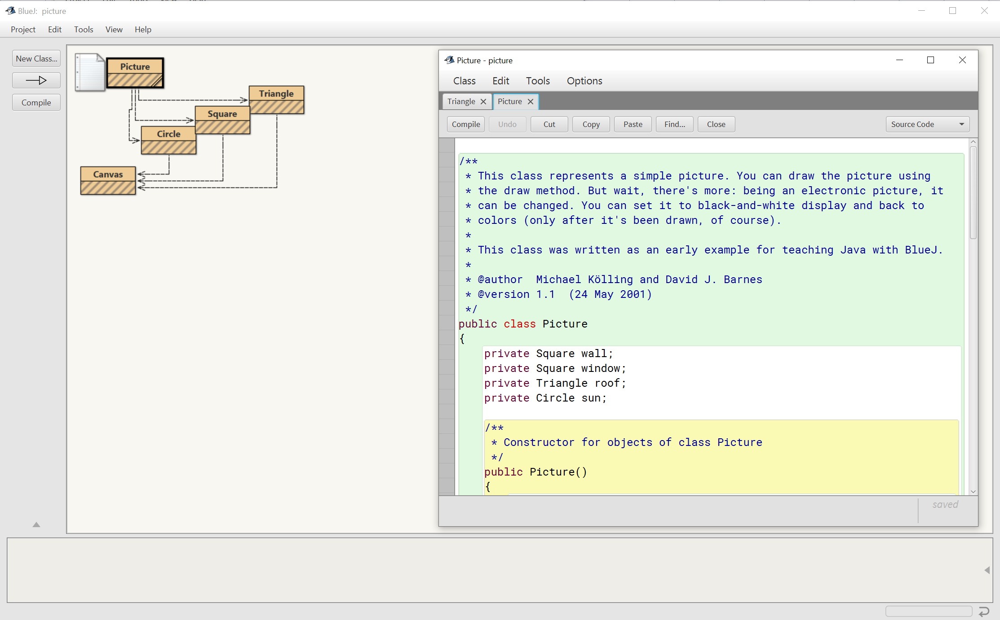
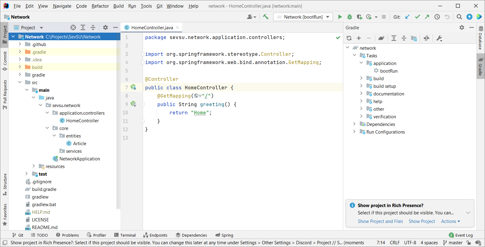

## О языке Java
На сегодняшний момент язык *Java* является одним из самых распространенных и популярных языков программирования.

Первая версия языка была разработана еще в 1996 году в недрах компании Sun Microsystems, впоследствии поглощенной компанией Oracle. *Java* задумывался как универсальный язык программирования, который можно применять для различного рода задач. 

Текущей версией является **Java 16**, которая вышла в марте 2021 года, а наиболее поддерживаемой сейчас - **Java 11**. 

*Java* превратилась из просто универсального языка в целую платформу и экосистему, которая объединяет различные технологии, используемые для целого ряда задач: от создания десктопных приложений до написания крупных веб-порталов и сервисов. Кроме того, экосистема *Java* активно применяется для создания программного обеспечения для множества устройств: обычных ПК, планшетов, смартфонов и мобильных телефонов и даже бытовой техники. Достаточно вспомнить популярность мобильной ОС *Android*, большинство программ для которой пишутся именно на языках экосистемы *Java*.

## Особенности и архитектура Java
Ключевой особенностью языка *Java* является то, что его код сначала компилируется в специальный байт-код, независимый от платформы. А затем этот байт-код выполняется виртуальной машиной *JVM* (*Java Virtual Machine*) (он может как интерпретироваться,так и [компилироваться](https://habr.com/ru/post/536288/)). 

В этом плане *Java* отличается от стандартных интерпретируемых языков как *Python* или *Ruby*, код которых сразу же выполняется интерпретатором. В то же время *Java* не является чисто компилируемым языком, как *С/C++* или *Pascal*.

*Рисунок 1. Архитектура и принцип работы Java*

Подобная архитектура обеспечивает кроссплатформенность и аппаратную переносимость программ на *Java*, благодаря чему подобные программы **без перекомпиляции** могут выполняться на различных платформах - *Windows*, *Linux*, *Mac OS* и др. Для каждой из платформ должна быть своя реализация виртуальной машины *JVM*, но каждая из этих реализаций может выполнять один и тот же код.

*Java* является языком с *C*-подобным синтаксисом и близок в этом отношении к *C/C++*, *C#* и *D*. Поэтому, если вы знакомы с одним из этих языков, то овладеть *Java* будет легче.

Еще одной ключевой особенностью *Java* является то, что она поддерживает автоматическую сборку мусора. А это значит, что вам не надо освобождать вручную память от ранее использовавшихся объектов, как в С++, так как сборщик мусора это сделает автоматически за вас.

*Рисунок 2. Архитектура JVM*

Java является **объектно-ориентированным языком**. Он поддерживает *полиморфизм*, *наследование*, *статическую типизацию*. Объектно-ориентированный подход позволяет решить задачи по построению крупных, но в тоже время гибких, масштабируемых и расширяемых приложений.

## JDK. Oracle JDK и OpenJDK
Для работы *Java* недостаточно одной лишь *JVM*. Также требуется общая библиотека классов и другие вспомогательные инструменты. Распространяемый комплект, позволяющий запустить любое *Java* приложение, называется *Java Runtime Environment* или *JRE*. Он содержит в себе *JVM* и дополнительные инструменты.

Для разработки на языке программирования *Java* потребуется специальный комплект инструментов, который называется *Java Development Kit* или *JDK*. Этот комплект инструментов включают в себя компилятор, отладчик, *JRE*, документацию и другие инструменты. 

Стоит отметить, что существуют разные реализации *JDK*, хотя все они используют один и тот же язык - *Java*. Две наиболее популярных реализации - *Oracle JDK* и дистрибутивы *OpenJDK*.

*Oracle JDK* всецело развивается компанией *Oracle*. *OpenJDK* же развивается *Oracle* и рядом других крупных и не очень компаний.

Наибольшие различия с точки зрения лицензирования. *OpenJDK* полностью бесплатна для любых сценариев использования, а *Oracle JDK* бесплатна для персональных нужд, а для коммерческих целей и поддержки потребуется приобрести лицензию.
В плане функционала, набора возможностей Oracle JDK и OpenJDK практически не должны отличаться.

Наиболее распространнеными дистрибутивами *OpenJDK* являются [AdoptOpenJDK](https://adoptopenjdk.net/) и [LibericaJDK](https://libericajdk.ru/).

## Среда разработки BlueJ
Для разработки на *Java* достаточно любого текстового редактора(*Notepad*, *Vim*, *Visual Studio Code* и т.д.) и компилятора `javac` из комплекта *JDK*.

В реальности, как правило, крупные программы разрабатываются не при помощи простого текстового редактора, а с использованием таких средств как **IDE** или интегрированные среды разработки, которые упрощают и ускоряют написание кода и создание приложений.

Для новичков может быть рекомендована среда разработки **BlueJ**, которая имеет простой интерфейс и прекрасно подходит для обучения.

*Рисунок 3. Среда BlueJ*

## Среда разработки IntelliJ IDEA
Самой популярной средой разработки для *Java* является **IntelliJ IDEA** от компании *JetBrains* (по ряду опросов на момент середины 2021 ею пользовалось до 70% разработчиков на Java).

*Рисунок 4. Среда IntelliJ IDEA*

Скачать данную среду можно с [официального сайта](https://www.jetbrains.com/idea/download). По этому адресу можно найти установочые образы для Windows, MacOS, Linux. Кроме того, сама среда доступна в двух версиях - *Ultimate* (платная с триальным бесплатным периодом) и *Community* (бесплатная). Для обучения рекомендуется бесплатная версия *Community*.

## Gradle
Ручная сборка или ручное управление зависимостями это хорошо, но не эффективно. Разработчики - очень ленивые люди и не хотят писать заново то, что кто-то уже написал для своего проекта. Для решения подобных проблем появились в свет системы сборки проектов, которые автоматизируют этот процесс. Кроме того, позволяют с одной стороны собрать Вам проект так, как Вы этого хотите, с другой стороны предоставляют вам более менее стандартизированные средства.

В экосистеме *Java* представлено 3 распространненных системы сборки - *Ant*, *Maven* и *Gradle*. 

Альтернативой Gradle является система автоматической сборки Maven. Эти две системы сборки с одной стороны разные, а с другой стороны имеют и ряд сходств. На эту тему на сайте [Gradle](https://gradle.org/) есть [материалы](https://docs.gradle.org/current/userguide/migrating_from_maven.html). 

Как сказано в этом руководстве, *Gradle* и *Maven* имеют разницу во взгляде на то, как собирать проект. *Gradle* основан на графе задач (`task`), которые могут зависеть друг от друга. Задачи выполняют какую-то работу. Maven же использует модель определённых фаз (`phase`), к которым присоединяются определённые "*цели*" (`goals`). В этих `goals` и выполняется какая-то работа. Однако, при таких разных подходах обе системы сборки следуют одному соглашению и управление зависимостями происходит схоже.

Чтобы начать использовать *Gradle* необходимо его скачать с сайта, либо использовать *IntelliJ IDEA*, которая скачает его автоматически при создании/клонировании проекта.