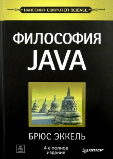
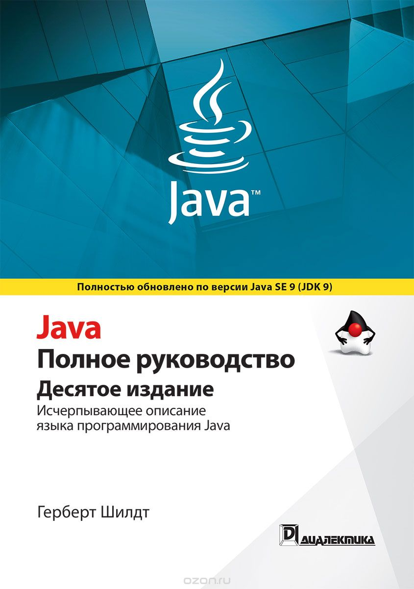
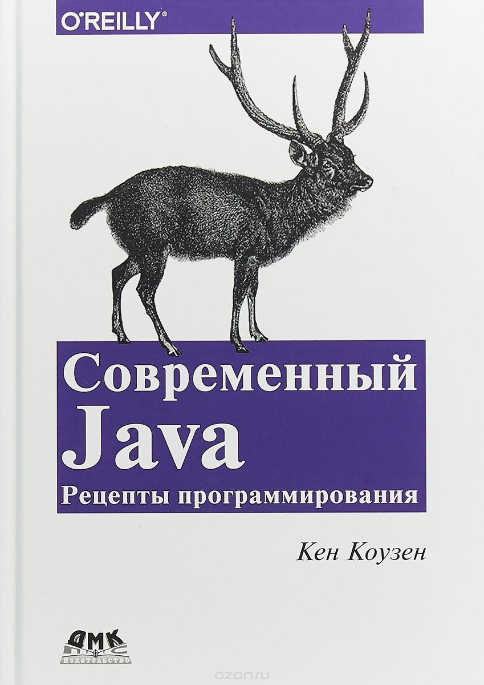

# Книги и ресурсы

## Книги

### __Философия Java__ | Брюс Эккель

Впервые читатель может познакомиться с полной версией этого классического труда, который ранее на русском языке печатался в сокращении. Книга, выдержавшая в оригинале не одно переиздание, за глубокое и поистине философское изложение тонкостей языка Java считается одним из лучших пособий для программистов. Чтобы по-настоящему понять язык Java, необходимо рассматривать его не просто как набор неких команд и операторов, а понять его "философию", подход к решению задач, в сравнении с таковыми в других языках программирования. На этих страницах автор рассказывает об основных проблемах написания кода: в чем их природа и какой подход использует Java в их разрешении. Поэтому обсуждаемые в каждой главе черты языка неразрывно связаны с тем, как они используются для решения определенных задач.

[Ссылка](https://www.labirint.ru/books/464095/)

### __Java. Полное руководство__ | Шилдт Герберт

В этом десятом издании справочного пособия, полностью обновленном с учетом последней версии Java SE 9, поясняется, как разрабатывать, компилировать, отлаживать и выполнять программы на языке программирования Java. Это пособие составлено Гербертом Шилдтом, автором популярных во всем мире книг по языкам программирования, таким образом, чтобы охватить все языковые средства Java, включая синтаксис, ключевые слова, основные принципы объектно-ориентированного программирования, значительную часть прикладного интерфейса Java API, библиотеки классов, аплеты и сервлеты, компоненты JavaBeans, библиотеки AWT и Swing, а также продемонстрировать их применение на простых и наглядных примерах. Не обойдены вниманием и новые средства, появившиеся в версии Java SE 9, в том числе модули и утилита JShell.

[Ссылка](https://www.ozon.ru/product/java-polnoe-rukovodstvo-145826480/?sh=-mZn7qPS)

### __Современный Java. Рецепты программирования__ | Коузен Кен

Включение средств функционального программирования в Java SE 8 ознаменовало революционное изменение достопочтенного объектно-ориентированного языка. Лямбда-выражения, ссылки на методы и потоки принципиально изменили идиомы языка. С тех пор многие разработчики стараются не отстать от жизни. И в этом поможет настоящий сборник рецептов. На примере более 70 подробных рецептов Кен Коузен демонстрирует использование новых возможностей языка для решения широкого круга задач.

[Ссылка](https://www.ozon.ru/product/sovremennyy-java-retsepty-programmirovaniya-145346364/?sh=GOtc27ak)

## Ресурсы
1. [StackOverflow](https://stackoverflow.com/questions/tagged/java) - сайт с вопросами и ответами по программированию. Тут есть всё.
2. [Metanit](https://metanit.com/java/) - Руководство по Java
3. [JavaRush](https://javarush.ru/) - Обучение Java в игровой форме