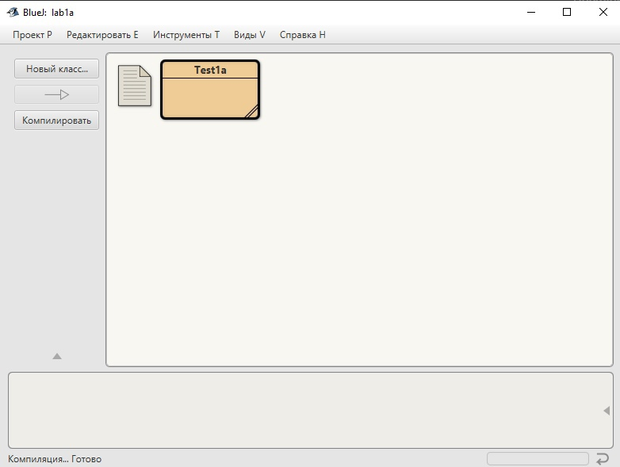
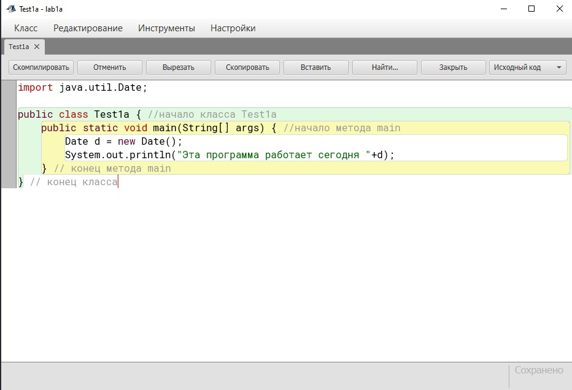
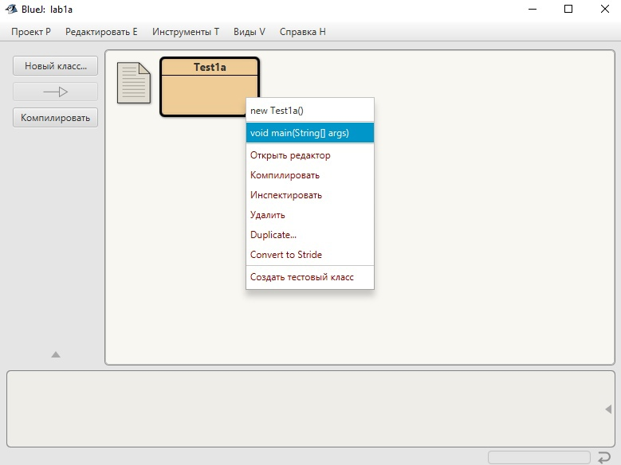
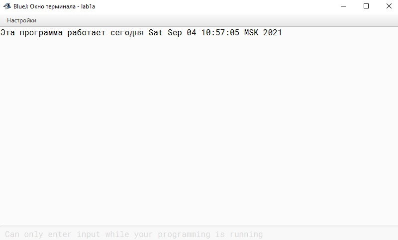

### Цель работы
Освоить основы применения *BlueJ* – подготовку текста программы, компиляцию программы, исправление ошибок и просмотр результатов. 

### Постановка задачи
Разработать простейшую линейную программу, согласно варианту задания, научиться запускать программу и контролировать выводимый текст (результат работы программы). 

### Краткие теоретические сведения
Составление программы – процесс, направленный на то, чтобы заставить компьютер выполнить определенную работу. Указание компьютеру должно быть представлено как последовательность инструкций (план, программа). Проверка того, что данный набор инструкций выполняется правильно, состоит в сравнении желаемого результата с тем, который дает компьютер.

[BlueJ](http://www.bluej.org) – система для разработки программ на языке *Java*, созданная специально для обучения. Для решения отдельной задачи *BlueJ* создает проект. Проект – это каталог, в котором находится файл с текстом программы и ряд других файлов. Имя проекта задает программист.

Набор и коррекция программы производится при помощи встроенного текстового редактора. Файл с программой имеет расширение `*.java`. Компилятор (`javac`) переводит программу в команды виртуальной Java-машины (*JVM*) и сохраняет в файле с расширением `*.class`. Такой файл будет выполнять *Java*-машина, и программа сможет проделать работу, ради которой она создана (рисунок 2.1).


*Рисунок 2.1. Архитектура и принцип работы Java*

Для составления программ студент должен владеть базовыми понятиями программирования, перечисленными ниже. 

**Идентификаторы** используются в качестве имен классов, методов и переменных. Идентификатор может быть любой последовательностью букв верхнего и нижнего регистра (в том числе, кириллических), чисел или символов подчеркивания `_` и знака доллара (`$`). Он не должен начинаться с цифры, чтобы не вступать в конфликт с числовой константой. Язык *Java* чувствителен к регистру, поэтому идентификатор `VALUE`, например, отличается от идентификатора `Value`.

**Переменная** – это именованная область памяти, в которой программа может установить некоторое значение. Значение переменной может изменяться во время выполнения программы.

Переменная определяется комбинацией идентификатора (имени), типа и необязательного инициализатора. Переменная должна быть объявлена перед ее использованием.

Синтаксис объявления переменной:
```
type identifier [=value][, identifier [=value]…];
```

* `type` – один из типов *Java*, имя класса или интерфейса,
* `identifier` – имя переменной,
* `value` – литерал (значение подходящего типа).


Примеры объявления переменной:
```java
int a, b, c;
int d = 3, e, f = 5;
```

**Выражение** – комбинация операндов и операций, задающая порядок вычисления некоторого значения (на основе приоритетов операций).

**Операнд** в простейшем случае является константой (литералом) или идентификатором (переменной). В общем случае каждый операнд выражения также представляет собой выражение, имеющее некоторое значение (в выражениях можно использовать скобки для изменения порядка действий).

**Операция** определяет действие, выполняемое над операндами. Возвращает некоторое значение.

**Оператор** − это некоторая конструкция, присущая данному конкретному языку, изменяющая состояние памяти компьютера, но ничего не возвращающая.

!!! note "Замечание"
    Не стоит путать два таких понятия как **оператор** и **операция**. Главное их отличие состоит в том, что операция возвращает значение, а оператор нет.

**Оператор присваивания** предписывает вычисление выражения, находящегося правее знака (`=`) и присвоение полученного значения переменной, находящейся левее знака (`=`).

### Порядок выполнения работы

#### Часть 1 - Создание и запуск Java-программы

Основное окно системы *BlueJ* показано на рисунке 2.2. 



*Рисунок 2.2. Основное окно системы*

Окно содержит главное меню системы, управляющие кнопки, окно проекта, стенд объектов, окно команд (окно кода) и индикатор работы виртуальной машины *Java*.

Запуск *BlueJ* происходит после щелчка по иконке *BlueJ*. Дождитесь сообщения `«Создается виртуальная машина…Готово»`. Выберите в меню *BlueJ* `Проект`--`Новый`. Введите имя проекта: `Фамилия_Группа_Lab1a`. 

Щелкните по кнопке *Новый класс*. Введите имя класса `Test1a`. Убедитесь, что тип класса – *Класс*. 

Двойным щелчком по иконке класса `Test1a` в окне проекта откройте текстовый редактор. При создании класса система *BlueJ* использует заготовку. Удалите из созданного класса весь код, нажав клавиши ++ctrl+a++ (выделить все) и ++del++. 

Окно редактора с нужным текстом показано на рисунке 2.3. 



*Рисунок 2.3. Окно текстового редактора*

Введите текст, приведенный на рисунке 2.3. Проверьте правильность набора (оператор `import` (импортирование из библиотеки *Java*), точки с запятой после каждого оператора). Проверьте парность скобок `{` и `}`. Помните, что в *Java* большие и маленькие буквы различаются.

Пример кода на рисунке 2.3
```java
import java.util.Date;

public class Test1a { //начало класса Test1a
    public static void main(String[] args) { //начало метода main
        Date d = new Date();
        System.out.println("Эта программа работает сегодня "+d);
    } // конец метода main
} // конец класса

```

Правильность набора текста программы проверяется визуально и при помощи компилятора. Компилятор, анализируя программу по строкам сверху вниз, проверяет соответствие языку *Java*. При несоответствии выдается сообщение об обнаруженной ошибке. Подсвечивается строка программы, на которой компилятор прекратил работу. Обычно ошибка находится в этой строке или выше. Запомните: компилятор не проверяет правильность алгоритма, он проверяет только соответствие текста правилам языка *Java*! Поэтому возможно, что программа, которая компилируется без ошибок, будет работать неверно.

Щелкните по кнопке **Компилировать**. Исправьте синтаксические ошибки, если они есть (ориентируйтесь на сообщения в нижней части окна). Если ошибок нет, можно выйти из редактора (кнопка Закрыть). 

В окне проекта штриховка иконки класса показывает, что он не скомпилирован. Если какие-то классы проекта не скомпилированы, кнопкой Компилировать можно вызвать их компиляцию.

Щелкните правой кнопкой мышки по иконке класса, чтобы вызвать контекстное меню (рисунок 2.4). Выберите в меню метод **`void main(String[ ] arg)`**.



*Рисунок 2.4. Окно проекта. Открыто контекстное меню класса*

Появится окно диалога, в котором можно задать аргумент arg метода main. Но сейчас аргумент не нужен, просто щелкните по **OK**.

Запустится метод `main`, при этом индикатор работы VM начнет вращаться (вращение можно заметить только на медленных машинах).

Результат работы программы – текст, указанный в методе `println` и дата – будут выведены в окно терминала (рисунок 2.5). (Если окна терминала нет, в главном окне выберите *Виды* – *Показать терминал*). 



*Рисунок 2.5. Окно терминала. Результат выполнения программы*

Опции окна терминала позволяют выполнить ряд действий с содержимым терминала: очистить окно терминала, скопировать текст в буфер обмена или в файл, зафиксировать порядок вызова методов и т.д.

#### Часть 2 - Внесение изменений в программу
Измените строковый литерал (текст в двойных кавычках после `println`) так, чтобы выводились Ваши имя и фамилия. Обратите внимание на возможности, которые предоставляет текстовый редактор. Кнопки редактора (**Отмена**, **Вырезать**, **Копировать**, **Вставить**, **Найти**) соответствуют типовым действиям по коррекции текстов. Эти же (и ряд других) действия скрыты под пунктами главного меню в верхней части окна. Многим командам редактора соответствуют *"быстрые"* комбинации клавиш. Например, **Вырезать**, **Копировать** и **Вставить** – это широко известные комбинации ++ctrl+x++ , ++ctrl+c++ , ++ctrl+v++ соответственно.

Откомпилируйте программу и проанализируйте результаты ее выполнения.

#### Часть 3 - Выполнение индивидуального задания.
Студент составляет программу (имя проекта: `Фамилия_Группа_Lab1b`)  согласно варианту задания (таблица 2.1) и оценивает результаты ее выполнения при помощи инструментальной системы *BlueJ*.

### Варианты заданий
В качестве индивидуального задания на лабораторную работу предлагается  разработать программу, выполняющую заданную операцию над операндами целого типа (**`int`**). В программе должны быть определены соответствующие переменные для хранения операндов и результата.
Программа должна осуществлять следующий вывод:

```
Программу выполнил:
Фамилия, имя, отчество студента,
Шифр группы,
Дата,
Вариант номер.
Название операнда1: значение операнда1,
Название операнда2: значение операнда2,
Название операции: значение результата.
Проверил:
Фамилия, имя, отчество преподавателя.
```
Проверьте работу программы на нескольких тестовых примерах.

Варианты заданий представлены в таблице 2.1.

| Номер варианта	| Операнд 1	| Операнд 2 | Операция |
|  ----------- | ----------- | ----------- | ----------- |
| 1	 | Число студентов в группе	| Число групп в потоке | Число студентов в потоке |
| 2	 | Число недель для выполнения проекта	| Число дней в неделе | Число дней для выполнения проекта |
| 3	 | Число дней в неделе | Число выходных дней | Число рабочих дней |
| 4	 | Число мест в кинотеатре | Число залов | Число мест в зале |
| 5	 | Число книг в учебном абонементе | Число книг в читальном зале | Число книг в библиотеке |
| 6	 | Число тетрадей | Число учебников | Общее число товаров в накладной |
| 7	 | Число домов | Число квартир в доме | Число семей, получивших квартиры |
| 8	 | Число абитуриентов, подавших заявления на специальность | Число бюджетных мест | Конкурс – человек на место |
| 9	 | Число студентов | Число преподавателей | Среднее число студентов на одного преподавателя |
| 10 | Стоимость билета | Число мест в автобусе | Выручка за рейс |
| 11 | Себестоимость товара | Наценка | Цена товара |
| 12 | Длина бассейна | Ширина бассейна | Площадь бассейна |
| 13 | Объем помещения | Высота потолка | Площадь помещения |
| 14 | Численность управляющего персонала | Численность рабочих | Всего сотрудников на фабрике |
| 15 | Фонд заработной платы предприятия | Число сотрудников предприятия | Средняя зарплата |
| 16 | Вес товара | Вес тары | Общий вес |
| 17 | Длительность первой серии фильма в минутах | Длительность второй серии фильма в минутах | Длительность фильма в часах |
|18	|Число недель в семестре |Часов лекций по дисциплине в неделю	|Всего часов лекций в семестре|
|19	|Число студентов очной формы обучения	|Число студентов заочной формы обучения	|Всего студентов в университете.|
|20	|Оклад	|Отчисления	|Зарплата на руки|
|21	|Длина рулона ткани в метрах	|Расход ткани на костюм в метрах	|Число костюмов|
|22	|Длительность серии фильма в минутах	|Число серий	|Длительность фильма в часах|
|23	|Количество студентов, сдавших сессию на 4 и 5	|Размер стипендии в рублях	|Размер стипендиального фонда в рублях|
|24	|Площадь стен помещения	|Площадь рулона обоев	|Число рулонов|
|25	|Общая площадь участка	|Площадь основания дома	|Площадь приусадебного участка|


### Контрольные вопросы
1. Опишите процесс создания проекта в инструментальной системе BlueJ.
2. Какие файлы входят в проект и каково их назначение?
3. Опишите процесс от создания до выполнения программы. Какая из трех моделей трансляции кода программы (компилятор, интерпретатор, компилятор+интерпретатор) используется в Java? 
4. В чем преимущество используемой в Java системы трансляции-выполнения программ?
5. Опишите назначение текстового редактора.  Файлы с каким расширением он создает?
6. Опишите назначение компилятора.  Файлы с каким расширением он создает?
7. Что делает виртуальная Java-машина?
8. Что из себя представляет программа с линейной структурой на языке Java? Для чего предназначен метод main?
9. Что делает встроенный метод System.out.println( );
10. Как получить значение текущей даты?
11. Для чего используются идентификаторы? Назовите требования к ним.
12. Как определить переменную целого типа в программе?
13. Для чего использован оператор присваивания в программе. 
14. Что такое переменная? Что такое выражение? Какие операции целочисленной арифметики выполнялись при вычислении выражения?
15. Перечислите возможности текстового процессора Microsoft Word, которые  вы использовали при оформлении отчета по лабораторной работе.


