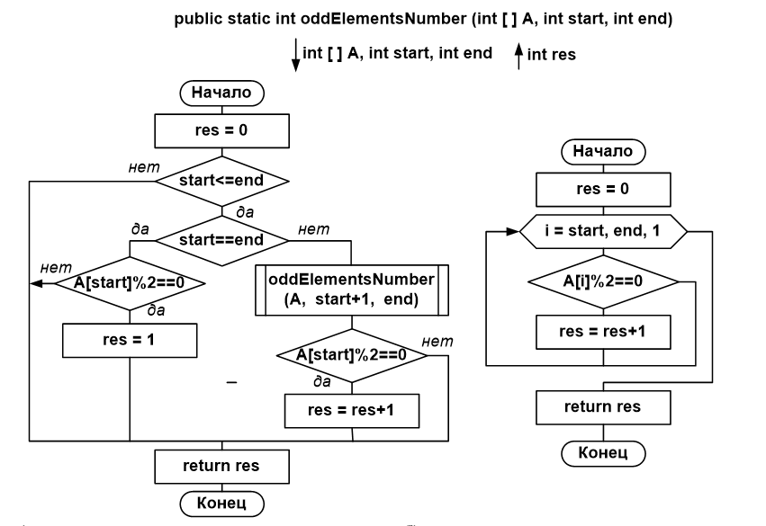
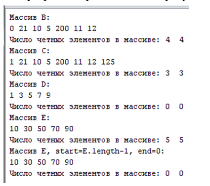

### Название работы
Разработка рекурсивных и итерационных алгоритмов. Классы-библиотеки статических методов.

### Цель работы
Целью данной работы является исследование и сравнение рекурсивных и итерационных алгоритмов обработки одномерных массивов, получение навыков в создании классов, являющихся библиотеками статических методов. 

### Постановка задачи
Разработать программу, реализующую обработку массива данных по заданию, указанному в таблице вариантов, в соответствии с номером варианта. Программа должна удовлетворять нижеперечисленным требованиям.

Программа должна содержать два класса: первый класс, содержащий метод **`main()`** (стартовая точка программы), и второй класс, содержащий два статических метода обработки одномерных массивов (рекурсивный и итерационный), заданные в таблице вариантов, а также статический метод вывода одномерного массива в окно терминала. Второй класс будет выполнять роль библиотеки алгоритмов. 

В методе `main()` должна быть предусмотрена инициализация различных массивов для полной проверки разработанных методов обработки массивов (набор тестов), соответствующие вызовы методов обработки массивов и вывод результатов их работы.


### Краткие теоретические сведения

#### Рекурсия, как приём программирования

Рекурсия – это процесс определения чего-то в терминах самого себя.

Рекурсия при обработке данных выражается в вызове подпрограммой (процедурой или функцией) самой себя.

В  подпрограммах, использующих рекурсию, нужно обязательно предусмотреть нерекурсивный случай.

Иногда рекурсия позволяет повысить эффективность обработки данных (алгоритм быстрой сортировки Хаара).

Иногда без рекурсии невозможно даже записать решение задачи, т.к. потребуется слишком много операторов (задача о Ханойских башнях:  рекурсия здесь не влияет на трудоемкость алгоритма (число операций), но позволяет компактно записать (и вообще записать) решение задачи) .

Если рекурсивные алгоритмы не дают перечисленных выше преимуществ, то лучше использовать итерационные алгоритмы, чтобы избежать переполнения системного стека при большой глубине рекурсивных вызовов. 

!!! note "Внимание"
    В некоторых языках предусмотрена оптимизация определенного вида рекурсии, называемого [хвостовой рекурсией](https://ru.wikipedia.org/wiki/%D0%A5%D0%B2%D0%BE%D1%81%D1%82%D0%BE%D0%B2%D0%B0%D1%8F_%D1%80%D0%B5%D0%BA%D1%83%D1%80%D1%81%D0%B8%D1%8F). 

    К сожалению, не все алгоритмы возможно реализовать таким образом.

    В случае оптимизации хвостовой рекурсии, компилятор сгенерирует такой код, который не будет приводить к переполнению стека вызовов.

Часто в качестве альтернативы рекурсивному методу обработки данных можно предложить итерационный, т.е. использующий циклическую обработку данных (как правило, с помощью операторов `for`, `while`, `do..while`). Циклические алгоритмы обработки данных подробно рассматривались в седьмой, восьмой и девятой лабораторных работах.

#### Классы-библиотеки как набор статических алгоритмов 

Базовая концепция *Java* – класс. Всё, что угодно в *Java* реализуется внутри класса. 

В *Java* можно реализовать несколько различных абстракций и концепций ООП:

**1. Стандартный класс**, используемый как шаблон для создания объектов (т.е. на основе этого класса создаются объекты-экземпляры, имеющие свойства, задаваемые переменными класса, и поведение, задаваемое методами класса). Например, на базе класса `Student` создаются конкретные объекты-экземпляры студентов ("Иванов", "Петров" и др.).
Такие классы подробно рассматриваются в 11, 12, 13 и 16 лабораторных работах.

**2. Класс, по сути, являющийся библиотекой алгоритмов** - класс, содержащий только статические методы. В качестве примера можно привести класс `Math`.

Что такое статические методы? Методы и поля, отмеченные ключевым словом `static`, считаются принадлежностью класса, а не объекта. Для запуска такого метода не требуется экземпляр класса. Такие методы запускаются от имени класса. Для доступа к таким методам нужно обратиться сперва к имени класса, а потом через точку - к имени метода или константе.
```java
double y = Math.sin(x) * Math.PI;
```

Использование статических переменных для указанного класса противоречит идее наличия у каждого объекта своих переменных экземпляра – свойств объекта (статические переменные класса будут одними и теми же для всех созданных объектов). Статические методы предназначены не для реализации функциональности объектов, а для упрощения кода и переиспользуемости, а также в тех случаях, когда использование методов экземпляра неоправданно.

**3. Класс, содержащий только статические переменные (без методов)**. Целесообразно использовать для задания глобальных переменных проекта (такие переменные будут существовать в течение всего времени работы программы). 
В последнее время такие классы создаются редко, хранят только переиспользуемые константы, которые не будут изменяться. Раньше также использовался для конфигурации, но сейчас для конфигурации используется связка из обычного класса + контейнера внедрения зависимости + библиотеки для считывания конфигурации.

**4. Интерфейсы**, описывающие действия над объектами разных иерархий и разной природы (является контрактом, содержит заголовки методов, которые необходимо реализовать в классе), будет рассмотрен позже.

**5. Класс, который является стартовой точкой программы**, должен содержать статический метод `main()`. На основе такого класса объекты, как правило, не создаются.           

В данной лабораторной работе мы создаем классы второго и пятого видов.

### Порядок выполнения работы

1. Разработайте класс, содержащий статические методы обработки одномерных массивов в соответствии с вариантом задания.
2. Разработайте тесты для полной проверки каждого метода. Проверьте правильность работы каждого метода, запустив его на соответствующих тестах. В случае необходимости отладки, используйте отладчик.
3. Разработайте класс, являющийся стартовой точкой программы (содержащий метод `main`). В методе `main` продемонстрируйте правильность работы рекурсивного и итерационного метода обработки одномерного массива на всех разработанных в пункте 2 тестах.
4. Проведите окончательную отладку программы, результаты работы приведите в отчёте.


### Варианты заданий

Вариант задания (таблица 1) предусматривает разработку рекурсивной и итерационной функции обработки одномерного массива.

*Таблица 1 - Варианты заданий*

|НВ	|Рекурсивная	|Итерационная	|НВ	|Рекурсивная 	|Итерационная|
|---|---|---|---|---|---|
|1	|Сумма элементов, значение которых больше A|	Количество нулевых элементов|	16|	Число ненулевых элементов|	Число нулевых элементов|
|2	|Произведение ненулевых элементов|	Количество ненулевых элементов|	17|	Максимальный среди положительных элементов|	Число отрицательных элементов|
|3	|Сумма отрицательных элементов	|Количество положительных элементов	|18	|Минимальный среди отрицательных элементов	|Число положительных элементов.|
|4	|Количество нулевых элементов	|Сумма элементов, значение которых больше A.	|19	|Произведение отрицательных элементов	|Сумма положительных элементов|
|5	|Число нулевых элементов	|Число ненулевых элементов	|20	|Сумма элементов, значение которых меньше A.	|Число элементов, значение которых больше В.|
|6	|Число ненулевых элементов	|Число нулевых элементов	|21	|Количество ненулевых элементов	|Максимальный, среди элементов, больших  В.|
|7	|Сумма отрицательных элементов	|Количество положительных элементов	|22	|Максимальный по модулю элемент	|Сумма модулей отрицательных элементов|
|8	|Произведение отрицательных элементов	|Произведение положительных элементов	|23	|Минимальный по модулю элемент	|Количество элементов массива, не принадлежащих интервалу [А,В]|
|9	|Сумма положительных элементов	|Количество отрицательных элементов	|24	|Минимальный элемент в интервале [A,B]	|Количество элементов, кратных 5 |
|10	|Сумма элементов, значение которых меньше А	|Количество элементов, значение которых находится в диапазоне [A,B]	|25	|Количество элементов, не кратных 3 	|Сумма элементов кратных 3 значением.| 
|11	|Количество элементов, значение которых находится в диапазоне [A,B]	|Сумма элементов, кратных 5.	|26	|Минимальный по модулю элемент	|Максимальный по модулю элемент|
|12	|Сумма элементов, имеющих нечетные значения	|Сумма элементов, значение которых находится в диапазоне [A,B]	|27	|Максимальный среди положительных элементов	|Количество отрицательных элементов|
|13	|Максимальный, среди положительных элементов	|Количество положительных элементов	|28	|Количество элементов, кратных 7	|Минимальный среди элементов, не находящихся в диапазоне [A,B]|
|14	|Количество нулевых элементов	|Сумма элементов, имеющих нечетные значения.	|29	|Сумма элементов с четным значением	|Количество элементов, не кратных 7| 
|15	|Число нулевых элементов	|Число ненулевых элементов	|30	|Количество элементов с нечетным значением	|Произведение элементов с четным значением|


### Пример программы
Задание. Разработать рекурсивный и итерационный статические методы, вычисляющие количество четных элементов в массиве `arr`, и продемонстрировать их работу. Указанные методы оформить отдельным классом.
Алгоритм работы рекурсивного метода представлен на рисунке 1а, алгоритм работы итерационного метода представлен на рисунке 1б.



*Рисунок 1 - Схемы алгоритмов а) рекурсивный б) итерационный*

Текст программы будет иметь следующий вид.
```java
public class ArrayMethods {
    // Метод для вывода массива в одну строку
    public static void printArray(int[] arr) { 
        if (arr == null) {
            return;
        }

        for (int i = 0; i < arr.length; i++) {
            System.out.print(arr[i] + " ");
        }

        System.out.println();
    }

    // Рекурсивная функция, возвращающая количество элементов 
    // с четным значением в массиве
    public static int countOddElementsRecursive(int[] arr, int startIndex, int endIndex){
        int result = 0; // если startIndex > endIndex метод вернет 0
        // Делим массив две части
        // 1 2 3 4 5 делится на 1 и 2 3 4 5
        // Так как массив разделить нельзя, используем индексы
        // Вначале проверяем arr[startIndex]
        if (startIndex <= endIndex ) {  // если есть, что просматривать
            // Проверяем первый элемент отдельно
            if (arr[startIndex] % 2 == 0)
            { 
                result++;
            }
            // Далее проверяем оставшуюся часть массива

            // базовый случай
            // нет оставшейся части массива
            if (startIndex == endIndex) {
               return result;
            }

            // рекурсивный случай
            else {
                // оставшуюся часть массива проверяем отдельно рекурсивно
                return result + countOddElementsRecursive(arr, start+1, end); 
            }
        }

        return result;
    }

    // Итерационная функция, возвращающая количество элементов 
    // с четным значением в массиве 
    // Нет смысла передавать индексы, так как у нас есть цикл)
    public static int countOddElementsIterative(int[] arr){
        int result = 0;

        for (int i = 0; i <= arr.length; i++) {
            if (arr[i] % 2 == 0) {
                result++;
            }
        }

        return result;
  } 
}  

public class Main {
    public static void main (String args [ ]) {
        int[] B = { 0, 21, 10, 5, 200, 11, 12 }; 
        // четные и нечетные,
        // первый элемент - четный
        int[] C = { 1, 21, 10, 5, 200, 11, 12, 125 };
        // четные и нечетные,
        // первый элемент - нечетный

        int[] D = { 1, 3, 5, 7, 9 }; 
        //только нечетные
        
        int[] E = { 10, 30, 50, 70, 90 };
        //только четные

        //статический метод запускается от имени класса, 
        //в котором он определен
        System.out.println("Массив В:");
        ArrayMethods.printArray(B);
        
        System.out.println("Число четных элементов в массиве: " +
        ArrayMethods.countOddElementsRecursive(B,0,B.length-1)+ "  "+
        ArrayMethods.countOddElementsIterative(B));
        
        System.out.println("Массив C:");
        ArrayMethods.printArray(C);

        System.out.println("Число четных элементов в массиве: " +
        ArrayMethods.countOddElementsRecursive(C,0,C.length-1)+ "  "+
        ArrayMethods.countOddElementsIterative(C));

        System.out.println("Массив D:");
        ArrayMethods.printArray(D);

        System.out.println("Число четных элементов в массиве: " +
        ArrayMethods.countOddElementsRecursive(D,0,D.length-1)+ "  "+
        ArrayMethods.countOddElementsIterative(D));

        System.out.println("Массив E:");
        ArrayMethods.printArray(E);

        System.out.println("Число четных элементов в массиве: " +
        ArrayMethods.countOddElementsRecursive(E,0,E.length-1)+ "  "+
        ArrayMethods.countOddElementsIterative(E));   
    }
}

```



*Рисунок 2 - Результаты работы программы*

### Контрольные вопросы

1. Что такое рекурсия? В чем выражается рекурсия при обработке данных?
2. Какой случай обязательно должен быть предусмотрен в рекурсивном алгоритме?
3. В чем недостаток рекурсивных алгоритмов?
4. Когда следует применять рекурсивные алгоритмы?
5. Что такое итерационный алгоритм? На основе каких управляющих операторов он строится? 
6. Может ли итерационный метод быть альтернативой рекурсивному? Если да, то приведите пример.
7. В каких классах оправдано применение статических методов и переменных? 
8. В каких классах иметь статические методы и переменные не рекомендуется?


