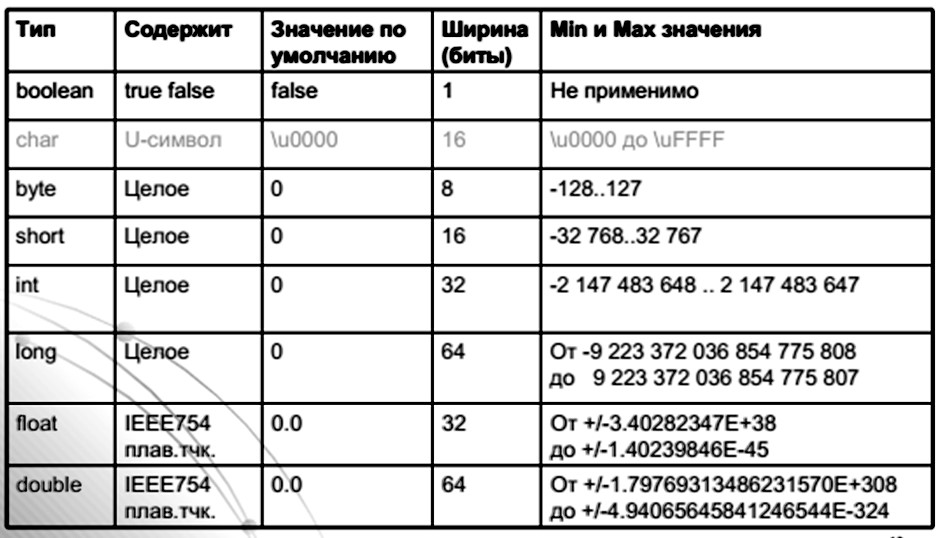
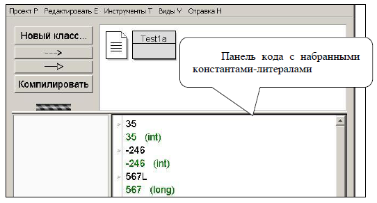
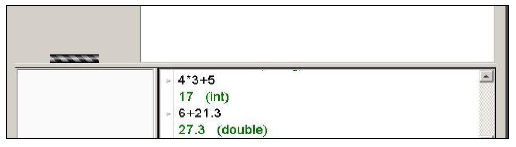

### Цель работы
Ознакомиться с простыми типами данных *Java*, научиться объявлять переменные и литералы этих типов и выполнять операции над ними, научиться применять оператор присваивания для данных простых типов, научиться применять метод `System.out.printf()` – метод форматированного вывода − для вывода на экран значений различных типов, научиться применять окно кода в *BlueJ*. 

### Постановка задачи

1. Ввести заданные операторы в окно кода *BlueJ* и проанализировать полученные результаты.
2. Разработать программу, в которой используется метод `System.out.printf()` для вывода в окно терминала данных, предусмотренных вариантом задания.

### Краткие теоретические сведения

**Простые, или примитивные, типы данных** - это встроенные в язык *Java* типы, аналогичные типам данных большинства языков программирования. Эти типы могут применяться самостоятельно или используются как составные части более сложных типов данных, которые создают программисты.

*Java* позволяет использовать 8 простых типов данных:

* `byte`, `short`, `int`, `long` –целочисленные,
* `float`, `double` – вещественные обычной и двойной точности,
* `boolean` – булевские (логические, представляющие истину или ложь),
* `char` – символьные, представляющие символы *Unicode*.

Диапазоны значений для простых типов данных приведены на рисунке 3.



*Рисунок 3.1 - диапазоны значений для примитивных типов данных*

### Базовые понятия программирования
Вспомним некоторые понятия программирования, упомянутые в предыдущей лабораторной работе.

#### Переменные и именованные константы

**Переменные** – элементы, значение которых при выполнении программы можно изменить, но тип изменить нельзя.

Переменные имеют имена и значения. Имя переменной – это название области памяти, в которой хранится значение переменной. Чтобы ввести переменную в употребление, ее необходимо объявить одним из двух способов:

1. `тип имя`;
2. `тип имя = начальноеЗначение;` (точка с запятой – это часть объявления!)

**Объявление переменной** – это приказ выделить для нее память.

**Имена переменных** пишут в стиле ― *camelStyle*, начиная с маленькой буквы, а каждое следующее слово в имени – с большой буквы.

**Именованные константы** – это переменные, значение которых определяется «при рождении», после чего изменять их значения запрещено.

**Форма задания константы с именем:** 
```java
final тип ИМЯ = значение;
```

Слово `final` указывает, что значение нельзя изменить. Принято имена констант записывать БОЛЬШИМИ БУКВАМИ.

#### Оператор присваивания

**Оператор присваивания** заменяет старое значение некоторой переменной новым. После замены старое значение теряется, т.е. использовать его нельзя.

**Форма оператора:** 
```java
переменная = выражение;
```

Переменная является приемником данных, а выражение – источником. Выражение определяет новое значение переменной. Равенство левой и правой частей наступает только после выполнения оператора присваивания и имеет смысл равенства значений источника и приемника. Порядок выполнения оператора: сначала, без учета левой части, вычисляется выражение с текущими значениями переменных. Затем полученное значение выражения становится значением переменной-приемника. 

Если в выражении используется та же переменная, скажем, `x`, что и слева, при вычислении выражения применяется имеющееся значение `x`, которое заменяется новым значением – значением выражения – после вычисления выражения. Например, пусть `x = 5.0`. При выполнении оператора `x = x + 1.2;` берется значение переменной `x`, равное 5, к нему добавляется число 1.2, и результат становится значением переменной `x`.

Язык *Java* требует, чтобы размер приемника был не меньше, чем размер результата. Когда это требование нарушается, возникает ошибка:
>Возможна потеря точности – possible loss of precision. 

Пример, при котором возникает такая ошибка: 
```java
float x; 
х = 1.0;
```
Размер слева – 32 бита, размер справа – 64 бита, т.к. 1.0 считается константой (литерал) типа `double`.

### Использование окна кода BlueJ

Система *BlueJ* имеет специальное окно – панель (окно) кода (или окно команд) (рисунки 3.2, 3.3). 

Окно кода позволяет проверить фрагменты программы до их включения в проект. Действия в окне кода выполняются по строкам после нажатия ++enter++. 

Объявленные переменные запоминаются, т.е. повторно объявить переменную нельзя. Если окно кода не видно после запуска *BlueJ*, откройте проект, созданный ранее, и нажмите *Виды* – *Показать панель кода*. 

При необходимости вводимый в окно кода текст можно расположить в нескольких строках, при этом промежуточные строки заканчиваются нажатием ++shift+enter++. Проверенные операторы можно вставить в текст программы, пользуясь копированием ++ctrl+c++ и вставкой ++ctrl+v++.



*Рисунок 3.2 - Окно кода. Примеры набора констант*



*Рисунок 3.3. Окно кода. Примеры набора выражений*

### Метод форматированного вывода __System.out.printf()__

В предыдущей работе использовался метод `System.out.println()`, который выводил в окно терминала символьную строку (объект типа `String`).

В этой работе рекомендуется применить метод форматированного вывода `System.out.printf()`, который более удобен, например, для представления результатов в виде аккуратной таблицы. Вызов метода имеет форму:
```java
System.out.printf(format, list);
```

**Строка форматов `format`** содержит форматные коды, по одному на каждый элемент списка выводимых переменных `list`. Форматный код имеет представленную ниже структуру (в скобки `[` и `]` заключены необязательные элементы, т.е. в программе такой элемент или присутствует без скобок, или отсутствует)

> %[номер_аргумента$][флаги][место][.дробь]тип

**Флаги `-` `+` `0` `,` `(` `)`**  определяют дополнительные характеристики выводимых данных: 

* **`-`** – выравнивание влево
* **`+`** – обязательный вывод знака числа
* пробел – пробел вместо плюса для положительных чисел
* 0 – заполнение старших пустых позиций числа нулями
* **`,`** – локализованный разделитель в числах
* **`()`** – отрицательные числа заключаются в скобки

**Параметр _тип_** определяет вариант преобразования внутреннего представления данных во внешнюю форму:

* `s` − `String` (строка символов);
* `c` − `char` (символ);
* `d` − десятичное целое;
* `o` − восьмеричное целое;
* `x` − шестнадцатеричное целое;
* `f` − действительное в фиксированном формате (в форме 999.9999);
* `e` − действительное в математическом формате (в форме 0.999Е99);
* `tD` − дата в форме «месяц-день-год»;
* `tF` − дата в формате «год-месяц-день»;
* `tT` − время в формате «часы:минуты:секунды».

**Параметры _место_ и _дробь_** определяют соответственно количество позиций для выводимых данных (ширину поля) и количество цифр в дробной части (применяются с параметрами типа `d` и `f`). Например, `%08.3f` применяется для вывода действительных данных. Под данные отводится 8 позиций (с учетом знака и разделяющей точки). Из них под дробную часть отводится 3 позиции. При необходимости в целую часть добавляются ведущие нули, чтобы полностью использовать 8 позиций.

Элементы между форматными кодами выводятся как литералы, в частности, `\t` – табуляция, `\n` – переход на новую строку (`%n` также означает переход на другую строку).

Примеры:

```java
printf("Hello %s!", "World"); 
// "Hello World!"

printf("%7d", 1); 
// " 1" – минимум 7 позиций

printf("%07d", 1); 
// "0000001" – начальные позиции
//заполнены нулями

printf("%.10f", Math.PI); 
// "3,1415926536" – с точностью
// до 10 знаков после запятой

printf("%tF", new Date()); 
// "2011-01-27"

printf("%tT", new Date()); 
// "22:42:37"
```

Фрагмент программы:
```java
int a = 256;
double b = 312.678951236;
String str = "форматированный вывод";

System.out.printf("Демонстрируем %s: a=%08d(10)=%x(16), b=%010.4f\n", str, a, a, b);
```

Данный фрагмент повлечет за собой следующий вывод в окно терминала:
```
a=00000256(10)=100(16), b=00312,6790
```

Элементы между форматными кодами (выделены красным в вызове метода `printf()`) выводятся как строковые литералы (константы).

### Порядок выполнения работы

#### Работа в окне кода BlueJ

**1.** Введите целые константы в окне кода, нажимая после каждой константы ++enter++: 

    * 35 
    * -246 
    * 5671L.

**2.** Введите выражения: 

    * 4*3+5 
    * 4+3*5 
    * 25-3/5-6+20/3 
    * 5%6 («пять по модулю шесть» − остаток от деления 5 на 6) 
    * 7%6 
    * 7%5

После ввода каждого выражения нажимайте ++enter++. Обратите внимание на тип и результат.

**3.** Наберите выражения: 

    * 1 == 1 
    * 1 < 5 
    * 2 <= 5 
    * 2 > 6 
    * 3 / 2 > 1 
    * 2 != 9

После ввода каждого выражения нажимайте ++enter++. В этих выражениях используются операции сравнения. Результат операции (и выражения) имеет логический тип (`boolean`). Если выражение верно, то его значение равно `true`, иначе – `false`. Проверяйте результат каждый раз после нажатия ++enter++.

**4.** Введите в панели кода действительные литералы, каждый в отдельной строке: 

    * 3.1415 
    * 2.71823F 
    * 0.314E+1

Проанализируйте результаты (что происходит после нажатия клавиши ++enter++).

**5.** Наберите в панели кода выражения: 

    * 25-3.5-6+21.3
    * 5/6.0
    * 5.0/6
    * 3.7f/5.3f

Обратите внимание на значение результата и на его тип.

**6.** Наберите в панели кода выражения 

    * 1 == 1.0 
    * 1.0 < 1.5 
    * 2.3 <= 2.3f
    * 1.5 == 1.5f

**7.** Наберите в панели кода: 
```java
double x; 
float a=3.5; 
float d=2.5; 
```

После точки с запятой нажимайте ++enter++. Проанализируйте сообщения системы.

**8.** 
Наберите в панели кода: 
```java
x = 3.5; //(тип x уже задан)
float a=3.5f;
double d=2.5f; 
```

После точки с запятой нажимайте ++enter++. Проверьте значения переменных, введя имя и ++enter++.

**9.** Наберите 
```java
d=d+3.75;
x=a+7.5f;
```

Проверьте значения переменных.

**10.** Введите: 
```java
final float K=5.4f; 
```
Проверьте значение `K`. Наберите оператор: 
```java
K=5.45;
```

Обратите внимание на сообщение. Наберите:
```
final double PI=3.1415926; 
```

Вычислите длину окружности с радиусом 10: ```2*PI*10```.

#### Разработка программы с использованием метода форматированного вывода __System.out.printf()__

Разработайте программу согласно варианту задания (таблица 3.1), проведите ее отладку и испытание на нескольких тестовых примерах.

### Варианты заданий

В качестве индивидуального задания на лабораторную работу предлагается разработать программу, которая выполняет следующие действия:

1. определяет и инициализирует (задает тип и значение) переменные `str`, `a`, `b`, `c`, `d`;
2. осуществляет следующий вывод:
```
Привет, значение_str: a=значение_a, b=значение_b, c=значение_с, d=значение_d!
```

Значения переменных должны выводиться в формате, предусмотренном вариантом задания. После вывода строки, должен быть осуществлен переход на следующую строку.

После выявления синтаксических ошибок программа должна быть откомпилирована и запущена не менее трех раз (с различными значениями переменных). В качестве тестовых значений переменных студент должен подобрать такие значения, которые проверяют все возможности программы. Например, проверку обязательного вывода знака числа нужно осуществить на положительных и отрицательных значениях. Желательно также проверить, как будет вести себя ваша программа, если заданное значение переменной не помещается в формат, заданный в методе `printf()`.

Варианты индивидуальных заданий представлены в таблице 3.1.

Использованы следующие условные обозначения:

* **С10** – десятичная система счисления;
* **С16** – шестнадцатеричная система счисления;
* **С8** – восьмеричная система счисления;
* **Ш** – ширина (минимальное количество цифр);
* **Т** – точность (число цифр после запятой);
* **НН** – наличие ведущих нулей;
* **ОН** – отсутствие ведущих нулей;
* **ВЗ** – обязательный вывод знака.

| Номер варианта | Строка str(String) | Целое a (int) | Целое b(short) | Целое с (byte) | Действительное d(double) | Действительное f(float) |
| :------------: | ------------------ | ------------- | -------------- | -------------- | ------------------------ | ----------------------- |
| 1 | Фамилия_Группа: | С10, Ш8, НН, ВЗ | С8 | С16 | Ш10, Т5, НН |Ш8, Т3, ОН | 
| 2 | Фамилия_Группа: | С16 | С10, Ш5, ОН | С8 | Ш5, Т3, ОН, ВЗ | Ш7, Т2, НН |
| 3 | Фамилия_Группа: | C8 | C16 | C10, Ш6, ОН | Ш8, T4, НН | Ш6, Т3, ОН, ВЗ |
| 4 | Фамилия_Группа: | С16 | С8 | С10, Ш8, НН | Ш7, T3, ОН, ВЗ | Ш9, Т4, НН |
| 5 | Фамилия_Группа: | С10, Ш5, ОН, ВЗ | С8 | С16 | Ш8, T2, НН | Ш10, Т4, ОН |
| 6 | Фамилия_Группа: | С10, Ш5, ОН | С8 | С16 | Ш8, T2, ОН, ВЗ | Ш6, Т3, НН |
| 7 | Фамилия_Группа: | С8 | С10, Ш9, НН | С16 | Ш10, T4, ОН | Ш8, Т2, НН, ВЗ |
| 8 | Фамилия_Группа: | С16 | С10, Ш7, ОН, ВЗ | С8 | Ш12, T6, НН | Ш6, Т3, ОН |
| 9 | Фамилия_Группа: | С16 | С8 | С10, Ш8, НН | Ш11, T5, ОН, ВЗ | Ш9, Т4, НН |
| 10 | Фамилия_Группа: | С10, Ш7, ОН, ВЗ | С8 | С16 | Ш14, T5, НН | Ш8, Т3, ОН |
| 11 | Фамилия_Группа: | С10, Ш8, НН, ВЗ | С8 | С16 | Ш10, Т5, НН | Ш8, Т3, ОН |
| 12 | Фамилия_Группа: | С16 | С10, Ш5, ОН | С8 | Ш5, Т3, ОН, ВЗ | Ш7, Т2, НН |
| 13 | Фамилия_Группа: | C8 | C16 | C10, Ш6, ОН | Ш8, T4, НН | Ш6, Т3, ОН, ВЗ |
| 14 | Фамилия_Группа: | С16 | С8 | С10, Ш8, НН | Ш7, T3, ОН, ВЗ | Ш9, Т4, НН |
| 15 | Фамилия_Группа: | С10, Ш5, ОН, ВЗ | С8 | С16 | Ш8, T2, НН | Ш10, Т4, ОН |
| 16 | Фамилия_Группа: | С10, Ш5, ОН | С8 | С16 | Ш8, T2, ОН, ВЗ | Ш6, Т3, НН |
| 17 | Фамилия_Группа: | С8 | С10, Ш9, НН | С16 | Ш10, T4, ОН | Ш8, Т2, НН, ВЗ |
| 18 | Фамилия_Группа: | С16 | С10, Ш7, ОН, ВЗ | С8 | Ш12, T6, НН | Ш6, Т3, ОН |
| 19 | Фамилия_Группа: | С16 | С8 | С10, Ш8, НН | Ш11, T5, ОН, ВЗ | Ш9, Т4, НН |
| 20 | Фамилия_Группа: | С10, Ш7, ОН, ВЗ | С8 | С16 | Ш14, T5, НН | Ш8, Т3, ОН |
| 21 | Фамилия_Группа: | С10, Ш8, НН, ВЗ | С8 | С16 | Ш10, Т5, НН | Ш8, Т3, ОН |
| 22 | Фамилия_Группа: | С16 | С10, Ш5, ОН | С8 | Ш5, Т3, ОН, ВЗ | Ш7, Т2, НН |
| 23 | Фамилия_Группа: | C8 | C16 | C10, Ш6, ОН | Ш8, T4, НН | Ш6, Т3, ОН, ВЗ |
| 24 | Фамилия_Группа: | С16 | С8 | С10, Ш8, НН | Ш7, T3, ОН, ВЗ | Ш9, Т4, НН |
| 25 | Фамилия_Группа: | С10, Ш5, ОН, ВЗ | С8 | С16 | Ш8, T2, НН | Ш10, Т4, ОН |

### Рекомендации по составлению отчета по лабораторной работе

В дополнение к общим требованиям к отчету, представленным в разделе 1, опишите по пунктам все исследования, которые вы провели в окне кода (п. Работа в окне кода BlueJ) и сделанные вами выводы.

### Контрольные вопросы

1. Какие простые типы данных существуют в *Java*?
2. От чего зависит диапазон значений числовых типов?
3. Какой из типов обеспечивает большую точность `double` или `float`?
4. Что такое литерал?
5. Как задается переменная?
6. Как задается именованная константа?
7. Как задать литерал типа `float`?
8. Как задать литерал типа `long`?
9. Опишите, как работает оператор присваивания?
10. Когда возникает ошибка «Потеря точности»?
11. Какие возможности предоставляет окно кода *BlueJ*?
12. Чему равно значение выражения 2<5? Какого оно типа?
13. Чему равно значение выражения 10<=5? Какого оно типа?
14. Какие возможности предоставляет оператор форматированного вывода `System.out.printf (format, list)`;
15) Перечислите возможности текстового процессора Microsoft Word, которые вы использовали для оформления списков при выполнении отчета по лабораторной работе.


