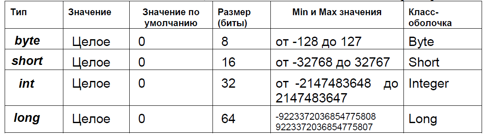
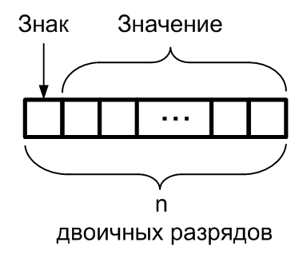

### Название работы
Обработка целочисленных данных

### Цель работы
Получить навыки объявления в программе переменных и литералов, применения арифметических операций для данных целых типов, применения оператора присваивания, закрепить знания по теме «Представление целых чисел в компьютере.

### Постановка задачи

1. Ознакомиться с принципами хранения и обработки целочисленных данных в *Java*.
2. Разработать и отладить программу, демонстрирующую выполнение операций над данными целого типа. 


### Краткие теоретические сведения

#### Типы данных
Язык *Java* является строго типизированным. А это значит, что каждая переменная и константа представляет определенный тип и данный тип строго определен. Тип данных определяет диапазон значений, которые может хранить переменная или константа.

Рассмотрим подробно целочисленные типы данных в *Java*.

Итак, рассмотрим систему встроенных базовых типов данных, которая используется для создания переменных в *Java*. А она представлена следующими типами.

* `byte`: хранит целое число от -128 до 127 и занимает **1 байт**
```java
byte a = 3;
byte b = 8;
```
* `short`: хранит целое число от -32768 до 32767 и занимает **2 байта**
```java
short a = 3;
short b = 8;
```
* `int`: хранит целое число от -2147483648 до 2147483647 и занимает **4 байта**
```java
int a = 4;
int b = 9;
```
* `long`: хранит целое число от –9 223 372 036 854 775 808 до 9 223 372 036 854 775 807 и занимает **8 байт**
```java
long a = 5;
long b = 10;
```


Характеристики целочисленных типов данных приведены на рисунке 1.



*Рисунок 1 - Целочисленные типы данных и их характеристики*

Для каждого целочисленного типа существует библиотечный класс-оболочка:

* `Byte`
* `Short`
* `Integer`
* `Long`

Этот класс содержит полезные методы для работы с целочисленными данными. Названия этих классов приведены в четвертом столбце таблицы выше.

#### Внутреннее и внешнее представление целочисленных данных
Внутренне представление – это то, которое *«видит»* процессор, внешнее – то, которое видит и применяет при записи литералов (в данном случае, целых чисел) программист. Внутреннее представление целочисленных данных – двоичное, количество битов приведено в столбце «Размер» таблицы на рисунке 1. Под знак числа выделен левый бит. Значение 0 этого бита имеют положительные числа, значение 1 – отрицательные. Формат двоичного целого числа представлен на рисунке 2. Для типа `byte` `n`=8, для типа `short` `n`=16, для типа `int` `n`=32, для типа `long` `n`=64.



*Рисунок 2 - Формат целого двоичного числа*

Отрицательные числа представляются *Java*  в дополнительных кодах следующим образом:

* `Знак` = 1;
* `Значение*` = 2^n─1^ ─ |`Значение`|

где `Значение*` - значение числа в дополнительном коде,
`Значение` – обычное представление двоичного числа.

Принято, что для любого положительного числа дополнительный код совпадает с прямым кодом (обычным представлением числа в двоичной позиционной системе счисления).

Все операции с целыми числами выполняются в двоичной системе счисления. Использование дополнительного кода для представления двоичных чисел позволяет процессору корректно выполнять операции сложения и вычитания на двоичном сумматоре.

Литералы (целые числа, присутствующие в программе) автоматически переводятся из внешнего представления (последовательность символов) во внутреннее (последовательность битов двоичного целого числа). Метод `println()` автоматически преобразует числа из внутреннего во внешнее представление. Все другие преобразования выполняются под контролем программиста.  

#### Запись целочисленных литералов в Java-программах

Восьмеричные значения обозначаются в *Java* ведущим нулем.

Десятичные значения не могут иметь ведущего нуля.

Значение 09, встреченное в программе, вызовет ошибку компилятора, т.к. цифра 9 ─ вне восьмеричного диапазона от 0 до 7.
Шестнадцатеричную константу обозначают с ведущими нулями: `0x` или `0X`.

Целые литералы создают значение типа `int` (32-разрядное целое число).

Когда литеральное значение назначается `byte`- или `short`-переменной, ошибка не генерируется, если это значение находится в пределах диапазона целевого типа.

Целый литерал может всегда назначаться переменной типа `long`.  Однако, чтобы задать длинный литерал, нужно явно сообщить компилятору, что значение имеет тип `long`. Это осуществляется добавлением символа `L` (в верхнем или нижнем регистре).

Например, `0x7FFFFFFFFFFFFFFFL`  или `9223372036854775807L` – самый большой целочисленный литерал.


#### Операции для целочисленных типов данных

Арифметические операции – (`+`, `-`, `*`, `/`, `%`) – (сложение, вычитание умножение, деление нацело, вычисление остатка от деления соответственно). Результат этих операций – целочисленный. 

Операции сравнения (или отношения) – (`<`,`>`,`<=`, `>=`, `==`, `!=`) – (меньше, больше, меньше или равно (не больше), больше или равно (не меньше), равно, не равно). Результат сравнения – булевское значение `true` (истина) или `false` (ложь), например, `2<3 `имеет значение `true`, а `2>3` – значение `false`.

Поразрядные логические операции будут рассмотрены в следующей лабораторной работе.

Арифметические операции с целочисленными данными выполняются точно, без округления. При выполнении целочисленного деления, дробная часть результата отбрасывается. 

Виду ограниченного диапазона, сложение и вычитание могут дать *переполнение* – результат, выходящий за границы диапазона. Переполнение выглядит как отрицательный результат при положительных слагаемых или как положительный результат при отрицательных слагаемых. Например, если к максимальному положительному `int`, равному `0x7FFF FFFF`, прибавить 1, получится наименьшее целое отрицательное число `0x8000 0000`. Если это число сложить с максимальным положительным (`0x8000 0000` + `0x7FFF FFFF`), получится число `0xFFFF FFFF` (двоичное представление числа -1 в дополнительном коде), которое на единицу меньше нуля (легко проверить, прибавив к нему 1).

При соединении ряда операций в одном выражении следует учитывать приоритеты операций. Так, арифметические операции имеют больший приоритет, чем операции сдвигов и поразрядные операции, а операции над одним операндом имеют больший приоритет, чем операции над двумя операндами. 

При вычислении значения выражения *Java* автоматически расширяет (повышает) тип каждого `byte`- или `short`-операнда и результата до `int` (т.к. результат сложения двух коротких операндов с одинаковыми знаками может не поместиться в короткий формат).

Это может вызывать плохо распознаваемые ошибки во время компиляции.

Например, казалось бы, благополучный код
```java
byte b = 50;
b = b * 2;
```

вызовет ошибку компиляции «Возможна потеря точности – `possible loss of precision`, т.к. значение выражения `b*2` имеет тип `int`, а целевая переменная `b` имеет тип `byte`. Такая же ошибка возникнет и при компиляции строки кода:
```java
int i = 2L; // (переменной типа int присваивается значение типа long).
```

Вообще, когда размер переменной слева меньше, чем размер результата справа, возникает ошибка:
>Возможна потеря точности – possible loss of precision

Для преодоления этой трудности есть два пути:

1.	числа длиной 1 байт хранить, например, в переменных типа `int`;
2.	использовать явное преобразование типа значения в правой части оператора присваивания:
```java
byte b = 50;
b = (byte)(b * 2);
```

Следует отметить, что тип `int` – наиболее универсален и эффективен и должен быть использован для расчетов, индексации элементов массива или выполнения целочисленных операций.

Может показаться, что использование `short` или `byte` экономит память, но нет никакой гарантии, что *Java* не будет внутренне так или иначе расширять эти типы до `int`.

Помните, что тип определяет поведение и ограничение на допустимые данные, а не размер. Единственное исключение – массивы, где тип `byte` гарантирует использование только одного байта на элемент массива, тип `short`  будет забирать 2 байта, а `int` 4 байта.


### Порядок выполнения работы

1. Разработайте программу согласно варианту задания.
2. Обоснуйте выбор типа целочисленных переменных.
3. Проведите отладку программы и испытание на нескольких тестовых примерах.

### Варианты заданий

В качестве индивидуального задания на лабораторную работу предлагается  разработать программу, демонстрирующую выполнение арифметических операций над целыми числами. 

В программе задать целочисленные переменные `a`, `b`, `c`. 
Вывести на экран в двоичной, шестнадцатеричной, восьмеричной и десятичной системах счисления значения `а`, `b`, `c`, а также результаты выполнения операций `-a`, `a+b`, `a-b`, `a*b`, `a/b`, `a%b`, `a++`, `b--`.  
Например:
```
a+b=100000000(2)=100(16)= 400(8)=256 (10); .
```

Подобный вывод можно осуществить одним вызовом метода `printf()`. Для получения представления двоичного числа в виде строки (`String`) используйте библиотечную функцию `Integer.toBinaryString(х)`, где `x` – аргумент типа `int`.
Сравнить с результатами ручных расчетов. 

Варианты заданий представлены в таблице:.


|Номер варианта|	a|	b|	с|
|---|---|---|--|
|1	|356	|725	|`(b-a)%a+56`|
|2	|125	|49	|`(a+b)/b-a+100%b`|
|3	|1024	|541	|`a%b*2-b/4`|
|4	|986	|25	|`a/(b+20)-253%b`|
|5	|1255	|345	|`(a+b)/(b+20)%20`|
|6	|236	|16	|`a/b%5+12*b`|
|7	|512	|48	|`a/b+(a%b)*2`|
|8	|2056	|185	|`(a+2*b)/(a-5*b)%9`|
|9	|145	|312	|`a/16+b%16-10*a`|
|10	|1345	|1200	|`(a-b)/5+(b-500)%5*3`|
|11	|712	|256	|`(b-a+a/4+b*4)%10`|
|12	|123	|56	|`a*b-(a+b/2)%7`|
|13	|875	|298	|`(a%b-a/b)*20`|
|14	|1421	|1200	|`(a-b/2+b%10)*3`|
|15	|127	|512	|`a/b*(a-b)%15+25`|
|16	|2024	|341	|`-(a/b+a%b)*5`|
|17	|456	|1348	|`(b/a+b%a*3)/10`|
|18	|25	|354	|`(a*a-b)%25/2`|
|19	|849	|315	|`((a-b)%b-a/b)*3`|
|20	|5	|7	|`(a*a+b*b*b)/10%5`|
|21	|15	|12	|`((a*a-b*b)+1024)%12/3`|
|22	|1500	|2800	|`((b-a)/10)*((b-a)/10)%20`|
|23	|456	|1234	|`(2*a+b/45)*3%14`|
|24	|1155	|956	|`((b-a)*2560%b)/12`|
|25	|1024	|2048	|`-2*(a%100+b%200)/5`|


### Контрольные вопросы

1. Что такое литерал?
2. Как в программе задать целочисленные литералы в различных системах счисления? 
3. Как получить представление двоичного целого числа в виде строки символов (`String`)?
4. Какие арифметические операции и операции сравнения допустимы для целочисленных типов? 
5. Как выполняется операция целочисленного деления?
6. Как выполняется операция, обозначаемая символом `%`?
7. Что такое переменная? Как объявляется переменная целочисленного типа? 
8. Как задать именованную константу целочисленного типа? 
9. Какие ошибки могут возникать при компиляции оператора присваивания, использующего переменные и выражения различных целых типов? Приведите примеры.
10. Какой тип будет у результата выражения, в котором выполняются операции над переменными типа `short` и `byte`?
11. Какой тип предпочтительно выбирать для одиночных (не массивов) целочисленных переменных и почему?
12. Внутреннее представление чисел:
```
0 0100111,
1 1111101,
1 1111111,
0 0000000 0100111,
1 1111111 1111101,
1 1111111 1111111,
0 0000000 00000000 00000001 000011100,
1 1111111 11111111 11111111 101011010.
```
Запишите эти числа в десятичной, восьмеричной и шестнадцатеричной системах счисления. Какого они типа?
13. Назовите максимальное значение (в шестнадцатеричной системе счисления), которое можно записать в переменную типа `byte`, `short`, `int` и `long`.
14. Чему равны значения выражений `10<=3`, `10!=3`, `5>3+1`? Какого они типа?
15. Фрагмент кода:
```java
int a=5; 
int b=3; 
f=a<b+1;
```
Какого типа переменная `f` и чему равно ее значение?
16. Перечислите возможности текстового процессора Microsoft Word, которые  вы использовали при выполнении отчета по лабораторной работе.


