### Название работы
Обработка числовых данных вещественных типов.

### Цель работы
Закрепить навыки объявления переменных и констант, освоить операции для данных вещественных типов, закрепить навыки применения оператора присваивания, исследовать форматы внутреннего представления вещественных чисел. 

### Постановка задачи

1. Изучить принципы хранения и обработки числовых данных вещественных типов (типов с плавающей точкой) в *Java*. Провести исследования в окне кода *BlueJ*.
2. Разработать и отладить программу, демонстрирующую выполнение операций над данными вещественного типа. 
3. Исследовать внутреннее представление данных вещественных типов в формате *IEEE-754* для значений, являющихся результатами выполнения программы.

### Краткие теоретические сведения

#### Вещественные числа и сопутствующие им машинные форматы
В данной работе исследуются типы `float` и `double` (вещественные данные одинарной и двойной точности), которые применяются для выполнения инженерных и научных расчетов. Характеристики этих типов приведены на рисунке 1.

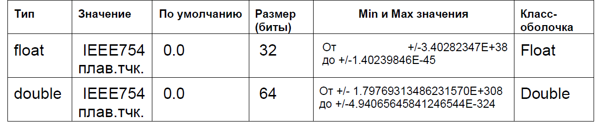

*Рисунок 1 - Вещественные типы данных и их характеристики*

Как мы знаем, числа представляются в ЭВМ в двоичной системе счисления. На рисунке 2 изображен стандартный формат представления чисел с плавающей точкой [IEEE-754](https://standards.ieee.org/standard/754-2019.html), который используется в *Java*.

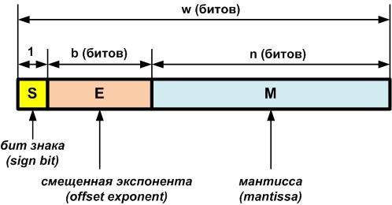

*Рисунок 2 - Формат IEEE-754*

* $S$– бит знака числа: если $S=0$, число положительное, если $S=1$, число отрицательное;
* $E$ – смещенный порядок (экспонента) двоичного числа;      
* $2^{(b-1)}-1$ ─ заданное смещение экспоненты (позволяет задавать только положительную экспоненту, т.е. не выделять дополнительный бит для ее  знака);
* $P = E - (2^{(b-1)}-1)$ ─ несмещенное (настоящее) значение порядка;
* $M$ - остаток мантиссы двоичного нормализованного числа с плавающей точкой.

Двоичное число с плавающей точкой создатели формата *IEEE-754* считают нормализованным, если $1<=Мантисса<=2$. Такая мантисса всегда начинается с 1. Нет смысла хранить эту единицу в отведенных `n` битах. Поэтому в `n` битах хранят только дробную часть ─ остаток от мантиссы $M$ (экономят один бит точности).

Формула вычисления десятичных чисел с плавающей точкой, из чисел, представленных в стандарте *IEEE-754*:

$$
F = (-1)^S*2^{E - (2^{(b-1)}-1)}*(1+M/2^{n})
$$

Обратите внимание на прибавление 1, с которой начинается мантисса любого нормализованного числа (по версии *IEEE-754*), и которую, поэтому, нет смысла хранить, расходуя на нее один лишний бит.

Деление остатка от мантиссы $M$ на $2^n$ обозначает отрицательные степени двойки, соответствующие весам разрядов $М$, например, $2^-1=1/2$.

Интерпретации формата *IEEE-754* для типа с одинарной точностью (`float`) и типа с двойной точностью (`double`) приведены на рисунке 3.

Заметим, что точность представления чисел определяется числом разрядов мантиссы. Число разрядов порядка определяет диапазон чисел (рисунок 1).

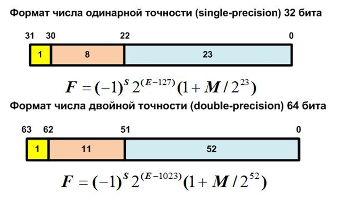

*Рисунок 3 - Интерпретации IEEE-754 для чисел с одинарной и двойной точностью*

Пример представления вещественного числа в формате float приведен на рисунке 4.

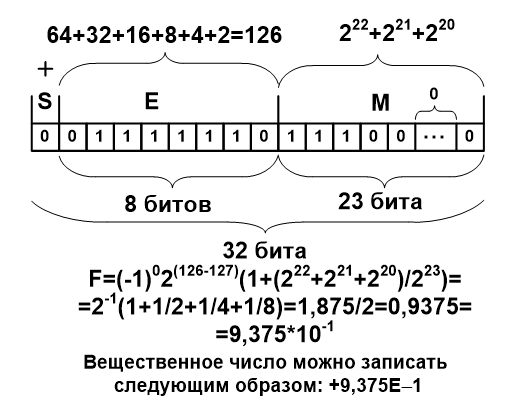

*Рисунок 4 - Пример представления вещественного числа в формате `float`*

#### Операции над вещественными данными.
С вещественными данными можно выполнять обычные арифметические операции (`+`, `-`, `*`, `/`), результат которых – тоже вещественное число. Сравнение действительных данных выполняется операциями `<`, `>`, `<=`, `>=`, `==`, `!=` (меньше, больше, меньше или равно (не больше), больше или равно (не меньше), равно, не равно). 

Следует проявлять внимательность при сравнении действительных данных и действительных литералов (описаны ниже), поскольку действительные данные представляются с погрешностью. 

Каждому простому типу в языке *Java* соответствует объектный тип – так называемый класс-оболочка (*wrapper class*). Классы-оболочки являются ссылочными типами. Классы-оболочки (для `float` и `double` это `Float` и `Double`) содержат полезные и интересные методы для проверок свойств данных или для их преобразования в другие типы. Например, метод:
```java 
static long doubleToLongBits(double value)
``` 

Этот метод, определенный в классе `Double`, возвращает представление заданного значения `value` типа `double` в соответствии с форматом *IEEE-754*;

```java
static int floatToIntBits(float value)
```

Этот метод, пределенный в классе `Float` возвращает представление заданного значения `value` типа `float` в соответствии с форматом *IEEE-754*.

Подробная информация о классах-оболочках имеется в документации по *Java*.


#### Константы – литералы действительных типов. 
Как мы уже знаем, литералы – это данные, значение которых целиком определяется самой записью этих данных, т.е. является частью текста программы.

Литералы с плавающей точкой могут быть выражены в стандартной (с фиксированным числом знаков после десятичной точки) или научной (экспоненциальной) форме.

Стандартная форма состоит из целого компонента, за которым следует десятичная точка, а далее – дробная компонента, например, `2.0`, `3.14159`, `0.25`.

Научная форма представления использует стандартные обозначения: число с плавающей точкой (мантисса) плюс суффикс, определяющий степень 10, на которую должно быть умножено число. Экспонента (возведение в степень)  обозначается буквой **E** или **e** (английского алфавита). За ней следует положительное или отрицательное число – порядок степени. Например, `─6.022E23`, `314159E ─05`, `2e+100`.

Научная форма вещественного числа проиллюстрирована на рисунке 5.

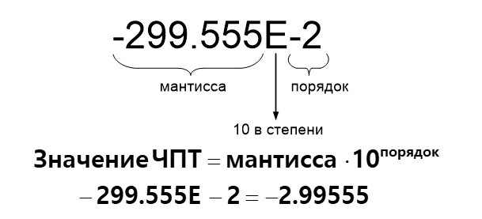

*Рисунок 5 - Научная форма представления вещественного числа*

В программе можем встретить, например, следующие строки:
```java
double a = ─299.555E─2;
float  b = 0.5f ;
```
По умолчанию литералы с плавающей точкой в *Java* имеют `double`-точность. Чтобы определить `float`-литерал, следует добавить в конец его записи символ `F` или `f`. Можно также явно определить `double`-литерал, добавляя `D` или `d` в конец его записи, но такое определение будет избыточным.
Примеры:
для типа `float`: `3.1415F` или `3.1415f` (`F` или `f` обозначает тип `float`); 
для типа `double`: `3.1415` (в фиксированном формате) или `0.314Е+1` (в научном формате), `234.525d` (явно указан тип). 


#### Выражения. 
Выражения позволяют комбинировать константы, переменные и операции для выполнения сложных вычислений.

Соединение в одном выражении нескольких операций требует учета их старшинства. Порядок выполнения операций в выражении:

1. выражение в круглых скобках, 
2. умножение и деление, 
3. сложение и вычитание. 

Обычно выражения – это правые части формул для вычисления значений переменных. Если операцию требуется выполнить с данными разного размера или типа, то более простой тип автоматически преобразуется в более сложный (целочисленные преобразуются в действительные, меньшие по размеру преобразуются в большие по размеру). Например, `float`-данные автоматически преобразуется в `double`, если складываются с `double`-данными. А преобразование (из `double` во `float`) должно указываться программистом явно, т.к. связано с уменьшением размера, т.е. с потерей значащих цифр. Указание дается в форме `(float)(выражение)`. Например, следующий фрагмент кода требует явного преобразования типа:
```java
double b=2.5;
float c=5.25f;
float а= (float) (b+c);
```

#### Особенности выполнения операций с действительными данными. 
Операции с действительными данными выполняются с погрешностью. Природа этой погрешности связана с ограниченным количеством значащих цифр мантиссы и с необходимостью при выполнении сложения и вычитания размещать разряды с одинаковым весом друг под другом. Рассмотрим появление погрешности на действиях с десятичными числами. Предположим, что величина мантиссы $М$ не превышает $1$, а количество разрядов равно $6$.

Пусть $a=0.523456*10^2$, $b=0.746879*10^2$. 

Тогда $a+b = 1.270335*10^2 + 0.127033*10^3$ (сохранены только 6 разрядов). Возникает погрешность, равная $0.0000005*10^2$. 

При сложении $a_1 = 0.523456*10^4$ и $b=0.746879*10^2$ получим $0.53092479 * 10^4$, или, оставляя 6 значащих цифр, $0.530924 * 10^4$. Погрешность при выполнении операции составила $0.00000079*10^4$.

При умножении шестиразрядного числа на шестиразрядное получается двенадцатиразрядное число, в котором следует сохранить только старшие 6 разрядов.

Пусть снова $a=0.523456*10^2$, $b=0.746879*10^2$. Вычислив $a*b = 0.390958293824*10^4$ и оставив 6 разрядов, получим $0.390958 * 10^4$, т.е. погрешность $0.000000293824*10^4$.

С ростом количества арифметических операций погрешность накапливается и может достичь такой величины, что результат потеряет смысл. Поэтому при решении вычислительных задач главное – не формула для вычислений, а умение вычислить значение с минимальным количеством операций, контролируя погрешность.


#### Библиотечные математические функции в __Java__
Класс `Math` содержит функции с плавающей точкой, которые применяются в алгебре, геометрии и тригонометрии (рисунки 6-8), а также несколько универсальных методов. В `Math` определены две константы типа `double`: `E` (приблизительно $2,72$)  и `PI` (приблизительно $3,14$). Класс `Math` находится в пакете `java.lang`, который импортируется автоматически во все программы.

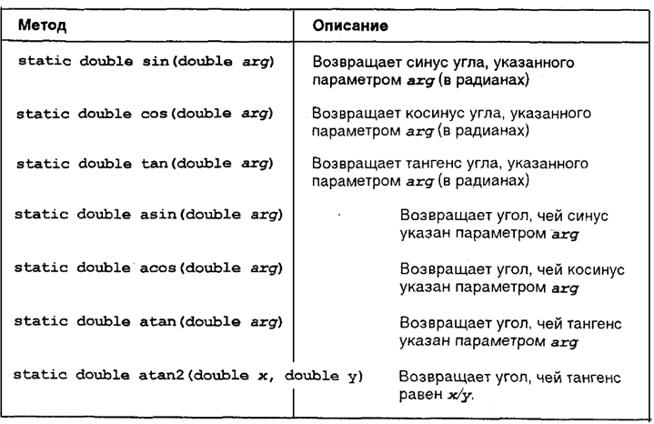

*Рисунок 6 - Методы трансцендентных функций*

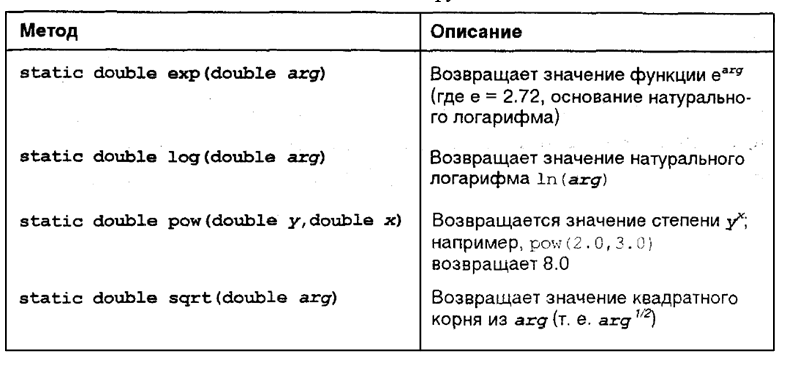

*Рисунок 7 - Методы экспоненциальных функций*

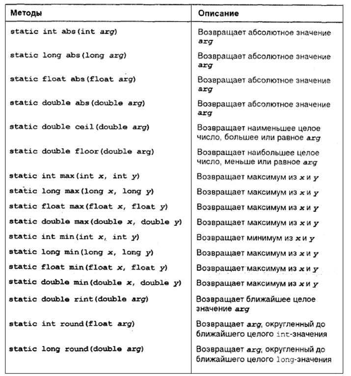

*Рисунок 8 - Методы округляющих функций*

В дополнение к методам, представленным выше, в `Math` определены следующие методы:

* Метод `IEEEremainder()` возвращает остаток от деления `dividend/divisor`.
* Метод `random()` предназначен для получения *псевдослучайного* числа из промежутка от 0 до 1. 
* Метод `toRadians()` конвертирует градусы в радианы.
* Метод `toDegrees()` переводит радианы в градусы.

### Порядок выполнения работы

#### Работа в окне кода в BlueJ

!!! note "Внимание"
    Каждое из перечисленных ниже заданий демонстрирует особенности работы с действительными числами в *Java*. Листинг (скриншот окна кода) для каждого задания должен быть приведен в отчете по лабораторной работе. Результаты выполнения каждого задания исполнительной системой *Java* (после их тщательного осмысления!) и соответствующие выводы также должны быть приведены в отчете.

1. Набрать в окне кода:
```java
double а1 = 2.523, b1 = 25.23, c1 = 0.2523;
```
Получить значения переменных `a1`, `b1`, `c1`. Сделать вывод.
2. Набрать в окне кода 
```java
double а2=-523.428e3;
```
Получить значение `a2`. 
3. Набрать в окне кода
```java
double а3 = 523.428e-3;
```
Получить значение `a3`. Сделать вывод по пунктам 2 и 3.
4. Вывести значения переменных `a1`, `b1`, `c1` в окно терминала в математическом формате при помощи оператора:
```java 
System.out.printf ("a1=%e;  b1=%e;  c1= %e \n", a1, b1, c1); .
```
5. Вывести значения переменных `a2` и `a3` в окно терминала в математическом формате  и фиксированном формате при помощи оператора:
```java 
System.out.printf ("a2 = %e  = %14.6f;  а3 = %e = %14.6f \n", a2, a2, a3, a3); 
```
Сделать вывод по пунктам 4 и 5.
6. Ввести в окне кода:
```java
final double M=0.25;
M=М+5;
```
Какое сообщение будет выдано и почему? Сделать вывод.
7. Набрать в окне кода: 
```java
double а4 = 0.25;  
double а5 = 0.25;  
```
Получить значения переменных `a4` и `a5`, а затем − значение выражения `a4==а5`. Какого оно типа?
8. Набрать в окне кода:
```java
double a6 = 5,1;
double a7 = a6 + 0.1;
```
Получить значение выражения `a7==5.2`. Получить значение переменной `a7`. Прокомментировать результат. Сделать вывод по пунктам 7 и 8. 
9. Набрать в окне кода: 
```java
double a8 = 25.25;  
float a9 = 25.25f;  
```
Получить значения переменных `a8` и `a9`, а затем − значение выражения `a8==a9`. 
10. Ввести операторы:
```java
a8 = a8 + 0.1;
a9 = (float) (a9 + 0.1f);
```
Получить значения переменных `a8` и `a9`, а затем − значение выражения `a8==a9`. Зачем в последнем операторе потребовалось явное преобразование типа? Сделайте выводы по пунктам 9 и 10. 
11. Вычислить каждое из трех приведенных ниже выражений дважды:  один раз с типом `double` переменной `х`, второй раз с типом `float` переменной `x` (чтобы не возникла ошибка двойного определения переменной `х`, во втором случае можно использовать имя `x1` вместо `x`). Для оценки погрешности вычисления сравнить результаты. В качестве значения `x` взять свой день рождения, деленный на месяц рождения плюс 0.1. Возведение в степень вычислять при помощи операции умножения. Сделать вывод.
    1. $х^2/2! + x^3/3!+x^4/4!$ 
    2. $(x-1)/(x+2.5) + ((x-3)/(x-3.5))^2$
    3. $(x+2.5*x^2-3.7*x^3)/(1.34+2.7x^3+5.21*x^5)$ 

12. Набрать фрагмент кода:
```java
float a = 4.0f;
float b = 3.5+a;
```
Какое сообщение выдает система и почему? Исправьте ошибку и получите значение `b`. Сделайте вывод.
13. Набрать фрагмент кода:
```java
int g=4, h=8;
double z=0.5+g/h;
double q=0.5+4/8;
double s=0.5+4.0/8.0;
```
Получите значения `z`, `q` и `s`. Объясните результаты. Сделайте вывод.
14. Наберите в окне кода операторы:
```java
System.out.println (Integer.toBinaryString(Float.floatToIntBits(0.9375f)));
System.out.println (Integer.toBinaryString(Float.floatToIntBits(-0.9375f)));
System.out.println (Long.toBinaryString(Double.doubleToLongBits(0.9375)));
System.out.println (Long.toBinaryString(Double.doubleToLongBits(-0.9375)));
```
Объясните результат. Сравните с представлением чисел 0.9375  и -0.9375 в формате *IEEE-754* для типов `float` и `double`, полученным вручную. Представление числа 0.9375 в формате *IEEE-754* для типа `float` приведено на рисунке 5. Сделайте выводы.


#### Разработка программы для выполнения операций с вещественными числами

1. Разработайте алгоритм вычислений и программу согласно варианту задания
2. Обоснуйте выбор типа для вещественных переменных.
3.  Проведите отладку программы и испытание на заданных тестовых примерах.

### Варианты заданий

В качестве индивидуального задания на лабораторную работу предлагается  разработать программу, реализующую вычисление по формулам, указанным в таблице вариантов ниже в соответствии с номером варианта. При составлении вариантов заданий использованы методические указания.

Вариант задания `V` необходимо вычислить по формуле
```java
V = N % 14 != 0 ?  N % 14 : 14,
```

где `N` – номер студента в списке группы.

Для решения поставленной задачи выполните следующие этапы:

1. Преобразуйте формулы с целью уменьшения количества операций при вычислениях. Упрощение возможно как за счет математических преобразований, так и за счет введения дополнительных переменных для сохранения значений выражений, неоднократно встречающихся в формуле. 
2. Для двух заданных вариантов исходных данных вычислите с помощью калькулятора значения, определяемые формулами (переведите калькулятор в режим работы с радианами при вычислении тригонометрических функций). При этом окажется, что одна пара исходных значений не входит в область допустимых значений, т.е. приведет к возникновению ошибки; 
3. Составьте алгоритм (схему) программы.
4. В соответствии с алгоритмом составьте программу на языке *Java*. 
5. Запустите программу на выполнение при обоих вариантах значений входных переменных. Проанализируйте полученные результаты (сравните с результатами расчетов на калькуляторе) и сообщения исполнительной среды *Java*

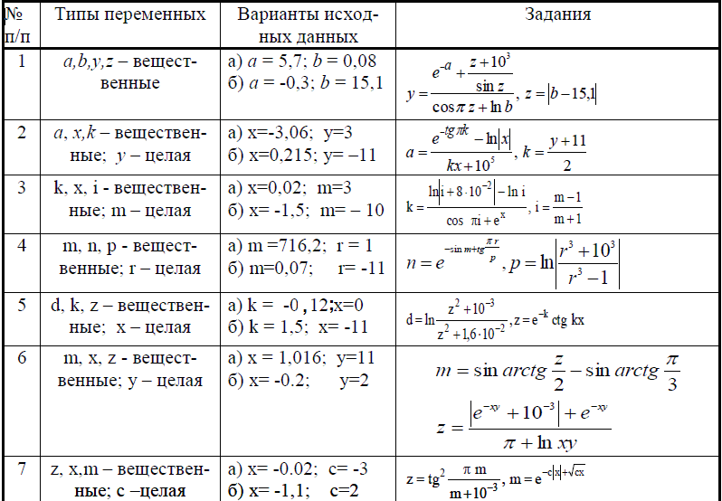

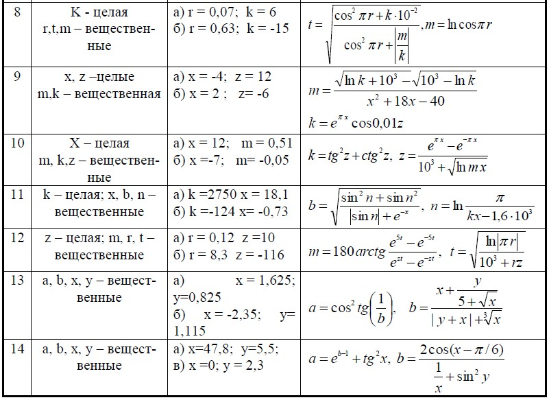

*Рисунок 9 - Варианты заданий*


### Пример выполнения индивидуального задания
Постановка задачи: Вычислить значение а по формуле:

$$
a = \frac{\sqrt[3]{|y|}}{(x+1)+(x-1))} + \frac{|sin(x)|}{\sqrt[x]{|y|}}
$$

для $x = 1,241$, $y = –0,879$.

Проанализируем формулу с целью выявления возможности упростить вычисления. Знаменатель первой дроби можно упростить следующим образом:    

$$
(x+1)+(x-1)=2x
$$

Чтобы дважды не вычислять $|y|$, введем дополнительную переменную:

$$
b=|y|
$$

Тогда с учетом соотношений выше, формулу для вычисления значения переменной `a` можно переписать следующим образом:

$$
a = \frac{\sqrt[3]{b}}{2x} + \frac{|sin(x)|}{\sqrt[x]{b}}
$$

Алгоритм вычислений будет иметь вид, показанный на рисунке 10. 
Предварительный расчет значения `а` с помощью калькулятора при заданных значениях `х` и `у` дает $b = 0,879$, $sin(x) = 0,9461$ и:

$$
a = \frac{0,9579}{2,482}+\frac{0,9461}{0,9013}=0,3859+1,0497=1,4357
$$
 
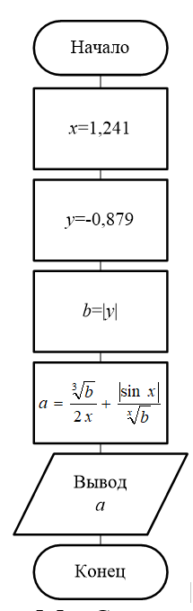

*Рисунок 10 - Схема алгоритма вычислений*

Текст программы на языке Java:
```java
public class Lab4 {
  public static void main (String args []) {
      double x, y, b, a;
      x = 1.241;
      y = -0.879;
      b = Math.abs(y);
      a = Math.pow(b, 1.0/3.0)/(2*x)+Math.abs(Math.sin(x)) / Math.pow(b, 1.0 / x);
      System.out.printf("x=%8.4f;  y=%8.4f;  a=%8.4f \n", x, y, a);
      System.out.println("Значение переменной а в формате IEEE 754: ");
      System.out.println(Long.toBinaryString(Double.doubleToLongBits(a)));
  } 
}
```
Результаты выполнения программы приведены на рисунке 11.

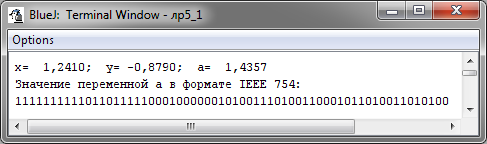

*Рисунок 11 - Результаты вычислений*

Значение переменной `a`, полученное в результате выполнения программы, совпало со значением, рассчитанным при помощи калькулятора.

!!! note "Внимание"
    Если в программе вы получили значение, не совпадающее с вашими расчетами (а вы точно уверены, что посчитали на калькуляторе правильно), в процессе отладки программы рекомендуется выводить в окно терминала все промежуточные результаты вычислений для обнаружения логической ошибки в программе. Например, при отладке приведенной выше программы была обнаружена следующая логическая ошибка: выражение для вычисления значения a первоначально выглядело так: 
    ```java
    Math.pow(b,1.0/3.0)/(2*x)+Math.abs(Math.sin(x))/Math.pow(b, x)
    ```
    вместо 
    ```java
    Math.pow(b,1.0/3.0)/(2*x)+Math.abs(Math.sin(x))/Math.pow(b,1.0/x), 
    ```
    что и давало неправильный результат.


### Контрольные вопросы

1. Какие типы *Java* определяют вещественные числа?
2. Какой формат используется для внутреннего представления вещественных данных? Из каких полей состоит этот формат.
3. Какое вещественное число считается нормализованным в математике, а какое в формате *IEEE-754*?
4. От чего зависит точность представления вещественных чисел в ЭВМ? От чего зависит диапазон представления вещественных чисел в ЭВМ?
5. Какой из форматов обеспечивает большую точность и диапазон и почему?
6. Как в программе задать литерал типа `float`?
7. Как задать литерал типа `double`?
8. Как выглядит действительное число, заданное в естественной форме (с фиксированным числом знаков после запятой) и в научной форме?
9. Как определить вещественную переменную в программе? Чем нужно руководствоваться при выборе ее типа?
10. Как определить вещественную константу в программе?
11. Когда в *Java*-программе может возникнуть ошибка, связанная с потерей точности? Приведите пример. Для чего используется явное преобразование типа в выражениях?
12. Объясните, почему возникает и накапливается погрешность при выполнении машинных расчетов с действительными данными. Как это влияет, в частности, на результат операции сравнения на равенство (`==`) действительных переменных.
13. Какой тип с плавающей точкой обеспечивает меньшую погрешность и за счет чего?
14. Какие библиотечные методы вы применили для получения  текстового эквивалента представления вещественного числа в форматах *IEEE-754* с одинарной и двойной точностью. Какие оговорки нужно сделать по-поводу полученного представления положительного числа? В каких классах-оболочках находятся использованные методы? 
15. В каком библиотечном классе определены методы для вычисления математических функций? Нужно ли импортировать в программу этот класс? Какие функции вы использовали в своей программе?
16. Перечислите возможности текстового процессора Microsoft Word, которые  вы использовали при выполнении отчета по лабораторной работе.


