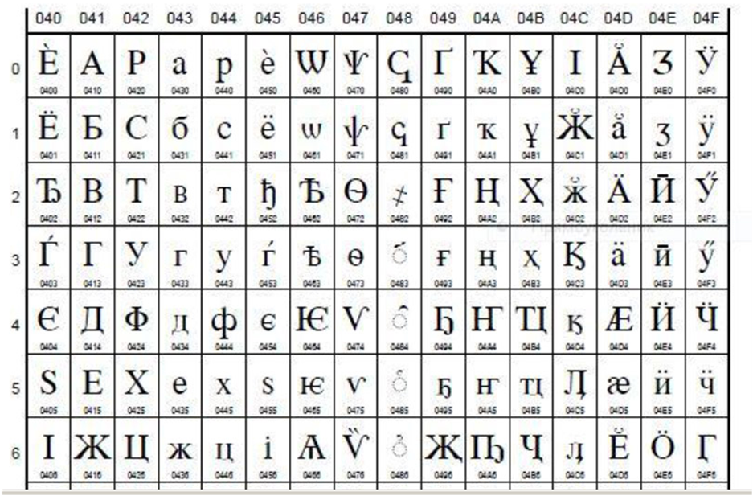
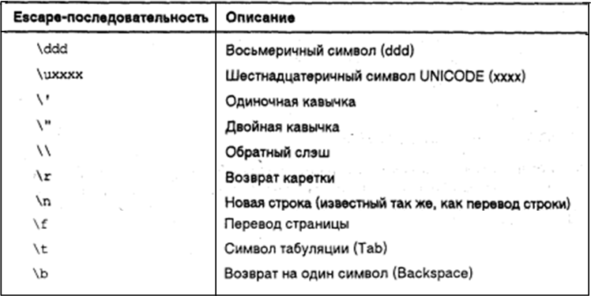
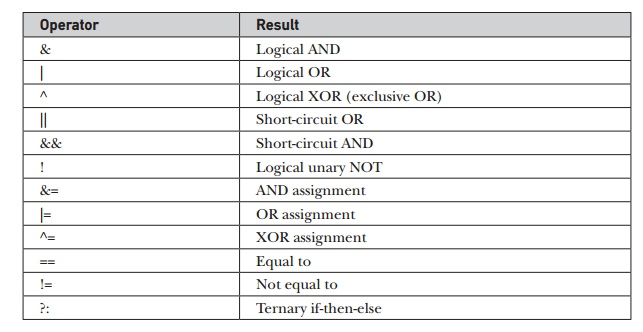
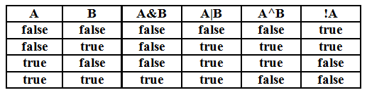
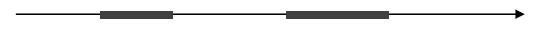
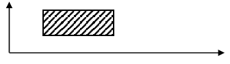

### Название работы
Обработка данных типа `char` и `boolean`. Условные выражения. Троичная условная операция (__тернарный оператор__) в *Java*.

### Цель работы
Освоить работу с типами `boolean` и `char`, научиться применять методы класса `Character` для анализа символов, научиться составлять сложные условные выражения, изучить синтаксис и научиться применять троичную условную операцию *Java*. 

### Постановка задачи

1. Ознакомиться с принципами хранения и обработки символов и логических значений в *Java*, а также с принципами построения логических выражений.
2. Выполнить заданные операции над данными типа `char` в окне кода.
3. Выполнить заданные операции над данными типа `boolean` в окне кода.
4. Разработать и отладить программу, демонстрирующую использование типов `char`  и `boolean`, условных выражений, а также троичной условной операции (тернарного оператора). 


### Краткие теоретические сведения

#### Тип __char__
Тип `char` представляет коды символов *Unicode*. Код символа – это номер соответствующего символа в таблице *Unicode*. Код является 16-битовым целым значением (без знака). Дополнительные сведения о символах *Unicode* можно получить, обратившись к Интернет-ресурсам:

* [http://www.unicode.org/charts/PDF](http://www.unicode.org/charts/PDF), 
* [http://www.javaportal.ru/java/articles/ruschars/ruschars.html](http://www.javaportal.ru/java/articles/ruschars/ruschars.html)

Число символов, которые можно закодировать с помощью 16 битов равно 2^16^=65536 (диапазон значений кода символа ─ от 0 до 65535).

Преимущество *Java*: набор символов *Unicode* определяет полный набор интернациональных символов, который может представлять все символы, находящиеся во всех человеческих языках. Язык *Java* cсоздан для разработки апплетов «всемирного использования»!
Недостаток: Использование *Unicode* несколько неэффективно для  языков, подобных английскому, немецкому, французскому, чьи символы могут легко помещаться в 8 битах. (плата за «глобальную мобильность»).

Стандартный набор символов, известный как *ASCII* (включает буквы английского алфавита, цифры, символы пунктуации, специальные символы) располагается в интервале значений кодов от 0 до 127 (как обычно), а расширенный восьмиразрядный набор символов *ISO-Latin-1*  ─ в диапазоне от 0 до 255.

Фрагмент кодовой таблицы, содержащий кириллические символы приведен на рисунке 1. 



*Рисунок 1 - Фрагмент таблицы Unicode с кириллическими символами (www.unicode.org)*

Тип `char` в *Java* по существу является подмножеством типа `int`, поэтому для типа `char` определены целочисленные операции, например, для данных типа `char` допустимо действие *код ± целое*. В программе программист действует с символами, а компилятор преобразует эти действия в работу с кодами. Следует обратить внимание, что при вычисления выражения, в котором используются целочисленные операции над символами, их коды преобразуются в значения типа `int`. Соответственно тип значения такого выражения – `int`. Если это значение присваивается переменной типа `char`, нужно использовать явное преобразование типа, например:
```java
char ch = (char)('A'+'B');
```

Операции сравнения символов на самом деле сравнивают их коды.

В программе можно использовать переменные и литералы типа `char`. 

Литерал типа `char` – это символ, заключенный в одиночные кавычки: `'z'`, `'7'`, `'+'`, `'&'`, `'ю'`, `'Я'` и т.д.

Символ можно задать также его кодом (целым числом в десятичной системе счисления), например:
```java
char ch = 88;
```

Некоторые «символы» не имеют графического изображения. Такие символы кодируются особо, например, `'\n'` – новая строка, `'\r'` – возврат каретки, `'\t'` – табуляция. Некоторые символы имеют специальный смысл – одиночные и двойные кавычки, слэш. Литералы этих символов записываются при помощи символа `\` : одиночная кавычка – `'\''`, двойная кавычка `'\"'`, слэш – `'\\'`. Можно задать восьмеричный или шестнадцатеричный код символа: `'\aaa'` (не более трех восьмеричных цифр `а`) или `'\uxxxx'` (ровно четыре шестнадцатеричных цифры `х`). Такой способ задания называется *escape-последовательностью*. Основные *escape-последовательности* приведены на рисунке 2. 



*Рисунок 2 - Основные escape-последовательности*

В практике программирования символы принято делить на категории: буквы, цифры, управляющие символы, пробельные символы и другие.

Различают также большие и маленькие буквы. Проверка того, что символ принадлежит определенной категории, предусмотрена в классе-оболочке `Character`. Так, `Character.isDigit(x)` возвращает `true`, если `x` – цифровой символ. Метод `isLetter(x)` проверяет, буква ли `x`. Имеются методы `isLetterOrDigit(x)` (`х` – буква или цифра?), `isLowerCase(x)` (`x` – маленькая буква?), `isUpperCase(x)` (`x` – большая буква?), `isSpaceChar(x)` (`x` – пробел?). 

Метод `Character.toUpperCase(x)` возвращает большую букву, соответствующую букве − значению `х` (проверьте в панели кода: `Character.toUpperCase('ж')`). Метод `Character.toLowerCase(x)` сопоставляет маленькую букву, соответствующую букве − значению `х`.


#### Тип __boolean__
Булевский тип в *Java* – это простой тип `boolean` и класс-оболочка `Boolean`. Литералы типа `boolean` – это `false` и `true` («ложь» и «истина»). К булевскому типу применимы операции сравнения (`==` и `!=`) и операции булевой логики (рисунок 3) 



*Рисунок 3 - Операции булевой логики*

Значения булевского типа получаются как результат арифметического сравнения значений других типов и/или как результат операций **И** (**AND** − `&`), **ИЛИ** (**OR** − `|`), **Исключающее ИЛИ** (**XOR** − `^`), **НЕ** (**NOT** − `!`).  Рисунок 4 демонстрирует правила выполнения этих операций (аналогичны действиям этих операций на битах целых чисел).



*Рисунок 4 - Правила выполнения операций булевой логики*

#### Сокращенные логические операции (`&&` и `||`).
Как видно из рисунока 4, односимвольная операция **ИЛИ** приводит к `true`-результату, когда операнд `А` – `true`, независимо от того, каков `B`. Точно также операция **И** приводит к `false`-результату, когда `А` – `false`, независимо от того, каков `В`.

Если использовать двузначные формы (`&&` и `||`) вместо однозначных (`&` и `|`), *Java* вообще не будет выполнять оценку правого операнда, если значение выражения полностью определяется значением левого операнда.

Использование сокращенной формы стало стандартной практикой в булевской логике, оставляя версии с одиночным символом исключительно для поразрядных операций целыми типами (хотя есть и исключения из этого правила).

Типовое применение булевского типа и операций с ним – хранение результатов проверки сложных условий. Например, `(x > 2.0) & (x < 5.0)` будет иметь значение `true`, если действительное `x` удовлетворяет неравенству `2.0 < x < 5.0` Выражение `!(x > 2.0)` истинно для тех же `x`, что и выражение `(x ≤ 2.0)`. 

Результаты булевских операций с константами и булевской переменной `x`: 

* `!true` → `false`
* `!false` → `true`
* `x | true` → `true`, `x | false` → `x`
* `x & false` → `false`
* `x & true` → `x`

#### Троичная условная операция.
В *Java* определена троичная (с тремя операндами) условная операция, также называемая **тернарным оператором** (`?:`). Ее синтаксис:
>expression1 ? expression2 : expression3

`expression1` – выражение, имеющее значение типа `boolean`.

Если оно `true`, то вычисляется `expression2`, иначе (если `expression1` − `false`), вычисляется  `expression3`. Результатом условной операции является значение вычисляемого выражения. Требуется, чтобы `expression2` и `expression3` возвращали значение *одного и того же типа*, который не может быть `void`).

Пример демонстрирует предотвращение деления на нуль благодаря применению тернарного оператора: 
```java
ratio = denominator == 0 ? 0 : numerator / denominator;
```
Частному `ratio` присваивается `0`, если делитель `denominator` равен нулю, и результат деления в противном случае.

### Порядок выполнения работы

#### Работа в BlueJ в окне кода с типом __char__

1. Объявите `char`-переменную и присвойте ей значение литерала – маленькой латинской буквы, например, `'z'`. Проверьте значение переменной, нажав ++return++s. 
2. Измените значение переменной, уменьшив или увеличив его на небольшое целое число (здесь нужно использовать явное преобразование типа в `char` для выражения в правой части оператора присваивания – объясните почему). Проверьте значение переменной и сформулируйте свой вывод. 
3. Наберите последовательно в окне кода: 
```
'Q'<'F'
'F'<'Q'
'A'>'9'
'X'==88
'Y'=='X'+1
```
Проанализируйте значения, возвращенные операциями сравнения, и сделайте соответствующие выводы.
4. Проверьте работу методов `toUpperCase()` и `toLowerCase()`. Для этого введите в панель кода следующие операторы:
```java
char a1= Character.toUpperCase ('v');
char a2= Character.toUpperCase ('V');
char a3= Character.toLowerCase ('Q');
char a4= Character.toLowerCase ('q');
```
После ввода каждого оператора проверяйте значение соответствующей переменной. Проанализируйте результаты. Сделайте выводы.
5. Проверьте работу методов `isLetter()`, `isDigit()`, `isLetterOrDigit()` (аргументом методов является символ). Для этого введите в панели кода следующие операторы:
```java
boolean b1=Character.isLetter('A');
b1=Character.isLetter('9'); 
b1=Character.isDigit('A');
b1=Character.isDigit('9');
b1= Character. isLetterOrDigit ('9');
b1= Character. isLetterOrDigit ('A');
b1= Character. isLetterOrDigit ('&');
```
После ввода каждого оператора проверяйте значение переменной `b1`. Проанализируйте результаты. Сделайте выводы.
6. Определите десятичные и шестнадцатеричные коды маленьких и больших букв русского алфавита, набрав
```java 
System.out.println((int)буква); 
// или
System.out.printf("%x",(int)буква);
// и 
System.out.println(Integer.toHexString((int)буква));
```
например:
```java 
System.out.println((int)'Б'); 
System.out.printf("%x\n", (int)'Б'); 
System.out.println(Integer.toHexString((int)'Б'));  
System.out.println((int)'б'); 
System.out.printf("%x\n", (int)'б');  
System.out.println(Integer.toHexString((int)'б'));
```
Сделайте выводы.

#### Работа в BlueJ в окне кода с типом __boolean__

1. В панели кода введите:
```java
boolean a=false;
boolean q=true;
a==q
a!=q
a<q
a>q
```
Сделайте выводы.
2. В панели кода определите числовую переменную `x` и булевскую переменную `b`. Вычислите значение `b = (x>2.0)&(x<5.0)` при `x=2`.1. Повторите вычисление при `x=5.3`. Вычислите `b = (x>2.0)|(x<5.0)` при тех же значениях `x`. Приведите в отчете результаты и сделанные выводы.
3. Введите булевские переменные `c`, `d`, `e`, `f`. Вычислите `e` по формуле:
```java
e = ! ( c & d | true) | (! c | ! d)
```
для всех возможных значений `c` и `d`. 
4. Вычислите `f = (!(c|d)==(!c&!d))` для всех возможных значений `c` и `d`. 
5. Составьте булевское выражение, которое истинно для значений `x`, находящихся внутри отмеченных интервалов (рисунок 5). Значения границ интервалов выберите самостоятельно. Проверьте в окне кода значение выражения для значений `х`, находящихся внутри интервалов и за пределами интервалов.
<br>
*Рисунок 5 - Интервалы на оси X, в которых выражение должно быть истинно*<br>
6.	Составьте булевское выражение, истинное для точек с координатами `(x,y)`, лежащих внутри прямоугольника (рисунок 6). Расположение прямоугольника на плоскости *XOY* выберите самостоятельно. Проверьте в окне кода значение выражения для точек, находящихся внутри прямоугольника и за его пределами.
<br>
*Рисунок 6 - Область истинности выражения*

#### Разработка программы для выполнения операций с данными типа char и boolean

1. Разработайте программу согласно варианту задания. 
2. Проведите отладку программы и испытание на достаточном количестве тестовых примеров.

Напомним, что под тестом (тестовым примером) понимается набор входных данных и соответствующий ему набор выходных данных программы. Программист должен разработать для своей программы набор тестов, проверяющий все возможные случаи (ветви) реализации программы.

### Варианты заданий

В качестве индивидуального задания на лабораторную работу предлагается  разработать программу, вычисляющую значение символьной переменной a в зависимости от значений символьных переменных `с` и `d`. В программе для присвоения значения переменной `a` предлагается использовать тернарный оператор (троичную условную операцию). В окне терминала должны быть выведены значения переменных `a`, `с` и `d`  в виде символов и в виде кодов символов для каждого тестового примера. Варианты заданий приведены ниже в таблице.

Вариант задания `V` необходимо вычислить по формуле
```java
V = N % 14 != 0 ?  N % 14 : 14,
```

где `N` – номер студента в списке группы.

|№ п/п	|Правило для вычисления значения переменной `a`|
|---|---|
|1	|`a=c+d`, если `с` – цифра, `d` – буква, или `с` – знак `'&'`; `a=c+2`, в противном случае. |
|2	|`a=c–d`, если `с` – буква, `d` – буква, `с>d`; `a=047016` , в противном случае.|
|3	|`a=c`, если `с='A`' или `с='F'` или `с='a'` или `с='f'`, `d` – цифра; `a=d`, в противном случае. |
|4	|`a=c+10`, если `c` – знак `'#'` или `'@'`, `d` – не буква; `a='G'`, в противном случае.|
|5	|`a= Character.toUpperCase(d)`, если `с='Y'` или `'!'`, `d` – буква или цифра; `a=c`, в противном случае.|
|6	|`a= Character.toUpperCase(с)`, если `с='y'` или `'n'`, `d` – не знак `'%'`;`a=d`, в противном случае. |
|7	|`a=c+20`, если `с='R'` или `'r'`, `d` – не цифра и не буква; `a=d`;|
|8	|`a= Character.toLowerCase(c)`, если `с` – буква, `d` – цифра или буква или знак `'*'`; `a=d++`, в противном случае.|
|9	|`a= Character.toLowerCase(d)`, если `с` – цифра или знак `'$'`, `d` – буква; `a=c`;|
|10	|`a=d––`; если `с = '@'`, или `с` – буква, или `d` – не цифра; `a=c––`, в противном случае.|
|11	|`a='Y'`, если `с` – буква или цифра, `d` – не буква и не цифра и не знак `'#'`; `a='N'`, в противном случае.|
|12	|`a= Character.toUpperCase(с)`, если `с` – буква, но `с` не является буквами `'A'` или `'a'`, `d ='%'`; `a=d`, в противном случае.| 
|13	|`a=c+d`, если `c` – буква, но не `'R'`, `d` – цифра, но не `'9'`; `a='7'`, в противном случае. |
|14	|`a='5'`, если `с='9'` или `с='0'`, `d` – не буква и не `'#'`; `a=c++`, в противном случае.|


### Контрольные вопросы

1. Для чего используется тип `char`. Сколько битов занимает значение типа `char`?
2. Что такое *Unicode*? Как представляется символ в `Java`? Сколько символов можно представить соответствующим образом? 
3. Как можно задать символьный литерал в программе? Назовите 3 способа. 
4. Как вывести код символа? 
5. Какие операции определены для типа `char`? Приведите в качестве примера участок кода, требующий явного преобразования типа `char` в `int`  и `int`  в `char`.
6. По какому принципу выполняется сравнение символов? Чему равны значения выражений `'A'<'D'`, `'C'>'F'`, `'9'<'A'`. Какого они типа?
7. С какими методами, реализующими функции над символами и определенными в классе-оболочке `Character`, вы познакомились в  ходе выполнения данной лабораторной работы? Значения каких типов они возвращают?
8. Для чего используется тип `boolean`? Какой класс оболочка ему соответствует в *Java*?
9. Какие значения может принимать тип `boolean`?
10. Чему равны значения выражений `2>5`, `3<10` ?
11. Какие операции определены для данных логического типа (`boolean`)?
12. Назовите правила выполнения операций булевой логики.
13. В чем состоит особенность выполнения *сокращенных* операций `&&` и `||` ?
14. Что из себя представляет условное выражение?
15. Приведите пример сложного условного выражения. Чему равно его значение?
16. Объясните синтаксис троичной условной операции (тернарного оператора). Приведите пример.
17. Перечислите возможности текстового процессора Microsoft Word, которые  вы использовали при выполнении отчета по лабораторной работе.


