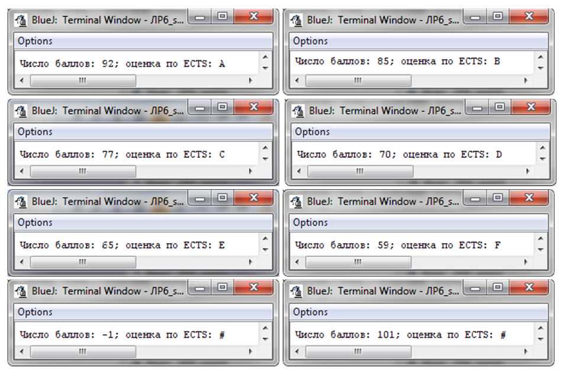

### Название работы
Исследование разветвляющихся алгоритмов и условных операторов.

### Цель работы
Целью данной работы является исследование разветвляющихся алгоритмов и их программирование с помощью условных операторов языка *Java*, приобретение начальных навыков тестирования программ.

### Постановка задачи

1. Изучить возможности условных операторов  *Java*.
2. Разработать и отладить программы, демонстрирующие применение условных операторов **`if`** и **`switch`**.
3. Протестировать программы на контрольных примерах.

### Краткие теоретические сведения

Часто при выполнении программы порядок действий должен зависеть от результата проверки некоторого условия. При истинности условия должна выполняться одна группа операторов, при ложности – другая. Например, при вычислении корней квадратного уравнения при неотрицательном дискриминанте применяется одна формула, а при отрицательном – другая. На схемах программ проверка условия изображается ромбом (рисунок 1, слева). Разделение хода выполнения программы на несколько ветвей называют ветвлением. Ветвление — однократное выполнение одной из двух или более операций, в зависимости от истинности некоторого заданного условия. В структурном программировании ветвление или выбор (ветвление с несколькими ветвями) изображают специальным соединением элементов (рисунок 1, справа). Напомним, движение по линиям сверху вниз и слева направо стрелками не отмечается, а движение справа налево или вверх указывается стрелками. 

<br>
*Рисунок 1 - Структура ветвление (а); Структура ветвление с 2 и более альтернативами (б)*

В языке *Java* для организации ветвлений предусмотрены:

1. Оператор присваивания, использующий тернарный оператор(троичную условную операцию):   
```java
переменная=условие ? выражение1 : выражение2;
```
2. Условный оператор (полный и неполный) – `if...else`:
```java
if (условие) оператор1;
else оператор2;   
// else может отсутствовать;
// Вместо операторов может быть блок кода с операторами
```
3. Многозвенная форма условного оператора − `if...else...if`:
```java
if (условие1) оператор1;
else if (условие2) оператор2;
else if (условие3) оператор3;
/// еще условия
else операторN; 
// else может отсутствовать;
// Вместо операторов может быть блок кода с операторами
// Технически это if из пункта 2,
// где вместо оператора - условный оператор
// (они вложены друг в друга)
```
4. Оператор-переключатель – `switch`:
```java
switch (выражение) {
    case value1:
        //последовательность операторов 1
        break;
    case value2:
        //последовательность операторов 2
        break;
    /// ...
    case valueN:
        //последовательность операторов N
        break;
    default:
        //последовательность операторов по умолчанию
        // default может отсутствовать
} 
// Оператор break – необязательный. Если он пропускается, 
// выполнение будет продолжено со следующей case-метки.
```

### Порядок выполнения работы

1. Изучите пример программы, использующей оператор **`if`**, приведенный в разделе ниже.
2. Cоставьте алгоритм (схему) программы, демонстрирующей применение оператора **`if`** (варианты индивидуальных заданий приведены в таблице 1. В программе должно быть предусмотрено задание значений переменных, вывод в окно терминала результатов с пояснениями. 
3. В соответствии с алгоритмом составьте программу на языке *Java*; 
4. Разработайте тесты для проверки программы: самостоятельно подберите такие значения исходных данных (переменной x), чтобы, запустив программу, можно было проверить правильность выбора каждой из ветвей алгоритма; рассчитайте на калькуляторе значения выходных переменных (`g`, `z`, `y`) для каждого значения переменной `x`.
5. Запустите программу на выполнение при трех вариантах значений для переменной `x` и двух вариантах значений для переменной `a`. Проанализируйте полученные результаты и сообщения среды *Java*.
6. Изучите пример программы, использующей оператор **`switch`**, приведенный в разделе ниже.
7. Составьте алгоритм (схему) программы, демонстрирующей применение оператора **`switch`** (варианты индивидуальных заданий приведены в таблице 2).
8. Разработайте тесты для проверки программы: самостоятельно подберите такие значения исходных данных, чтобы, запустив программу, можно было проверить правильность выбора каждой из ветвей алгоритма; 
9. Проверьте правильность выполнения программы с помощью разработанных тестов. Проанализируйте полученные результаты и сообщения среды *Java*.

### Варианты заданий

В качестве первого индивидуального задания на лабораторную работу предлагается  разработать программу, реализующую вычисление $y=g(x)+z(x)$ при заданном значении x. Формулы для вычисления `g` и `z` приведены в таблице 1 для каждого варианта.

В качестве второго индивидуального задания на лабораторную работу предлагается  разработать программу, реализующую выбор одного из нескольких вариантов действий в зависимости от значения переменной `choice`. Варианты второго задания  приведены в таблице 2.


Вариант задания `V` необходимо вычислить по формуле
```java
V = N % 14 != 0 ?  N % 14 : 14,
```

где `N` – номер студента в списке группы.

*Таблица 1 - Варианты заданий*


*Таблица 2 - Варианты заданий*


!!! tip "Примечание"
    В вариантах 2 и 4 в качестве исходного данного используйте либо одиночный символ, либо получите первый символ из строки.

    Первый символ из строки можно получить вот так:
    ```java
    String someText = "Hello, world!";
    char a = someText.charAt(0);
    ```

    В одной из следующих лабораторных работ мы разберем строки подробнее.


### Пример выполнения индивидуального задания

#### Пример выполнения первого задания
Рассмотрим следующую постановку задачи: составить программу вычисления значения $y=g(x)+z(x)$ при заданном значении $x$, где $g(x)$ и $z(x)$ − кусочно-заданные функции


Алгоритм вычислений будет иметь вид, показанный на рисунке 2. На этом рисунке изображены также пути реализации алгоритма при трех вариантах исходных данных: x=-5.3; x=-0.1; x=1.0. Видим, что эти тестовые примеры покрывают все ветви алгоритма.

Данные, полученные в результате расчетов на калькуляторе:

при $x=-5.3, g=3.0754, z=80269.6748, y=80275.7503$;

при $x=-0.1, g=1.0033, z=1.1099, y=2.1133$;

при $x=1.0, g=0.6178, z=1.6931, y=2.3110$.

<br>
*Рисунок 2 - Cхема алгоритма и тестирования*

```java
public class Lab6_1 {
     public static void main(String[ ] args){
            double x = 1, g, z, y;
            
            if (x <= 0) {
                g = Math.cbrt(1 + x * x);
            } else {
                g = Math.pow(Math.sin(x),2) * (1 + x)/
                            (2+Math.pow(Math.cos(x),2));
            } 
            
            if (x < -0.2)
                z = 2 * Math.exp(-2 * x);
            else if (x > 0.8) 
                z = 1 + Math.log(1 + x);
            else 
                z = (1 + Math.pow(x,3)) / (1 + x);
            
            y = g + z;
            
            System.out.printf("x = %.5f, g = %.5f, z = %.5f, y = %.5f\n",
                                            x, g, z, y);  
     }
}
```

Второй вариант той же программы использует тернарный оператор для вычисления значения переменной `g`, а также импортирование статических функций класса `Math`(это позволяет обращаться к соответствующей функции просто по ее имени, не указывая перед ним имя класса `Math`):
```java
import static java.lang.Math.*;

public class Lab6_1 {
     public static void main (String[] args){
            double x = 1, g, z, y;

            g = (x <= 0) 
                ? cbrt(1 + x * x) 
                : pow(sin(x), 2) * (1 + x)/
                         (2 + pow(cos(x), 2));

            if (x < -0.2) {
                z = 2 * exp(-2 * x);
            } else {
                if (x > 0.8) 
                    z = 1 + log(1 + x);
                else 
                    z = (1 + pow(x,3)) / (1 + x);
            }

            y = g + z;

            System.out.printf("x = %.5f, g = %.5f, z = %.5f, y = %.5f\n",
                                         x, g, z, y); 
     }    
}
```

Результаты выполнения программы для различных значений `x` представлены на рисунке 3.

Значения переменных, полученные в результате выполнения программы, совпали со значениями, рассчитанными при помощи калькулятора.

!!! tip "Примечание"
    Если в программе вы получили значение, не совпадающее с вашими расчетами (а вы точно уверены, что посчитали на калькуляторе правильно), в процессе отладки программы рекомендуется выводить в окно терминала все промежуточные результаты вычислений для обнаружения логической ошибки в программе. Также рекомендуется использовать отладчик, встроенный в вашу среду разработки.

<br>
*Рисунок 3 - Результаты работы программы*

#### Пример выполнения второго задания
Разработать программу перевода оценки по 100-балльной шкале в оценку по системе *ECTS* (англ. *European Credit Transfer and Accumulation System — Европейская система перевода и накопления баллов*)  по правилу:

* 90 – 100  баллов : A; 
* 82 – 89  баллов: B; 
* 74 – 81 балл: C; 
* 68 – 73 балла: D; 
* 60 – 68 баллов: E;
* 0 – 59 баллов: F.

Выбор варианта в программе осуществить с помощью оператора **`switch`**.

Схема алгоритма перевода оценки изображена на рисунке 4.

```java
public class Lab6_2 {
    public static void main(String[] args) {
        int score = 90; //число баллов 
        char ects; //оценка по системе ECTS
        switch (score) {
            case 90:
            case 91:
            case 92:
            case 93:
            case 94:
            case 95:
            case 96:
            case 97:
            case 98:
            case 99:
            case 100:
                ects = 'A';
                break;

            case 82:
            case 83:
            case 84:
            case 85:
            case 86:
            case 87:
            case 88:
            case 89:
                ects = 'B';
                break;

            case 74:
            case 75:
            case 76:
            case 77:
            case 78:
            case 79:
            case 80:
            case 81:
                ects = 'C';
                break;

            case 68:
            case 69:
            case 70:
            case 71:
            case 72:
            case 73:
                ects = 'D';
                break;

            case 60:
            case 61:
            case 62:
            case 63:
            case 64:
            case 65:
            case 66:
            case 67:
                ects = 'E';
                break;

            default:
                ects = (score < 0 || score > 100) ? '#' : 'F';
        }

        System.out.printf("Число баллов: %d; оценка по ECTS: %c\n", score, ects);
    }
}
```
<br>
*Рисунок 4 - Схема работы программы*

<br>
*Рисунок 5 - Результаты работы программы*


### Контрольные вопрос

1. Изобразите синтаксическую диаграмму полного и неполного условного оператора. Как эти конструкции изображаются на схемах алгоритмов? Объясните их работу.
2. Поясните термин «логическое выражение». Значение какого типа оно возвращает, какие логические операции в нем могут быть использованы? Приведите примеры сложных логических (условных) выражений. Для чего в условных операторах используются логические выражения (условия)?
3. Что представляет собой составной оператор (блок операторов)? Для чего он используется?
4. В каком случае условный оператор можно заменить оператором присваивания, использующим троичную условную операцию?
5. Перечислите основные блоки, применяемые в схемах разветвляющихся алгоритмов. 
6. Опишите синтаксис и алгоритм работы вложенных операторов **`if`**: **`if...else...if`**.
7. Опишите синтаксис и алгоритм работы оператора **`switch`**? В каких случаях его целесообразно применять? Для чего в ветвях **`case`** оператора **`switch`** применяется оператор **`break`**?  Что будет, если в какой-либо ветви его опустить?
8. Для чего в операторе **`switch`** применяется элемент **`default`**? Можно ли его опустить?
9. Как вы осуществляли тестирование программы? Что такое тест? Сколько тестов вы использовали и почему?
10. Летели два верблюда, один рыжий, другой налево. Сколько весит килограмм асфальта, если ёжику 24 года?


