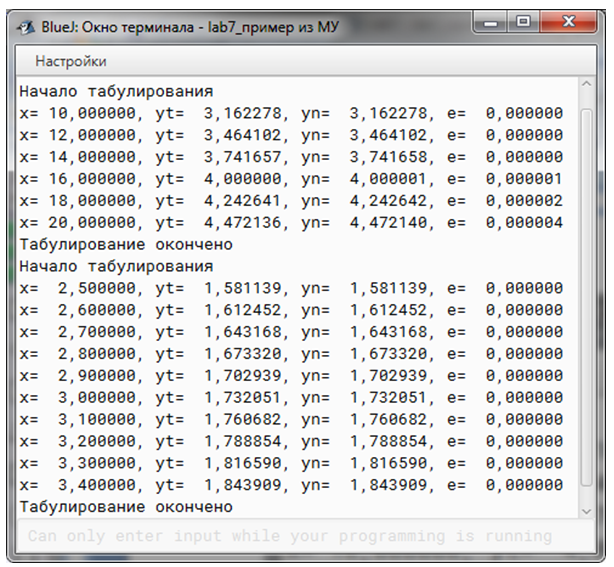

### Название работы
Исследование циклических алгоритмов.

### Цель работы
Целью данной работы является изучение назначения и приемов использования операторов циклов *Java*, исследование циклических алгоритмов и программ, применяемых для решения типовых задач вычисления значения функции по рекуррентной формуле при заданном значении аргумента и табулирования функции на заданном интервале.

### Постановка задачи
1. Ознакомиться с теоретическими сведениями о рекуррентных формулах арифметических корней, а также с возможностями построения циклических программ в *Java*.
2. Разработать методы  для вычисления функции арифметического корня по рекуррентной формуле согласно варианту задания и  для табулирования этой функции на заданном интервале.

### Краткие теоретические сведения

#### Операторы цикла

Подавляющее большинство программ содержат циклы. 

**Цикл** – это последовательность операторов, которая выполняется несколько раз подряд.

Язык *Java* поддерживает три оператора цикла.

Цикл **`while`** - оператор цикла с предусловием - имеет следующий синтаксис:
```java
while (условие) оператор;
```

Если оператор составной:
```java
while (условие) {
    //тело цикла – последовательность операторов
}
```

Выполнение операторов в теле цикла повторяется, пока `условие` (логическое выражение) истинно.
Тело цикла может не выполниться ни разу, если `условие` изначально ложно.

Цикл **`do while`** - оператор цикла с постусловием - имеет следующий синтаксис:
```java
do оператор; 
while (условие);
```

Если оператор составной:
```java
do {
    //тело цикла – последовательность операторов
} while (условие);
```

Выполнение операторов в теле цикла повторяется, пока `условие` (логическое выражение) истинно.
Тело цикла *выполняется хотя бы один раз*, т.к. значение `условие` (логического выражения) проверяется *в конце цикла*.

Цикл **`for`** - оператор цикла с управляющей переменной (параметром цикла) - имеет следующий синтаксис:
```java
for (инициализация; условие; итерация) оператор;
```

Если оператор, выполняемый в теле цикла,  составной:
```java
for (инициализация; условие; итерация) {
    //тело цикла – последовательность операторов
}
```

В начале работы цикла выполняется выражение `инициализация`. В общем случае это выражение устанавливает значение переменной управления циклом, которая действует как счетчик. Выражение инициализации выполняется только один раз.
В этом выражении можно указать несколько переменных управления циклом любого типа. Эта часть цикла - необязательная.

Затем оценивается условное выражение `условие`, которое *обычно* сравнивает переменную управления циклом с каким-либо граничным значением. Если значение условного выражения  − `true`, то выполняются операторы тела цикла, если `false`, цикл завершается. Эта часть цикла - необязательная.

Далее выполняется часть цикла `итерация`. Обычно это выражение, которое осуществляет инкрементные или декрементные операции с переменной управления  циклом. Эта часть цикла - необязательная.

Каждый проход любого цикла называется **итерацией**.

В каждом проходе цикла **`for`**  сначала оценивается условное выражение `условие`, потом выполняется тело цикла и затем – выражение `итерация`. Этот процесс выполняется до тех пор, пока значение выражения `условие` не станет `false`.

При отсутствии всех трех управляющих частей цикл **`for`** превращается в бесконечный цикл.

В отличие от других языков программирования в *Java* переменная, управляющая циклом может иметь *любой* тип.

Циклические процессы, реализуемые вышеназванными операторами цикла, изображены на рисунке 1.

<br>
*Рисунок 1 - Циклы Java*

#### Рекуррентные формулы вычисления значений и функции
В различных алгоритмах численного решения задач часто используются итерационные методы. **Метод итераций (метод последовательных приближений)** – метод решения математических задач с помощью построения последовательности, сходящейся к искомому решению, начиная с некоторого начального приближения. При этом члены последовательности вычисляются повторным применением какой-либо операции (итерациями). 

Иными словами, итерационные методы – это методы, в которых точное решение может быть получено лишь в результате бесконечного повторения единообразных (как правило, простых) действий.

В итерационных алгоритмах часто применяются так называемые рекуррентные формулы. Рекуррентные формулы служат для получения последовательности значений. При этом каждое следующее значение вычисляется по предшествующим значениям с помощью одной и той же формулы. 

Рекурентная формула — формула вида $a_n=f(n, a_{n-1}, a_{n-2}, \dots, a_{n-p}), n \geq p + 1$ выражающая каждый член последовательности $a_n$ через $p$ предыдущих членов. 

В качестве конкретного примера применения такого подхода приведем правило Ньютона вычисления арифметических корней. 

Пусть $x$ – заданное положительное число, a $n \geq 2$   – заданный натуральный показатель корня. Ставится задача вычислить вещественное значение $y=\sqrt[n]{x}$ путем последовательных приближений с помощью арифметических операций. 

Согласно правилу Ньютона процесс приближений к $\sqrt[n]{x}$ определяется формулой:

$$
y_{k+1}=y_k-\frac{y^n_k-x}{ny^{n-1}_k}
$$

Или в другом виде:

$$
y_{k+1}=\frac{1}{n}((n-1)y_k-\frac{x}{y^{n-1}_k})
$$

$k = 0, 1, 2, \dots$, а $у_0 \gt 0$ задается.

Еще из глубокой древности известен частный случай правила Ньютона – процесс Герона: 

$$
y_{k+1}=\frac{1}{2}(y_k-\frac{x}{y_k})
$$

Он применяется для извлечения квадратных корней $y=\sqrt{x}$.


### Порядок выполнения работы

1. Разработайте программу согласно варианту задания.
2. Проведите отладку программы и испытание на достаточном количестве тестовых примеров. 
Напомним, что под тестом (тестовым примером) понимается набор входных данных и соответствующий ему набор выходных данных программы. Программист должен разработать для своей программы набор тестов, проверяющий все возможные случаи (ветви) реализации программы.

### Варианты заданий

Вариант задания `V` необходимо вычислить по формуле
```java
V = N % 14 != 0 ?  N % 14 : 14,
```

где `N` – номер студента в списке группы.

В качестве индивидуального задания на лабораторную работу предлагается  разработать класс, включающий несколько методов.

*Первый метод* должен осуществлять вычисление значения функции (арифметического корня) средствами класса `Math`.

*Второй метод* должен осуществлять вычисление арифметического корня по рекуррентной формуле для заданного значения `х`. 

Метод реализует циклический алгоритм, в теле которого пересчитывается по рекуррентной формуле значение $y_k$  при $k=1,2,3,\dots,n$. Согласно теории рекуррентных вычислений с ростом $k$ значение $y_k$  приближается к точному значению $y$. В программе пересчет $y_k$  должен начаться с $y_0=x$   и повториться $n$ раз. Значения $x$ и $n$ должны передаваться в метод в качестве параметров. На каждом шаге цикла должен осуществляться вывод $y_k$  и ошибки вычисления по рекуррентной формуле $\epsilon=|y_k-y|$. 


*Таблица 1 - Варианты заданий*


*Таблица 2 - Виды циклов для реализации*


Запустите метод на выполнение при двух значениях $х$ из диапазона $[x_{min}, x_{max}]$,  заданного  в  таблице 1.  

Для каждого значения $х$ проанализируйте полученные значения последовательных приближений $y_k$ , вычисленных по рекуррентной формуле, к точному значению $у$.  Сколько итераций потребовалось для получения значения $y_k$  , равного $y$ с точностью до 6 знака? От чего зависит значение необходимого числа итераций?

Третий метод должен осуществлять табулирование функции арифметического корня на заданном интервале.

Под табулированием функции понимают вычисление значения функции при всех значениях аргумента $х$, изменяющихся с шагом $\Delta x$ в пределах от  $x_{min}$  до $x_{max}$. 

Для вычисления значения функции третий метод будет вызывать первый метод и второй метод. Третий метод должен осуществлять вывод точного значения функции $y_{точное}$ (считаем точным значение функции, вычисленное средствами модуля `Math`) и приближенного значения $y_k$  (вычисленного по рекуррентной формуле), а также ошибки $\epsilon$  для каждого значения $x$. 

Запустите метод на выполнение при значениях $n$, $x_{min}$, $x_{max}$, $\Delta x$, заданных в таблице 3.1 и при другом наборе значений. 

Четвертый метод − `main()` − должен осуществлять табулирование функции последовательно на нескольких интервалах с различным значением  $\Delta x$. 

Во всех вариантах начальное приближение $y_0 = x$.


### Пример программы
Необходимо составить программу для приближенного вычисления значения функции $y=\sqrt{x}$ с помощью рекуррентной формулы  $y_{k+1}=\frac{1}{2}(y_k-\frac{x}{y_k})$ , для за данного $х$. Алгоритм метода вычисления корня по рекуррентной формуле можно представить с помощью схемы, показанной на рисунке 3.3. Схема алгоритма табулирования функции на заданном интервале показана на рисунке 3.4. 

Текст программы будет иметь следующий вид.
```java
public class Main {
    public static double squareRoot(double x) {
        return Math.sqrt(x);
    }

    public static double squareRootRecurrent(double x, int n) {
        double y = x; // y0 = x

        for (int i = 1; i <= n; i++) {
           y = (y + x / y) / 2; // считаем по формуле новое yk
           System.out.printf ("x=%10.6f, y=%10.6f, i=%4d\n", x, y, i); //выводим
        }    
        
        return y;
    }
   
    public static void tabulate(double startX, double endX, double deltaX) {
        // Объявляем и присваиваем x начальное значение
        // Остальные только объявляем
        // yt - точное значение
        // yk - значение по реккурентной формуле
        // err - ошибка epsilon
        double x = startX, yt, yk, err;
        int n = 10;
        while (x <= endX) {
            // Считаем значения для текущего x
            yt = squareRoot(x);
            yk = squareRootRecurrent(x, n);
            // Считаем ошибку
            err = Math.abs(yt - yk);
            System.out.printf("x=%10.6f, yt=%10.6f, yk=%10.6f, err=%10.6f\n",
                                          x, yt, yk, err);
            x += deltaX; // Переход к следующему иксу
        }
   } 
    
    public static void main(String[] args) {
        System.out.println("Начало табулирования");
        tabulate(10, 20, 2);
        System.out.println("Табулирование окончено");
        System.out.println("Начало табулирования");
        tabulate(2.5, 3.5, 0.1);
        System.out.println("Табулирование окончено");
    } 
}
```

!!! tip "Примечание"
    В прошлой версии методических указаний методы `squareRoot`, `squareRootRecurrent` и `tabulate` назывались
    `fun`, `funIter` и `go` соответственно.


*Рисунок 4 - Алгоритм вычисления корня по рекуррентной формуле*


*Рисунок 5 - Алгоритм табулирования функции*


*Рисунок 6 - Результаты вызова метода  `funIter(10,10)`*


*Рисунок 7 - Результаты вызова метода  `funIter(500000,15)`*


*Рисунок 8 - Результаты работы программы*

![График функции, построенный по результатам табулирования  на интервале [10,100] с шагом 10](../assets/images/ПБПОИ/lab7/9.png)
*Рисунок 9 - График функции, построенный по результатам табулирования  на интервале [10,100] с шагом 10*

### Контрольные вопросы

1. Опишите синтаксис и алгоритм работы оператора цикла с предусловием. Какое минимальное количество раз выполняется цикл с предусловием?
2. Опишите синтаксис и алгоритм работы оператора цикла с постусловием. Какое минимальное количество раз выполняется цикл с постусловием?
3. Опишите синтаксис и алгоритм работы оператора цикла с параметром (управляющей переменной). 
4. Управляющие переменные каких типов можно использовать в цикле `for` языка *Java*? 
5. От каких исходных данных зависит время выполнения составленных в лабораторной работе программ? Объясните почему. 
6. От чего зависит точность вычисления значения функции по итерационной формуле?
7. Какое условие вы использовали для выхода из цикла табулирования функции? Почему мы никогда не попадаем в правую границу интервала при увеличении значения аргумента? 
8. Можно ли использовать в качестве условия выхода из цикла результат сравнения на равенство значений вещественных переменных, полученных в результате выполнения операций над этими переменными?


